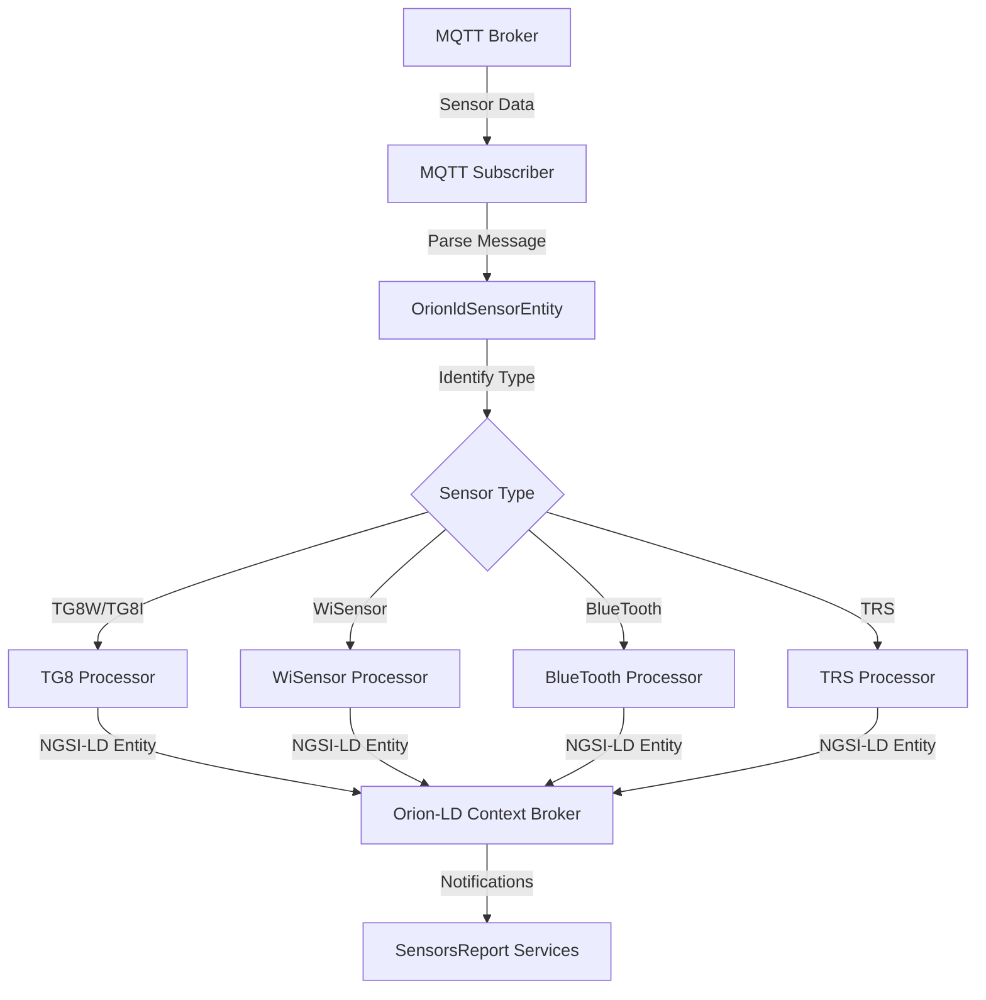
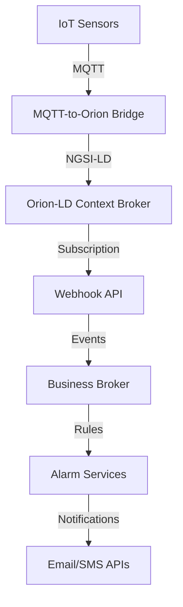

# Sensors-Report-MQTT-to-Orion

[](https://dotnet.microsoft.com/download/dotnet/8.0)
[](https://www.docker.com/)
[](../LICENSE)

## Overview

The Sensors-Report-MQTT-to-Orion is a critical bridge service that connects MQTT sensor networks to the FIWARE Orion-LD Context Broker within the SensorsReport ecosystem. This service continuously monitors MQTT topics for incoming sensor data, processes and transforms the data according to NGSI-LD standards, and forwards it to the Orion-LD Context Broker for storage and further processing by other SensorsReport services.

## Features

### Core Functionality
- **MQTT Subscription**: Real-time subscription to configurable MQTT topics
- **Multi-sensor Support**: Support for various sensor types including TG8, WiSensor, BlueTooth, and TRS
- **Data Transformation**: Automatic conversion from sensor-specific formats to NGSI-LD entities
- **Orion-LD Integration**: Native integration with FIWARE Orion-LD Context Broker
- **Tenant Management**: Automatic tenant detection and context switching

### Sensor Processing
- **TG8 Sensors**: Complete support for TG8W and TG8I temperature/humidity sensors
- **Heartbeat Handling**: Automatic processing of sensor heartbeat and online status
- **Entity Management**: Smart entity creation, updates, and batch operations
- **Data Validation**: Comprehensive validation of incoming sensor data

### Reliability Features
- **Auto-Reconnection**: Automatic MQTT broker reconnection with retry logic
- **Error Handling**: Robust error handling with detailed logging
- **Background Processing**: Runs as a background service for continuous operation
- **Tenant Caching**: Efficient tenant information caching for performance

### Integration Features
- **NGSI-LD Compliance**: Full compliance with FIWARE NGSI-LD standards
- **JSON-LD Support**: Dynamic JSON-LD schema downloading and validation
- **Flexible Configuration**: Environment variable and command-line configuration
- **Comprehensive Logging**: Structured logging with NLog integration

## Technology Stack

- **.NET 8.0**: Core framework for high-performance applications
- **MQTTnet**: MQTT client library for broker communication
- **FIWARE Orion-LD**: NGSI-LD context broker integration
- **Newtonsoft.Json**: JSON processing and manipulation
- **NLog**: Structured logging framework
- **Docker**: Containerization for deployment
- **Kubernetes**: Orchestration and scaling

## Project Structure

```
Sensors-Report-MQTT-to-Orion/
├── MqttSubscriber.cs                 # Main MQTT subscription service
├── OrionldSensorEntity.cs           # Base sensor entity processing
├── TG8.cs                           # TG8 sensor implementation
├── OrionIdISensorEntity.cs          # Sensor entity interfaces and types
├── Orionld.cs                       # Orion-LD client implementation
├── OrionldTenantCache.cs            # Tenant management and caching
├── OrionldAPIKey.cs                 # API key management
├── JsonLdSchemaDownloader.cs        # JSON-LD schema handling
├── KrakendMapping.cs                # API gateway mapping utilities
├── Program.cs                       # Application entry point and configuration
├── Sensors-Report-MQTT-to-Orion.csproj  # Project dependencies
├── Dockerfile                       # Container build configuration
├── kubernetes.yaml                  # Kubernetes deployment manifests
├── nlog.config                      # Logging configuration
├── Directory.Build.props            # Build properties
└── README.md                        # This documentation
```

## Architecture and Data Flow

### MQTT to Orion-LD Bridge Flow


### Entity Processing Pipeline
1. **MQTT Message Reception**: Subscribe to configured MQTT topics
2. **Message Parsing**: Parse JSON payload and identify sensor type
3. **Entity Transformation**: Convert sensor data to NGSI-LD format
4. **Tenant Resolution**: Determine appropriate tenant context
5. **Orion-LD Operations**: Create or update entities in context broker
6. **Error Handling**: Log and handle any processing errors

## Getting Started

### Prerequisites
- .NET 8.0 SDK
- Access to MQTT broker
- FIWARE Orion-LD Context Broker
- Docker (for containerized deployment)

### Configuration

The service can be configured using environment variables or command-line arguments:

#### Environment Variables

| Variable | Description | Default | Required |
|----------|-------------|---------|----------|
| `SENSORSREPORTMQTT_TO_ORION_MQTTHOST` | MQTT broker hostname | `mqtt.sensorsreport.com` | Yes |
| `SENSORSREPORTMQTT_TO_ORION_MQTTPORT` | MQTT broker port | `1883` | Yes |
| `SENSORSREPORTMQTT_TO_ORION_MQTTTOPIC` | MQTT topic pattern | `Synchro/#` | Yes |
| `SENSORSREPORTMQTT_TO_ORION_ORIONURL` | Orion-LD broker URL | `http://orion-ld-broker:1026` | Yes |
| `SENSORSREPORTMQTT_TO_ORION_JSONLD` | JSON-LD context URL | `http://ngsi-ld.sensorsreport.net/synchro-context.jsonld` | No |
| `SENSORSREPORTMQTT_TO_ORION_MQTTUSER` | MQTT username | - | No |
| `SENSORSREPORTMQTT_TO_ORION_MQTTPASSWORD` | MQTT password | - | No |
| `SENSORSREPORTMQTT_TO_ORION_MQTTCLIENTID` | MQTT client ID | Auto-generated | No |
| `SENSORSREPORTMQTT_TO_ORION_MQTTCLEANSESSION` | MQTT clean session | `true` | No |
| `SENSORSREPORTMQTT_TO_ORION_MQTTKEEPALIVEPERIOD` | MQTT keep alive period | `60` | No |

#### Command Line Arguments

```bash
# Basic configuration
--orionurl=http://localhost:1026 \
--mqtthost=localhost \
--mqttport=1883 \
--mqtttopic=Synchro/#

# With authentication
--mqttuser=username \
--mqttpassword=password \
--jsonld=http://example.com/context.jsonld
```

### Local Development

#### 1. Clone and Setup
```bash
cd Sensors-Report-MQTT-to-Orion
dotnet restore
```

#### 2. Configure Environment
```bash
# MQTT Configuration
export SENSORSREPORTMQTT_TO_ORION_MQTTHOST="localhost"
export SENSORSREPORTMQTT_TO_ORION_MQTTPORT="1883"
export SENSORSREPORTMQTT_TO_ORION_MQTTTOPIC="Synchro/#"

# Orion-LD Configuration
export SENSORSREPORTMQTT_TO_ORION_ORIONURL="http://localhost:1026"
export SENSORSREPORTMQTT_TO_ORION_JSONLD="http://ngsi-ld.sensorsreport.net/synchro-context.jsonld"
```

#### 3. Run the Application
```bash
dotnet run
```

The service will start and begin subscribing to the configured MQTT topics.

#### 4. Test with Sample Data
```bash
# Publish a test TG8 sensor message
mosquitto_pub -h localhost -t "Synchro/TG8/device001" -m '{
  "id": "urn:ngsi-ld:TG8:device001",
  "type": "TG8",
  "temperature": {
    "type": "Property",
    "value": 23.5,
    "unitCode": "CEL"
  },
  "humidity": {
    "type": "Property", 
    "value": 65.2,
    "unitCode": "P1"
  },
  "online": {
    "type": "Property",
    "value": true
  }
}'
```

### Docker Deployment

#### Build Container
```bash
# From the root SensorsReport directory
docker build -f Sensors-Report-MQTT-to-Orion/Dockerfile -t sensors-report-mqtt-to-orion:latest .
```

#### Run Container
```bash
docker run -d \
  --name mqtt-to-orion \
  -e SENSORSREPORTMQTT_TO_ORION_MQTTHOST="mqtt.example.com" \
  -e SENSORSREPORTMQTT_TO_ORION_ORIONURL="http://orion.example.com:1026" \
  sensors-report-mqtt-to-orion:latest
```

### Kubernetes Deployment

Deploy using the provided Kubernetes manifests:
```bash
kubectl apply -f kubernetes.yaml
```

## Sensor Support

### TG8 Sensors (TG8W/TG8I)

The service provides complete support for TG8 temperature and humidity sensors:

#### Supported Data Format
```json
{
  "id": "urn:ngsi-ld:TG8:sensor001",
  "type": "TG8",
  "temperature": {
    "type": "Property",
    "value": 24.3,
    "unitCode": "CEL",
    "observedAt": "2024-01-01T10:00:00Z"
  },
  "humidity": {
    "type": "Property",
    "value": 67.8,
    "unitCode": "P1",
    "observedAt": "2024-01-01T10:00:00Z"
  },
  "online": {
    "type": "Property",
    "value": true
  },
  "battery": {
    "type": "Property",
    "value": 85.5,
    "unitCode": "P1"
  },
  "location": {
    "type": "GeoProperty",
    "value": {
      "type": "Point",
      "coordinates": [2.3522, 48.8566]
    }
  }
}
```

#### Processing Features
- **Heartbeat Detection**: Automatic detection of heartbeat messages with online status
- **Entity Management**: Smart creation and updating of sensor entities
- **Batch Operations**: Efficient batch processing for multiple sensor updates
- **Tenant Resolution**: Automatic tenant detection and context switching

### Future Sensor Support

The architecture supports extensible sensor types:
- **WiSensor**: Wireless sensor network devices
- **BlueTooth**: Bluetooth Low Energy sensors
- **TRS**: Traffic and road sensors

## Data Processing

### Entity Type Detection
```csharp
// Automatic sensor type detection from MQTT payload
switch (entityType.ToUpper())
{
    case "TG8":
    case "TG8W":
        this.entityType = EntityType.TG8W;
        break;
    case "TG8I":
        this.entityType = EntityType.TG8I;
        break;
    case "WiSensor":
        this.entityType = EntityType.WiSensor;
        break;
    // Additional sensor types...
}
```

### NGSI-LD Transformation
- **Property Mapping**: Automatic mapping of sensor values to NGSI-LD properties
- **Metadata Preservation**: Maintains sensor metadata and timestamps
- **Context Integration**: Applies appropriate JSON-LD contexts
- **Validation**: Validates entity structure before submission

### Tenant Management
- **Automatic Detection**: Detects tenant from sensor ID or configuration
- **Context Switching**: Switches Orion-LD tenant context per entity
- **Caching**: Efficient tenant information caching for performance
- **Multi-tenancy**: Full support for multi-tenant deployments

## Monitoring and Observability

### Comprehensive Logging
The service uses NLog for detailed logging:

```csharp
// Connection status logging
Logger.Info("Connected to MQTT broker.");
Logger.Info($"Subscribed to topic {_mqttTopic}");

// Data processing logging
Logger.Trace($"Received topic: {topic}");
Logger.Trace($"Received message: {payload}");
Logger.Info($"Entity {this.Id} updated, Tenant: {this.TenantID}");

// Error logging
Logger.Error($"Error processing message: {result}");
Logger.Warn($"Unknown entity type: {entityType}");
```

### Health Monitoring
- **MQTT Connection Status**: Monitor broker connectivity and reconnection attempts
- **Message Processing Rate**: Track incoming message volume and processing speed
- **Entity Operations**: Monitor Orion-LD entity creation and update success rates
- **Error Rates**: Track processing errors and failure patterns

### Performance Metrics
Monitor these key metrics:
- **MQTT Messages/Second**: Incoming message rate from sensors
- **Processing Latency**: Time from MQTT message to Orion-LD entity
- **Success Rate**: Percentage of successfully processed messages
- **Tenant Operations**: Tenant resolution and caching efficiency
- **Orion-LD Response Times**: Context broker operation performance

### Logging Categories
- **Trace**: Detailed message content and processing steps
- **Info**: Successful operations and status updates
- **Warn**: Non-critical issues and unknown entity types
- **Error**: Processing failures and system errors

## Error Handling

### MQTT Connection Errors
```csharp
// Automatic reconnection logic
_mqttClient.DisconnectedAsync += async e =>
{
    Logger.Warn("Disconnected from MQTT broker.");
    await Task.Delay(TimeSpan.FromSeconds(5), stoppingToken);
    try
    {
        await _mqttClient.ConnectAsync(mqttOptions, stoppingToken);
    }
    catch (Exception ex)
    {
        Logger.Error($"Error reconnecting to MQTT broker: {ex.Message}");
    }
};
```

### Data Processing Errors
- **JSON Validation**: Validates incoming JSON before processing
- **Entity Validation**: Ensures entity completeness before Orion-LD submission
- **Type Detection**: Handles unknown sensor types gracefully
- **Orion-LD Errors**: Comprehensive error handling for context broker operations

### Recovery Mechanisms
- **Automatic Retry**: Retries failed operations with exponential backoff
- **Circuit Breaker**: Prevents cascade failures during service outages
- **Graceful Degradation**: Continues processing other messages when individual messages fail
- **State Recovery**: Maintains processing state across service restarts

## Performance Considerations

### MQTT Processing
- **Async Operations**: All MQTT operations are asynchronous and non-blocking
- **Connection Pooling**: Efficient MQTT client connection management
- **Topic Filtering**: Optimized topic subscription and filtering
- **Message Buffering**: Handles high-volume message streams efficiently

### Orion-LD Integration
- **Batch Operations**: Groups multiple entity updates into batch requests
- **Connection Reuse**: HTTP client connection pooling for Orion-LD
- **Tenant Caching**: Caches tenant information to reduce lookup overhead
- **Async Processing**: Non-blocking I/O for all context broker operations

### Memory Management
- **Streaming Processing**: Processes messages without storing large datasets
- **Garbage Collection**: Efficient memory management for long-running operations
- **Resource Disposal**: Proper disposal of MQTT and HTTP resources

### Scaling Strategies
```yaml
# Kubernetes horizontal scaling
apiVersion: apps/v1
kind: Deployment
metadata:
  name: mqtt-to-orion
spec:
  replicas: 3  # Multiple instances for high availability
  template:
    spec:
      containers:
      - name: mqtt-to-orion
        resources:
          requests:
            memory: "128Mi"
            cpu: "100m"
          limits:
            memory: "512Mi"
            cpu: "500m"
```

## Security Considerations

### MQTT Security
- **Authentication**: Support for MQTT username/password authentication
- **TLS/SSL**: Support for encrypted MQTT connections
- **Client Certificates**: Support for mutual TLS authentication
- **Topic Restrictions**: Configurable topic filtering for security

### Orion-LD Security
- **API Authentication**: Support for API key authentication
- **Tenant Isolation**: Strict tenant boundary enforcement
- **HTTPS**: Secure communication with context broker
- **Data Validation**: Input validation to prevent injection attacks

### Data Protection
- **Sensitive Data**: Secure handling of authentication credentials
- **Logging Security**: Sanitized logging without sensitive information
- **Configuration Security**: Secure storage and handling of configuration data

## Integration with SensorsReport Ecosystem

### Upstream Integration
- **MQTT Sensors**: Receives data from various IoT sensor networks
- **Sensor Gateways**: Integrates with edge computing sensor gateways
- **Third-party Systems**: Supports integration with external sensor platforms

### Downstream Integration
- **SensorsReport.Business.Broker.API**: Triggers business rules based on sensor data
- **SensorsReport.AlarmRule.API**: Provides data for alarm rule evaluation
- **SensorsReport.Webhook.API**: Sends notifications when entities are updated
- **SensorsReport.Audit.API**: Logs all sensor data processing activities

### Event Flow Integration


## Troubleshooting

### Common Issues

#### MQTT Connection Failures
```bash
# Check MQTT broker connectivity
mosquitto_pub -h mqtt.example.com -p 1883 -t "test" -m "hello"

# Verify credentials
mosquitto_pub -h mqtt.example.com -p 1883 -u username -P password -t "test" -m "hello"

# Check service logs
docker logs mqtt-to-orion | grep "MQTT"
```

#### Orion-LD Communication Issues
```bash
# Test Orion-LD connectivity
curl -v http://orion-ld-broker:1026/ngsi-ld/v1/entities

# Verify entity creation
curl -X GET "http://orion-ld-broker:1026/ngsi-ld/v1/entities/urn:ngsi-ld:TG8:sensor001"

# Check tenant configuration
curl -H "NGSILD-Tenant: your-tenant" http://orion-ld-broker:1026/ngsi-ld/v1/entities
```

#### Data Processing Errors
```bash
# Check JSON format
echo '{"id":"test","type":"TG8"}' | jq .

# Validate sensor data
mosquitto_pub -h localhost -t "Synchro/TG8/test" -m '{"id":"urn:ngsi-ld:TG8:test","type":"TG8","online":true}'

# Monitor processing logs
kubectl logs -f deployment/mqtt-to-orion | grep "Entity"
```

### Debug Commands
```bash
# Check service health
kubectl get pods -l app=mqtt-to-orion

# View detailed logs
kubectl logs -f deployment/mqtt-to-orion --tail=100

# Test MQTT subscription
kubectl exec -it mqtt-to-orion-pod -- mosquitto_sub -h mqtt-broker -t "Synchro/#"

# Check environment variables
kubectl exec -it mqtt-to-orion-pod -- env | grep SENSORSREPORTMQTT_TO_ORION
```

## Dependencies

### NuGet Packages
- `MQTTnet` (4.3.1.873): MQTT client library
- `Newtonsoft.Json` (13.0.3): JSON processing
- `NLog` (6.0.1): Logging framework
- `NLog.Web.AspNetCore` (6.0.1): ASP.NET Core logging integration
- `Microsoft.Extensions.Hosting` (8.0.0): Background service hosting
- `IdentityModel` (6.2.0): Authentication and authorization

### External Dependencies
- **MQTT Broker**: Message broker for sensor data ingestion
- **FIWARE Orion-LD**: NGSI-LD context broker for entity storage
- **JSON-LD Context**: Schema definitions for data validation

### Runtime Dependencies
- **.NET 8.0 Runtime**: Core runtime environment
- **System Libraries**: Network and JSON processing libraries

## Related Services

- **MQTT Sensor Networks**: Source of sensor data via MQTT protocols
- **SensorsReport.Business.Broker.API**: Processes sensor data for business rules
- **SensorsReport.Webhook.API**: Receives notifications from Orion-LD
- **SensorsReport.Alarm.API**: Creates alarms based on sensor data
- **SensorsReport.Audit.API**: Logs sensor data processing activities

## Contributing

### Development Guidelines

1. **Sensor Support**: Follow the ISensorEntity interface for new sensor types
2. **Error Handling**: Implement comprehensive error handling with detailed logging
3. **Testing**: Test with actual MQTT brokers and sensor data
4. **Documentation**: Document new sensor types and data formats
5. **Performance**: Ensure efficient processing for high-volume sensor data

### Adding New Sensor Types

1. **Create Sensor Class**: Implement ISensorEntity interface
2. **Add Type Detection**: Update OrionldSensorEntity for new types
3. **Implement Processing**: Add entity transformation logic
4. **Update Documentation**: Document supported data formats
5. **Add Tests**: Create unit and integration tests

### Pull Request Process

1. Fork the repository
2. Create a feature branch (`git checkout -b feature/new-sensor-type`)
3. Implement changes with tests
4. Test with actual MQTT and Orion-LD instances
5. Update documentation
6. Submit a pull request

## License

This project is part of the SensorsReport system for AerOS. See the root LICENSE file for details.

## Support

For issues with the MQTT-to-Orion Bridge:

1. **Check MQTT Connectivity**: Verify MQTT broker accessibility and credentials
2. **Verify Orion-LD Integration**: Test context broker connectivity and operations
3. **Validate Sensor Data**: Ensure sensor data follows expected JSON format
4. **Review Logs**: Check application logs for detailed error information
5. **Monitor Performance**: Track message processing rates and error patterns
6. **Contact Support**: Reach out to the SensorsReport development team

## Changelog

### Version 1.0.0
- Initial release with TG8 sensor support
- MQTT subscription and automatic reconnection
- FIWARE Orion-LD integration with NGSI-LD compliance
- Multi-tenant support with tenant caching
- Comprehensive logging and error handling
- Docker and Kubernetes deployment support
- Extensible architecture for additional sensor types

### Future Versions
- WiSensor, BlueTooth, and TRS sensor implementations
- Enhanced security with TLS/SSL support
- Advanced monitoring and metrics collection
- Performance optimizations for high-volume deployments
- Additional data transformation capabilities
