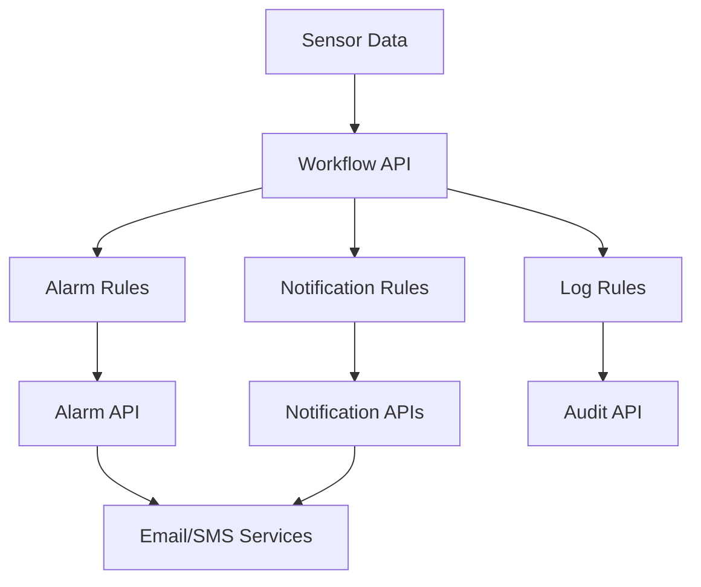

# Sensors-Report-Workflow.API

[](https://dotnet.microsoft.com/download/dotnet/8.0)
[](https://www.docker.com/)
[](../LICENSE)

## Overview

The Sensors-Report-Workflow.API is a microservice that provides workflow management capabilities within the SensorsReport ecosystem. This service enables the creation, management, and execution of automated workflows for sensor data processing, alerting, and business process automation. It supports defining complex workflows that can be triggered by sensor events, schedules, or external triggers.

## Features

### Core Functionality
- **Workflow CRUD Operations**: Complete Create, Read, Update, Delete operations for workflow definitions
- **In-Memory Storage**: Fast in-memory workflow storage for demonstration and testing
- **Query Support**: Search workflows by name with query filtering
- **JWT Authentication**: Secure API access with Keycloak integration
- **RESTful API**: Standard HTTP methods with JSON responses

### Workflow Management
- **Dynamic Workflow Creation**: Define workflows through API calls
- **Workflow Search**: Query workflows with text-based filtering
- **Flexible Schema**: Extensible workflow model for various use cases
- **Unique Identification**: Automatic UUID generation for workflow instances

### Security Features
- **JWT Bearer Authentication**: Secure access with token-based authentication
- **Keycloak Integration**: Enterprise-grade identity and access management
- **Authorization**: Role-based access control for workflow operations
- **Swagger Documentation**: Interactive API documentation with security integration

### Development Features
- **Automatic Versioning**: Build-time version increment with custom scripts
- **Structured Logging**: Comprehensive logging with NLog integration
- **Health Monitoring**: Application startup and error tracking
- **Development Tools**: Swagger UI for API testing and exploration

## Technology Stack

- **.NET 8.0**: Core framework for high-performance web APIs
- **ASP.NET Core**: Web framework for RESTful API development
- **JWT Bearer**: Token-based authentication
- **Keycloak**: Identity and access management integration
- **NLog**: Structured logging framework
- **Swagger/OpenAPI**: API documentation and testing
- **Docker**: Containerization for deployment
- **Kubernetes**: Orchestration and scaling

## Project Structure

```
Sensors-Report-Workflow.API/
├── Controllers/
│   └── WorkflowController.cs        # Main workflow API controller
├── Dockerfile                       # Container build configuration
├── Program.cs                       # Application entry point and configuration
├── Sensors-Report-Workflow.API.csproj  # Project dependencies and build config
├── kubernetes.yaml                  # Kubernetes deployment manifests
├── nlog.config                      # Logging configuration
├── increment_version.sh             # Version management script
├── d.sh                            # Development helper script
└── README.md                       # This documentation
```

## API Reference

### Base URL
- **Local Development**: `http://localhost:5000/api/workflow`
- **Production**: `https://your-domain/api/workflow`

### Authentication
All endpoints require JWT Bearer authentication via Keycloak.

### Endpoints

#### GET /api/workflow
Retrieve a list of workflows with optional search filtering.

**Query Parameters:**
- `q` (string, optional): Search query to filter workflows by name

**Headers:**
- `Authorization: Bearer <jwt-token>` (required)

**Response:**
```json
[
  {
    "id": "550e8400-e29b-41d4-a716-446655440000",
    "name": "Temperature Monitoring Workflow",
    "description": "Automated workflow for monitoring temperature sensors"
  },
  {
    "id": "6ba7b810-9dad-11d1-80b4-00c04fd430c8",
    "name": "Alarm Processing Workflow",
    "description": "Workflow for processing and routing alarm notifications"
  }
]
```

**Status Codes:**
- `200 OK`: Workflows retrieved successfully
- `401 Unauthorized`: Invalid or missing authentication token
- `500 Internal Server Error`: Server error

#### POST /api/workflow
Create a new workflow definition.

**Headers:**
- `Content-Type: application/json`
- `Authorization: Bearer <jwt-token>` (required)

**Request Body:**
```json
{
  "name": "Sensor Data Processing Workflow",
  "description": "Automated processing pipeline for incoming sensor data"
}
```

**Response:**
```json
{
  "id": "123e4567-e89b-12d3-a456-426614174000",
  "name": "Sensor Data Processing Workflow",
  "description": "Automated processing pipeline for incoming sensor data"
}
```

**Status Codes:**
- `201 Created`: Workflow created successfully
- `400 Bad Request`: Invalid workflow data
- `401 Unauthorized`: Invalid or missing authentication token
- `500 Internal Server Error`: Creation failed

#### GET /api/workflow/{WorkflowId}
Retrieve a specific workflow by ID.

**Path Parameters:**
- `WorkflowId` (string, required): Unique identifier of the workflow

**Headers:**
- `Authorization: Bearer <jwt-token>` (required)

**Response:**
```json
{
  "id": "123e4567-e89b-12d3-a456-426614174000",
  "name": "Sensor Data Processing Workflow",
  "description": "Automated processing pipeline for incoming sensor data"
}
```

**Status Codes:**
- `200 OK`: Workflow retrieved successfully
- `404 Not Found`: Workflow not found
- `401 Unauthorized`: Invalid or missing authentication token
- `500 Internal Server Error`: Server error

## Data Models

### Workflow Entity
The basic workflow model that defines automated process flows:

```json
{
  "id": "123e4567-e89b-12d3-a456-426614174000",
  "name": "Temperature Alert Workflow",
  "description": "Monitors temperature sensors and triggers alerts when thresholds are exceeded"
}
```

### Core Properties
- **id**: Unique identifier (UUID format, auto-generated if not provided)
- **name**: Human-readable workflow name
- **description**: Detailed workflow description

### Extended Properties (Future Enhancement)
The workflow model is designed to be extensible for additional properties:
- **triggers**: Event triggers that start the workflow
- **steps**: Sequential or parallel workflow steps
- **conditions**: Conditional logic for workflow branching
- **outputs**: Results and artifacts produced by the workflow
- **schedule**: Time-based triggers for workflow execution
- **status**: Current workflow status (active, paused, completed)

## Getting Started

### Prerequisites
- .NET 8.0 SDK
- Keycloak server for authentication
- Docker (for containerized deployment)

### Local Development

#### 1. Clone and Setup
```bash
cd Sensors-Report-Workflow.API
dotnet restore
```

#### 2. Configure Authentication
```bash
# Keycloak Configuration
export Keycloak__Authority="http://localhost:8080/realms/sr"
export Keycloak__RequireHttpsMetadata="false"

# Application Configuration
export ASPNETCORE_ENVIRONMENT="Development"
export ASPNETCORE_URLS="http://localhost:5000"
```

#### 3. Run the Application
```bash
dotnet run
```

The API will be available at `http://localhost:5000` with Swagger UI at `http://localhost:5000/swagger`.

#### 4. Test Basic Functionality
```bash
# Get JWT token from Keycloak first
TOKEN="your-jwt-token-here"

# Get all workflows
curl -H "Authorization: Bearer $TOKEN" http://localhost:5000/api/workflow

# Create a workflow
curl -X POST http://localhost:5000/api/workflow \
  -H "Content-Type: application/json" \
  -H "Authorization: Bearer $TOKEN" \
  -d '{
    "name": "Test Workflow",
    "description": "A simple test workflow"
  }'

# Search workflows
curl -H "Authorization: Bearer $TOKEN" \
     "http://localhost:5000/api/workflow?q=Test"
```

### Docker Deployment

#### Build Container
```bash
# From the Sensors-Report-Workflow.API directory
docker build -t sensors-report-workflow-api:latest .
```

#### Run Container
```bash
docker run -d \
  --name workflow-api \
  -p 80:80 \
  -e Keycloak__Authority="http://keycloak:8080/realms/sr" \
  sensors-report-workflow-api:latest
```

### Kubernetes Deployment

Deploy using the provided Kubernetes manifests:
```bash
kubectl apply -f kubernetes.yaml
```

## Configuration

### Keycloak Integration
The service integrates with Keycloak for authentication:

```json
{
  "Keycloak": {
    "Authority": "http://localhost:8080/realms/sr",
    "RequireHttpsMetadata": false
  }
}
```

### JWT Configuration
JWT authentication is configured with the following validation parameters:
- **ValidateIssuer**: true - Validates the token issuer
- **ValidateAudience**: false - Audience validation disabled
- **ValidateLifetime**: true - Validates token expiration
- **ValidateIssuerSigningKey**: true - Validates token signature

### Environment Variables

| Variable | Description | Default |
|----------|-------------|---------|
| `Keycloak__Authority` | Keycloak realm authority URL | `http://localhost:8080/realms/sr` |
| `Keycloak__RequireHttpsMetadata` | Require HTTPS for metadata | `false` |
| `ASPNETCORE_ENVIRONMENT` | Application environment | `Production` |
| `ASPNETCORE_URLS` | Application URLs | `http://*:80` |

## Usage Examples

### Authentication Setup

First, obtain a JWT token from your Keycloak server:

```bash
# Get access token from Keycloak
TOKEN=$(curl -X POST "http://localhost:8080/realms/sr/protocol/openid-connect/token" \
  -H "Content-Type: application/x-www-form-urlencoded" \
  -d "grant_type=client_credentials" \
  -d "client_id=your-client-id" \
  -d "client_secret=your-client-secret" \
  | jq -r '.access_token')
```

### Workflow Management

#### Creating Workflows
```bash
# Create a temperature monitoring workflow
curl -X POST http://localhost:5000/api/workflow \
  -H "Content-Type: application/json" \
  -H "Authorization: Bearer $TOKEN" \
  -d '{
    "name": "Temperature Monitoring Workflow",
    "description": "Monitors temperature sensors and triggers alerts for threshold violations"
  }'

# Create an alarm processing workflow
curl -X POST http://localhost:5000/api/workflow \
  -H "Content-Type: application/json" \
  -H "Authorization: Bearer $TOKEN" \
  -d '{
    "name": "Alarm Processing Workflow",
    "description": "Processes incoming alarms and routes notifications to appropriate channels"
  }'
```

#### Retrieving Workflows
```bash
# Get all workflows
curl -H "Authorization: Bearer $TOKEN" \
     http://localhost:5000/api/workflow

# Search workflows by name
curl -H "Authorization: Bearer $TOKEN" \
     "http://localhost:5000/api/workflow?q=temperature"

# Get specific workflow by ID
curl -H "Authorization: Bearer $TOKEN" \
     http://localhost:5000/api/workflow/123e4567-e89b-12d3-a456-426614174000
```

### Integration Examples

#### Workflow-based Sensor Processing
```bash
# Create a comprehensive sensor data workflow
curl -X POST http://localhost:5000/api/workflow \
  -H "Content-Type: application/json" \
  -H "Authorization: Bearer $TOKEN" \
  -d '{
    "name": "Comprehensive Sensor Data Pipeline",
    "description": "End-to-end workflow for sensor data ingestion, validation, rule evaluation, and notification routing"
  }'
```

#### Maintenance Workflow
```bash
# Create a maintenance scheduling workflow
curl -X POST http://localhost:5000/api/workflow \
  -H "Content-Type: application/json" \
  -H "Authorization: Bearer $TOKEN" \
  -d '{
    "name": "Predictive Maintenance Workflow",
    "description": "Analyzes sensor trends to predict equipment maintenance needs and schedule interventions"
  }'
```

## Architecture and Integration

### SensorsReport Ecosystem Integration
The Workflow API serves as the orchestration layer for:



### Workflow Execution Context
- **Trigger Events**: Sensor data changes, alarms, scheduled events
- **Processing Steps**: Rule evaluation, data transformation, notification routing
- **Output Actions**: Create alarms, send notifications, log events, update entities

### Integration Patterns
- **Event-Driven**: Workflows triggered by sensor events and system changes
- **Scheduled**: Time-based workflow execution for maintenance and reporting
- **On-Demand**: Manual workflow execution for testing and administration

## Monitoring and Observability

### Application Logging
The service uses NLog for comprehensive logging:

```csharp
// Application startup logging
logger.Info("Application starting...");
logger.Info($"Build Version: {version}");

// Error handling with detailed context
logger.Error(ex, "Application startup failed");
```

### Health Monitoring
- **Startup Tracking**: Application initialization and version logging
- **Error Handling**: Comprehensive exception logging and graceful failure
- **Resource Monitoring**: Memory and CPU usage tracking
- **Authentication Status**: JWT validation and authorization tracking

### Performance Metrics
Monitor these key metrics:
- **API Request Rate**: Workflow operations per second
- **Response Times**: Average API response latency
- **Authentication Success**: JWT validation success rate
- **Workflow Creation Rate**: New workflows created per time period
- **Search Performance**: Query response times and result accuracy

### Logging Categories
- **Information**: Successful operations and application status
- **Warning**: Non-critical issues and configuration warnings
- **Error**: Failed operations and system errors

## Error Handling

### Authentication Errors
```json
{
  "error": "Unauthorized",
  "message": "Invalid or expired JWT token",
  "status": 401
}
```

### Validation Errors
```json
{
  "error": "Bad Request",
  "message": "Workflow name is required",
  "status": 400
}
```

### Not Found Errors
```json
{
  "error": "Not Found",
  "message": "Workflow with ID '123e4567-e89b-12d3-a456-426614174000' not found",
  "status": 404
}
```

### Error Recovery
- **Graceful Degradation**: Service continues operating when individual workflows fail
- **Retry Logic**: Automatic retry for transient failures
- **Circuit Breaker**: Protection against cascading failures
- **Logging**: Comprehensive error logging for debugging and monitoring

## Performance Considerations

### In-Memory Storage
- **Fast Access**: Lightning-fast read and write operations
- **Thread Safety**: Concurrent dictionary for thread-safe operations
- **Memory Efficiency**: Optimized for small to medium workflow collections
- **Scalability**: Consider persistent storage for large-scale deployments

### API Performance
- **Async Operations**: Non-blocking I/O for better throughput
- **Efficient Filtering**: Optimized search algorithms
- **Connection Pooling**: HTTP client optimization
- **Response Caching**: Consider caching for frequently accessed workflows

### Scaling Strategies
```yaml
# Kubernetes horizontal scaling
apiVersion: apps/v1
kind: Deployment
metadata:
  name: workflow-api
spec:
  replicas: 3  # Multiple instances for high availability
  template:
    spec:
      containers:
      - name: workflow-api
        resources:
          requests:
            memory: "128Mi"
            cpu: "100m"
          limits:
            memory: "512Mi"
            cpu: "500m"
```

## Security Considerations

### Authentication Security
- **JWT Validation**: Comprehensive token validation with multiple checks
- **Secure Defaults**: HTTPS metadata validation disabled only for development
- **Token Lifecycle**: Proper token expiration and renewal handling
- **Authorization**: Role-based access control through JWT claims

### API Security
- **Input Validation**: Comprehensive validation of all API inputs
- **Rate Limiting**: Protection against abuse (typically handled at gateway level)
- **CORS Configuration**: Proper cross-origin resource sharing setup
- **Error Information**: Sanitized error messages without sensitive data

### Data Protection
- **In-Transit Security**: HTTPS/TLS for all API communications
- **At-Rest Security**: Secure storage considerations for persistent workflows
- **Audit Trail**: Complete logging of all workflow operations
- **Access Control**: Fine-grained permissions for workflow operations

## Version Management

The project includes automatic version management:

### Version Increment Script
```bash
#!/bin/bash
# increment_version.sh - Automatically increments patch version
VERSION_FILE="version.txt"
if [ -f "$VERSION_FILE" ]; then
    OLD_VERSION=$(cat "$VERSION_FILE" | tr -d '\r\n' | tr -d ' ')
    MAJOR=$(echo "$OLD_VERSION" | cut -d. -f1)
    MINOR=$(echo "$OLD_VERSION" | cut -d. -f2)
    PATCH=$(echo "$OLD_VERSION" | cut -d. -f3)
    PATCH=$((10#$PATCH + 1))
    echo "$MAJOR.$MINOR.$PATCH" > "$VERSION_FILE"
else
    echo "1.0.0.1" > "$VERSION_FILE"
fi
```

### Build Integration
- **Automatic Increment**: Version incremented on each build
- **Version Logging**: Current version logged at startup
- **Assembly Metadata**: Version embedded in compiled assemblies

## Dependencies

### NuGet Packages
- `Microsoft.AspNetCore.Authentication.JwtBearer` (8.0.0): JWT authentication
- `Microsoft.AspNetCore.OpenApi` (8.0.15): OpenAPI/Swagger support
- `Microsoft.IdentityModel.Tokens` (7.0.3): Token validation
- `NLog` (5.2.8): Logging framework
- `NLog.Web.AspNetCore` (5.3.8): ASP.NET Core integration
- `Swashbuckle.AspNetCore` (6.6.2): Swagger UI

### External Dependencies
- **Keycloak**: Identity and access management server
- **JWT Provider**: Token issuing and validation service

### Runtime Dependencies
- **.NET 8.0 Runtime**: Core runtime environment
- **ASP.NET Core Runtime**: Web framework runtime

## Related Services

- **SensorsReport.Business.Broker.API**: Orchestrates business logic that workflows can trigger
- **SensorsReport.Alarm.API**: Creates alarms that can be processed by workflows
- **SensorsReport.NotificationRule.API**: Manages notification routing rules used in workflows
- **SensorsReport.Audit.API**: Logs workflow execution and management activities
- **SensorsReport.Webhook.API**: Receives external triggers that can initiate workflows

## Contributing

### Development Guidelines

1. **Authentication Testing**: Always test with valid JWT tokens
2. **Error Handling**: Implement comprehensive error handling for all operations
3. **Logging**: Add appropriate logging for debugging and monitoring
4. **Version Management**: Use the increment script for version tracking
5. **Security**: Follow security best practices for API development

### Future Enhancements

1. **Persistent Storage**: Replace in-memory storage with database backend
2. **Workflow Execution**: Implement actual workflow execution engine
3. **Step Definitions**: Add support for workflow steps and conditions
4. **Trigger Management**: Implement event-based workflow triggers
5. **Scheduling**: Add time-based workflow scheduling
6. **Monitoring**: Enhanced workflow execution monitoring and metrics

### Pull Request Process

1. Fork the repository
2. Create a feature branch (`git checkout -b feature/workflow-enhancement`)
3. Make your changes with tests
4. Test authentication and authorization
5. Update documentation
6. Submit a pull request

## Troubleshooting

### Common Issues

#### Authentication Failures
```bash
# Verify Keycloak connectivity
curl http://localhost:8080/realms/sr/.well-known/openid_configuration

# Test token validation
curl -H "Authorization: Bearer $TOKEN" http://localhost:5000/api/workflow
```

#### Service Won't Start
```bash
# Check logs for startup errors
docker logs workflow-api

# Common causes:
# - Keycloak not accessible
# - Port conflicts
# - Invalid configuration
```

#### Version Management Issues
```bash
# Check version file
cat version.txt

# Manually run version script
bash increment_version.sh

# Verify version logging
grep "Build Version" logs/application.log
```

### Debug Commands
```bash
# Check service health
curl http://localhost:5000/swagger

# View service logs
kubectl logs -f deployment/workflow-api

# Test authentication
curl -v -H "Authorization: Bearer $TOKEN" http://localhost:5000/api/workflow

# Check environment variables
kubectl exec -it workflow-api-pod -- env | grep Keycloak
```

## License

This project is part of the SensorsReport system for AerOS. See the root LICENSE file for details.

## Support

For issues with the Workflow API:

1. **Check Keycloak Integration**: Verify identity provider connectivity and configuration
2. **Verify JWT Tokens**: Ensure tokens are valid and properly formatted
3. **Test API Endpoints**: Use Swagger UI for interactive testing
4. **Review Logs**: Check application logs for detailed error information
5. **Monitor Performance**: Track API response times and resource usage
6. **Contact Support**: Reach out to the SensorsReport development team

## Changelog

### Version 1.0.0
- Initial release with basic workflow CRUD operations
- JWT authentication with Keycloak integration
- In-memory workflow storage for demonstration
- Swagger UI for API documentation and testing
- Automatic version management system
- Docker and Kubernetes deployment support
- Comprehensive logging and error handling

### Future Versions
- Persistent storage backend implementation
- Workflow execution engine
- Event-driven workflow triggers
- Scheduling and automation features
- Advanced monitoring and metrics
- Enhanced security and audit capabilities
