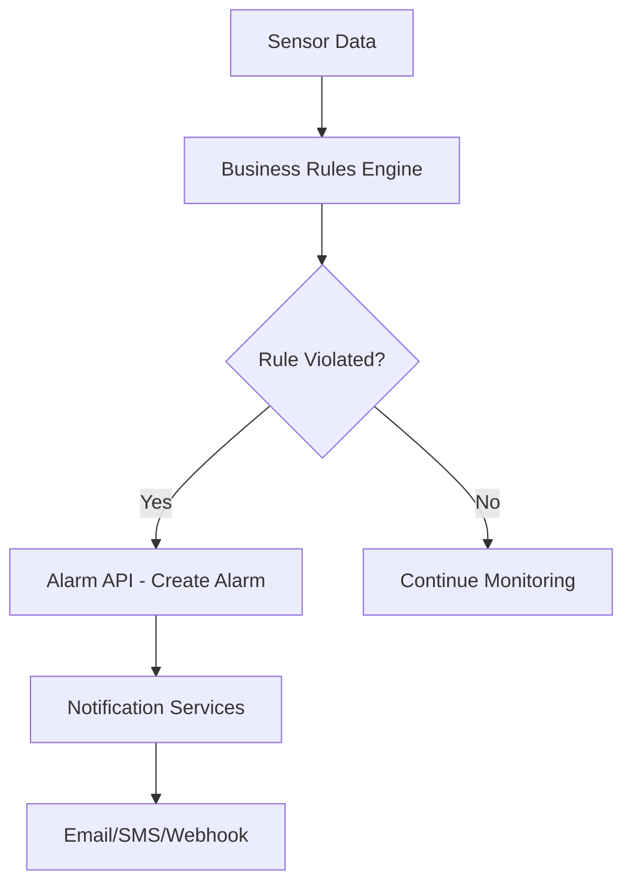

# SensorsReport.Alarm.API

[](https://dotnet.microsoft.com/download/dotnet/8.0)
[](https://www.docker.com/)
[](../LICENSE)

## Overview

The SensorsReport.Alarm.API is a microservice that provides comprehensive alarm management functionality for the SensorsReport IoT platform. This API serves as the central hub for creating, managing, and querying alarm entities within the FIWARE NGSI-LD ecosystem. It handles alarm creation from sensor data violations, alarm lifecycle management, and provides RESTful endpoints for alarm operations with full multi-tenant support.

## Features

### Core Functionality
- **Alarm CRUD Operations**: Complete Create, Read, Update, Delete operations for alarm entities
- **Multi-tenant Support**: Full tenant isolation using NGSILD-Tenant headers
- **FIWARE NGSI-LD Integration**: Native integration with Orion-LD Context Broker
- **RESTful API**: Standard HTTP methods with JSON responses
- **Pagination Support**: Efficient handling of large alarm datasets

### Alarm Management
- **Alarm Entity Storage**: Persistent storage of alarm entities in Orion-LD
- **Flexible Querying**: Support for filtering, pagination, and tenant-scoped queries
- **Alarm Lifecycle**: Track alarm states from creation to resolution
- **Structured Metadata**: Rich alarm metadata including severity, timestamps, and relationships

### Integration Features
- **Orion-LD Native**: Direct integration with FIWARE Orion-LD Context Broker
- **Tenant Awareness**: Automatic tenant context handling for all operations
- **Health Monitoring**: Built-in health checks for service monitoring
- **Structured Logging**: Comprehensive logging with NLog integration

## Technology Stack

- **.NET 8.0**: Core framework for high-performance web APIs
- **ASP.NET Core**: Web framework for RESTful API development
- **MongoDB Driver**: Database connectivity for Orion-LD integration
- **FIWARE Orion-LD**: NGSI-LD context broker for entity storage
- **NLog**: Structured logging framework
- **Docker**: Containerization for deployment
- **Kubernetes**: Orchestration with Flux GitOps

## Project Structure

```
SensorsReport.Alarm.API/
├── Controllers/
│   └── AlarmController.cs          # Main API controller for alarm operations
├── Services/
│   └── AlarmService.cs             # Business logic and Orion-LD integration
├── Properties/                     # Assembly properties
├── flux/                          # Kubernetes deployment manifests
├── Dockerfile                     # Container build configuration
├── Program.cs                     # Application entry point and DI setup
├── appsettings.json              # Default configuration
├── nlog.config                   # Logging configuration
└── README.md                     # This documentation
```

## API Reference

### Base URL
- **Local Development**: `http://localhost:5000/api/alarm`
- **Production**: `https://your-domain/api/alarm`

### Authentication
All endpoints require tenant identification via the `NGSILD-Tenant` header.

### Endpoints

#### GET /api/alarm
Retrieve a list of alarms for the current tenant.

**Query Parameters:**
- `limit` (int, optional): Maximum number of alarms to return (default: 100)
- `offset` (int, optional): Number of alarms to skip for pagination (default: 0)

**Headers:**
- `NGSILD-Tenant: <tenant-id>` (required)

**Response:**
```json
[
  {
    "id": "alarm-001",
    "type": "Alarm",
    "@context": "https://uri.etsi.org/ngsi-ld/v1/ngsi-ld-core-context-v1.6.jsonld"
  }
]
```

**Status Codes:**
- `200 OK`: Alarms retrieved successfully
- `404 Not Found`: No alarms found for the tenant
- `400 Bad Request`: Invalid query parameters
- `500 Internal Server Error`: Server error

#### GET /api/alarm/{alarmId}
Retrieve a specific alarm by ID.

**Path Parameters:**
- `alarmId` (string, required): Unique identifier of the alarm

**Headers:**
- `NGSILD-Tenant: <tenant-id>` (required)

**Response:**
```json
{
  "id": "alarm-001",
  "type": "Alarm",
  "severity": {
    "type": "Property",
    "value": "high"
  },
  "status": {
    "type": "Property", 
    "value": "active"
  },
  "triggeredAt": {
    "type": "Property",
    "value": "2024-01-01T12:00:00Z"
  },
  "@context": "https://uri.etsi.org/ngsi-ld/v1/ngsi-ld-core-context-v1.6.jsonld"
}
```

**Status Codes:**
- `200 OK`: Alarm retrieved successfully
- `404 Not Found`: Alarm not found
- `400 Bad Request`: Invalid alarm ID
- `500 Internal Server Error`: Server error

#### POST /api/alarm
Create a new alarm entity.

**Headers:**
- `Content-Type: application/json`
- `NGSILD-Tenant: <tenant-id>` (required)

**Request Body:**
```json
{
  "id": "alarm-001",
  "type": "Alarm",
  "severity": {
    "type": "Property",
    "value": "high"
  },
  "status": {
    "type": "Property",
    "value": "active"
  },
  "device": {
    "type": "Relationship",
    "object": "urn:ngsi-ld:Device:sensor-001"
  }
}
```

**Response:**
```json
{
  "id": "alarm-001",
  "type": "Alarm",
  "severity": {
    "type": "Property",
    "value": "high"
  }
}
```

**Status Codes:**
- `201 Created`: Alarm created successfully
- `400 Bad Request`: Invalid alarm data
- `500 Internal Server Error`: Creation failed

#### PUT /api/alarm/{alarmId}
Update an existing alarm entity (full replacement).

**Path Parameters:**
- `alarmId` (string, required): Unique identifier of the alarm

**Headers:**
- `Content-Type: application/json`
- `NGSILD-Tenant: <tenant-id>` (required)

**Request Body:**
```json
{
  "id": "alarm-001",
  "type": "Alarm",
  "status": {
    "type": "Property",
    "value": "resolved"
  }
}
```

**Response:**
```json
{
  "id": "alarm-001", 
  "type": "Alarm",
  "status": {
    "type": "Property",
    "value": "resolved"
  }
}
```

**Status Codes:**
- `200 OK`: Alarm updated successfully
- `404 Not Found`: Alarm not found
- `400 Bad Request`: Invalid alarm data
- `500 Internal Server Error`: Update failed

#### PATCH /api/alarm/{alarmId}
Partially update an existing alarm entity.

**Path Parameters:**
- `alarmId` (string, required): Unique identifier of the alarm

**Headers:**
- `Content-Type: application/json`
- `NGSILD-Tenant: <tenant-id>` (required)

**Request Body:**
```json
{
  "status": {
    "type": "Property",
    "value": "acknowledged"
  }
}
```

**Response:**
```json
{
  "id": "alarm-001",
  "type": "Alarm", 
  "status": {
    "type": "Property",
    "value": "acknowledged"
  }
}
```

**Status Codes:**
- `200 OK`: Alarm updated successfully
- `404 Not Found`: Alarm not found
- `400 Bad Request`: Invalid patch data
- `500 Internal Server Error`: Update failed

#### DELETE /api/alarm/{alarmId}
Delete an alarm entity.

**Path Parameters:**
- `alarmId` (string, required): Unique identifier of the alarm

**Headers:**
- `NGSILD-Tenant: <tenant-id>` (required)

**Response:**
No content

**Status Codes:**
- `204 No Content`: Alarm deleted successfully
- `404 Not Found`: Alarm not found
- `400 Bad Request`: Invalid alarm ID
- `500 Internal Server Error`: Deletion failed

## Data Models

### Alarm Entity (NGSI-LD)
Alarms are NGSI-LD entities that extend the base EntityModel and represent alarm conditions in the system:

```json
{
  "id": "urn:ngsi-ld:Alarm:alarm-001",
  "type": "Alarm",
  "severity": {
    "type": "Property",
    "value": "high"
  },
  "status": {
    "type": "Property",
    "value": "active"
  },
  "message": {
    "type": "Property",
    "value": "Temperature threshold exceeded"
  },
  "triggeredAt": {
    "type": "Property",
    "value": "2024-01-01T12:00:00Z"
  },
  "device": {
    "type": "Relationship",
    "object": "urn:ngsi-ld:Device:sensor-001"
  },
  "location": {
    "type": "GeoProperty",
    "value": {
      "type": "Point",
      "coordinates": [40.7128, -74.0060]
    }
  },
  "@context": "https://uri.etsi.org/ngsi-ld/v1/ngsi-ld-core-context-v1.6.jsonld"
}
```

### Common Properties
- **id**: Unique identifier (URN format recommended)
- **type**: Entity type (always "Alarm")
- **severity**: Alarm severity level (low, medium, high, critical)
- **status**: Current alarm status (active, acknowledged, resolved, suppressed)
- **message**: Human-readable alarm description
- **triggeredAt**: Timestamp when alarm was triggered
- **device**: Reference to the device/sensor that triggered the alarm
- **location**: Geographic location (optional)

### Severity Levels
- **low**: Informational alerts, no immediate action required
- **medium**: Warning conditions that should be monitored  
- **high**: Error conditions requiring attention
- **critical**: Severe conditions requiring immediate action

### Status Values
- **active**: Alarm is currently active and unacknowledged
- **acknowledged**: Alarm has been acknowledged by an operator
- **resolved**: Alarm condition has been resolved
- **suppressed**: Alarm is temporarily suppressed

## Getting Started

### Prerequisites
- .NET 8.0 SDK
- Access to FIWARE Orion-LD Context Broker
- Docker (for containerized deployment)

### Local Development

#### 1. Clone and Setup
```bash
cd SensorsReport.Alarm.API
dotnet restore
```

#### 2. Configure Environment Variables
```bash
# Orion-LD Context Broker Configuration
export ORION_LD_HOST="localhost"
export ORION_LD_PORT="1026"

# Application Configuration
export ASPNETCORE_ENVIRONMENT="Development"
export ASPNETCORE_URLS="http://localhost:5000"

# Default tenant (if header not provided)
export NGSILD_TENANT="default"
```

#### 3. Run the Application
```bash
dotnet run
```

The API will be available at `http://localhost:5000`.

#### 4. Test Basic Functionality
```bash
# Health check
curl http://localhost:5000/health

# Get alarms (requires tenant header)
curl -H "NGSILD-Tenant: mytenant" http://localhost:5000/api/alarm

# Create an alarm
curl -X POST http://localhost:5000/api/alarm \
  -H "Content-Type: application/json" \
  -H "NGSILD-Tenant: mytenant" \
  -d '{
    "id": "alarm-001",
    "type": "Alarm",
    "severity": {"type": "Property", "value": "high"},
    "status": {"type": "Property", "value": "active"}
  }'
```

### Docker Deployment

#### Build Container
```bash
# From the root SensorsReport directory
docker build -f SensorsReport.Alarm.API/Dockerfile -t sensorsreport-alarm-api:latest .
```

#### Run Container
```bash
docker run -d \
  --name alarm-api \
  -p 80:80 \
  -e ORION_LD_HOST="orion.example.com" \
  -e ORION_LD_PORT="1026" \
  sensorsreport-alarm-api:latest
```

### Kubernetes Deployment

Deploy using Flux manifests:
```bash
kubectl apply -f flux/
```

## Configuration

### Orion-LD Integration
The service integrates with FIWARE Orion-LD Context Broker for entity storage:

```json
{
  "OrionLD": {
    "Host": "localhost",
    "Port": 1026,
    "UseHttps": false,
    "BasePath": "/ngsi-ld/v1"
  }
}
```

### Environment Variables

| Variable | Description | Default |
|----------|-------------|---------|
| `ORION_LD_HOST` | Orion-LD Context Broker host | `localhost` |
| `ORION_LD_PORT` | Orion-LD Context Broker port | `1026` |
| `ORION_LD_USE_HTTPS` | Use HTTPS for Orion-LD connection | `false` |
| `NGSILD_TENANT` | Default tenant for operations | `default` |
| `ASPNETCORE_ENVIRONMENT` | Application environment | `Production` |
| `ASPNETCORE_URLS` | Application URLs | `http://*:80` |

## Usage Examples

### Basic Alarm Operations

#### Creating an Alarm
```bash
curl -X POST http://localhost:5000/api/alarm \
  -H "Content-Type: application/json" \
  -H "NGSILD-Tenant: manufacturing" \
  -d '{
    "id": "temperature-alarm-001",
    "type": "Alarm",
    "severity": {
      "type": "Property",
      "value": "high"
    },
    "status": {
      "type": "Property", 
      "value": "active"
    },
    "message": {
      "type": "Property",
      "value": "Temperature exceeded 80°C on sensor TMP-001"
    },
    "device": {
      "type": "Relationship",
      "object": "urn:ngsi-ld:Device:TMP-001"
    }
  }'
```

#### Retrieving Alarms
```bash
# Get all alarms for a tenant
curl -H "NGSILD-Tenant: manufacturing" \
     http://localhost:5000/api/alarm

# Get alarms with pagination
curl -H "NGSILD-Tenant: manufacturing" \
     "http://localhost:5000/api/alarm?limit=10&offset=0"

# Get specific alarm
curl -H "NGSILD-Tenant: manufacturing" \
     http://localhost:5000/api/alarm/temperature-alarm-001
```

#### Updating Alarm Status
```bash
# Acknowledge an alarm
curl -X PATCH http://localhost:5000/api/alarm/temperature-alarm-001 \
  -H "Content-Type: application/json" \
  -H "NGSILD-Tenant: manufacturing" \
  -d '{
    "status": {
      "type": "Property",
      "value": "acknowledged"
    }
  }'

# Resolve an alarm
curl -X PUT http://localhost:5000/api/alarm/temperature-alarm-001 \
  -H "Content-Type: application/json" \
  -H "NGSILD-Tenant: manufacturing" \
  -d '{
    "id": "temperature-alarm-001",
    "type": "Alarm",
    "status": {
      "type": "Property",
      "value": "resolved"
    },
    "resolvedAt": {
      "type": "Property",
      "value": "2024-01-01T14:30:00Z"
    }
  }'
```

### Multi-tenant Examples

#### Different Tenants, Same Alarm IDs
```bash
# Tenant A - Manufacturing
curl -X POST http://localhost:5000/api/alarm \
  -H "NGSILD-Tenant: manufacturing" \
  -d '{"id": "alarm-001", "type": "Alarm", "severity": {"type": "Property", "value": "high"}}'

# Tenant B - Healthcare  
curl -X POST http://localhost:5000/api/alarm \
  -H "NGSILD-Tenant: healthcare" \
  -d '{"id": "alarm-001", "type": "Alarm", "severity": {"type": "Property", "value": "medium"}}'

# Each tenant sees only their own alarms
curl -H "NGSILD-Tenant: manufacturing" http://localhost:5000/api/alarm/alarm-001
curl -H "NGSILD-Tenant: healthcare" http://localhost:5000/api/alarm/alarm-001
```

### Integration with Business Rules

#### Alarm Created by Business Rule
```bash
# Business rule triggers alarm creation
curl -X POST http://localhost:5000/api/alarm \
  -H "Content-Type: application/json" \
  -H "NGSILD-Tenant: factory1" \
  -d '{
    "id": "vibration-alarm-002",
    "type": "Alarm",
    "severity": {
      "type": "Property", 
      "value": "critical"
    },
    "status": {
      "type": "Property",
      "value": "active"
    },
    "ruleTriggered": {
      "type": "Relationship",
      "object": "urn:ngsi-ld:BusinessRule:vibration-threshold"
    },
    "device": {
      "type": "Relationship", 
      "object": "urn:ngsi-ld:Device:VIBR-001"
    },
    "thresholdValue": {
      "type": "Property",
      "value": 15.7
    },
    "actualValue": {
      "type": "Property",
      "value": 22.3
    }
  }'
```

## Multi-tenancy

The API provides complete tenant isolation through:

### Tenant Identification
- **Header-based**: Uses `NGSILD-Tenant` header for tenant identification
- **Automatic Isolation**: All operations are automatically scoped to the tenant
- **Orion-LD Integration**: Tenant context is passed to Orion-LD for data isolation

### Data Isolation
```bash
# Tenant A operations
curl -H "NGSILD-Tenant: tenant-a" http://localhost:5000/api/alarm

# Tenant B operations  
curl -H "NGSILD-Tenant: tenant-b" http://localhost:5000/api/alarm

# Results are completely isolated between tenants
```

### Service Path Support
The API supports FIWARE service paths for additional context:
```bash
# Include service path for hierarchical organization
curl -H "NGSILD-Tenant: factory" \
     -H "Fiware-ServicePath: /building1/floor2" \
     http://localhost:5000/api/alarm
```

## Integration

### FIWARE Orion-LD Context Broker
The service integrates seamlessly with Orion-LD:

- **Entity Storage**: All alarms are stored as NGSI-LD entities
- **Query Capabilities**: Leverages Orion-LD's powerful query capabilities
- **Subscriptions**: Can be integrated with Orion-LD subscriptions for real-time updates
- **Temporal Queries**: Historical alarm data through Orion-LD temporal interface

### Business Rule Engine Integration


### Event Flow Example
1. **Sensor Update**: Temperature sensor reports 85°C
2. **Rule Evaluation**: Business rule detects threshold violation (>80°C)
3. **Alarm Creation**: Alarm API creates alarm entity
4. **Notification**: Alarm triggers notification workflows
5. **Acknowledgment**: Operator acknowledges alarm via API
6. **Resolution**: Temperature normalizes, alarm resolved

### SensorsReport Ecosystem Integration
- **Business Broker API**: Receives rule violations and creates alarms
- **Email API**: Sends alarm notifications via email
- **SMS API**: Sends critical alarm notifications via SMS
- **Webhook API**: Triggers custom webhooks for alarm events
- **Audit API**: Logs all alarm-related activities

## Monitoring and Observability

### Health Checks
The API provides built-in health monitoring:

```bash
# Check service health
curl http://localhost:5000/health

# Response
{
  "status": "Healthy",
  "totalDuration": "00:00:00.001"
}
```

### Logging
- **Framework**: NLog with structured logging
- **Tenant Context**: All logs include tenant information
- **Request Tracing**: Each request tracked with correlation IDs
- **Error Logging**: Comprehensive error logging with stack traces

### Log Examples
```csharp
// Successful alarm creation
logger.LogInformation("Alarm created successfully for tenant {TenantId}: {AlarmId}", 
    tenantId, alarmId);

// Error during alarm creation
logger.LogError(ex, "Failed to create alarm for tenant {TenantId}: {Error}", 
    tenantId, ex.Message);
```

### Performance Metrics
Monitor these key metrics:
- **Request Rate**: API requests per second
- **Response Time**: Average response latency
- **Success Rate**: Percentage of successful operations
- **Orion-LD Connection**: Context broker connectivity status
- **Memory Usage**: Service memory consumption

### Observability Integration
- **Structured Logs**: JSON-formatted logs for centralized logging
- **Health Endpoints**: Standard health check patterns
- **Error Tracking**: Detailed error information and stack traces
- **Performance Counters**: Request/response timing metrics

## Error Handling

### Standard Error Responses
All errors follow a consistent format:

```json
{
  "error": {
    "type": "ValidationError",
    "title": "Invalid Alarm Data", 
    "detail": "Alarm ID cannot be null or empty",
    "status": 400,
    "instance": "/api/alarm"
  }
}
```

### Common Error Scenarios

#### Missing Tenant Header
```bash
# Request without tenant header
curl http://localhost:5000/api/alarm

# Response: 400 Bad Request
{
  "error": {
    "type": "MissingTenantError",
    "title": "Tenant Required",
    "detail": "NGSILD-Tenant header is required for all operations"
  }
}
```

#### Alarm Not Found
```bash
# Request for non-existent alarm
curl -H "NGSILD-Tenant: mytenant" \
     http://localhost:5000/api/alarm/nonexistent

# Response: 404 Not Found
{
  "error": {
    "type": "NotFoundError", 
    "title": "Alarm Not Found",
    "detail": "Alarm with ID 'nonexistent' does not exist"
  }
}
```

#### Orion-LD Connection Error
```bash
# When Orion-LD is unavailable
curl -H "NGSILD-Tenant: mytenant" \
     http://localhost:5000/api/alarm

# Response: 500 Internal Server Error
{
  "error": {
    "type": "ServiceUnavailableError",
    "title": "Context Broker Unavailable", 
    "detail": "Unable to connect to Orion-LD Context Broker"
  }
}
```

### Retry Logic
The service implements retry logic for transient failures:
- **Connection Timeouts**: Automatic retry with exponential backoff
- **Network Errors**: Configurable retry attempts
- **Rate Limiting**: Respect Orion-LD rate limits

## Performance Considerations

### Throughput Optimization
- **Async Operations**: All Orion-LD calls are asynchronous
- **Connection Pooling**: HTTP client connection pooling
- **Efficient Queries**: Optimized NGSI-LD queries with proper pagination
- **Caching**: Consider implementing caching for frequently accessed alarms

### Resource Management
- **Memory Efficiency**: Streaming responses for large datasets
- **Connection Management**: Proper disposal of HTTP connections
- **Timeout Configuration**: Appropriate timeouts for Orion-LD calls

### Scaling Strategies
```yaml
# Kubernetes deployment scaling
apiVersion: apps/v1
kind: Deployment
metadata:
  name: alarm-api
spec:
  replicas: 3  # Multiple instances for high availability
  template:
    spec:
      containers:
      - name: alarm-api
        resources:
          requests:
            memory: "256Mi"
            cpu: "250m"
          limits:
            memory: "512Mi" 
            cpu: "500m"
```

## Security Considerations

### Multi-tenant Security
- **Tenant Isolation**: Strict tenant boundary enforcement
- **Data Separation**: Complete data isolation between tenants
- **Access Control**: Tenant-scoped access to all operations

### API Security
- **Input Validation**: Comprehensive validation of all inputs
- **SQL Injection Protection**: Parameterized queries and input sanitization
- **Rate Limiting**: Protection against abuse (typically handled at gateway level)
- **Error Information**: Sanitized error messages without sensitive data

### Orion-LD Security
- **Secure Communication**: TLS for Orion-LD communication in production
- **Authentication**: Service-to-service authentication if required
- **Network Security**: Proper network segmentation and firewall rules

## Troubleshooting

### Common Issues

#### Service Won't Start
```bash
# Check logs for startup errors
docker logs alarm-api

# Common causes:
# - Missing environment variables
# - Orion-LD not accessible
# - Port conflicts
```

#### Tenant Data Not Found
```bash
# Verify tenant header is included
curl -v -H "NGSILD-Tenant: mytenant" http://localhost:5000/api/alarm

# Check Orion-LD directly
curl -H "NGSILD-Tenant: mytenant" \
     http://orion:1026/ngsi-ld/v1/entities?type=Alarm
```

#### Orion-LD Connection Issues
```bash
# Test Orion-LD connectivity
curl http://orion:1026/version

# Check network connectivity
ping orion

# Verify DNS resolution
nslookup orion
```

### Debug Commands
```bash
# Check service health
curl http://localhost:5000/health

# View service logs
kubectl logs -f deployment/alarm-api

# Test Orion-LD integration
kubectl exec -it alarm-api-pod -- curl http://orion:1026/version

# Check environment variables
kubectl exec -it alarm-api-pod -- env | grep ORION
```

### Performance Debugging
```bash
# Monitor response times
curl -w "%{time_total}\n" http://localhost:5000/api/alarm

# Check Orion-LD performance
curl -w "%{time_total}\n" http://orion:1026/ngsi-ld/v1/entities?type=Alarm

# Monitor resource usage
kubectl top pods alarm-api
```

## Dependencies

### External Dependencies
- **FIWARE Orion-LD**: NGSI-LD Context Broker for entity storage
- **MongoDB**: Database backend for Orion-LD (indirect dependency)

### .NET Dependencies
```xml
<PackageReference Include="MongoDB.Driver" Version="3.4.0" />
```

### Runtime Dependencies
- **.NET 8.0 Runtime**: Core runtime environment
- **SensorsReport.Api.Core**: Shared core functionality
- **SensorsReport.OrionLD.Extensions**: Orion-LD integration extensions

## Related Services

- **SensorsReport.Business.Broker.API**: Evaluates business rules and creates alarms
- **SensorsReport.AlarmRule.API**: Manages alarm rule definitions
- **SensorsReport.Email.API**: Sends alarm notification emails
- **SensorsReport.SMS.API**: Sends alarm notification SMS messages
- **SensorsReport.Webhook.API**: Triggers alarm webhooks
- **SensorsReport.Audit.API**: Logs alarm-related activities
- **SensorsReport.NotificationRule.API**: Manages notification routing rules

## Contributing

When contributing to this service:

1. **Follow .NET Best Practices**: Use established coding standards
2. **Maintain NGSI-LD Compliance**: Ensure all entities follow NGSI-LD format
3. **Add Comprehensive Tests**: Include unit and integration tests
4. **Update Documentation**: Keep API documentation current
5. **Test Multi-tenancy**: Verify tenant isolation works correctly
6. **Performance Testing**: Ensure changes don't impact performance

### Development Workflow
1. Fork the repository
2. Create a feature branch (`git checkout -b feature/alarm-enhancement`)
3. Make your changes with tests
4. Verify multi-tenant functionality
5. Test with actual Orion-LD instance
6. Update documentation
7. Submit a pull request

## License

This project is part of the SensorsReport system for AerOS. See the root LICENSE file for details.

## Support

For issues with the Alarm API:

1. **Check Orion-LD Connectivity**: Verify context broker is accessible
2. **Verify Tenant Headers**: Ensure NGSILD-Tenant header is included
3. **Review Logs**: Check service logs for detailed error information
4. **Test with Health Endpoint**: Verify service is running correctly
5. **Contact Support**: Reach out to the SensorsReport development team

## Changelog

### Version 1.0.0
- Initial release with basic CRUD operations
- FIWARE NGSI-LD integration
- Multi-tenant support
- Orion-LD Context Broker integration
- Comprehensive error handling
- Health monitoring endpoints
- Docker and Kubernetes deployment support
