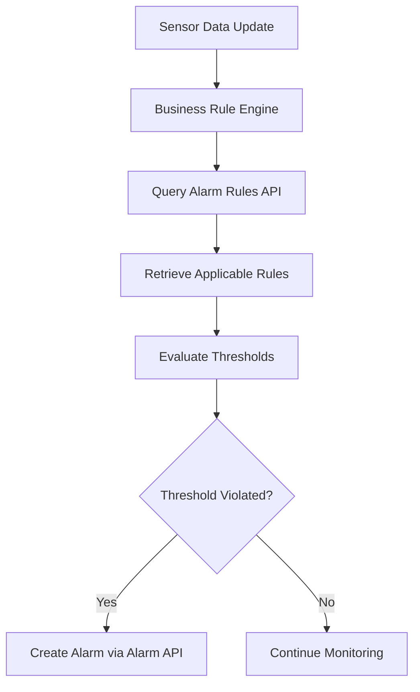

# SensorsReport.AlarmRule.API

[](https://dotnet.microsoft.com/download/dotnet/8.0)
[](https://www.docker.com/)
[](../LICENSE)

## Overview

The SensorsReport.AlarmRule.API is a microservice that provides comprehensive alarm rule management functionality for the SensorsReport IoT platform. This API serves as the central hub for creating, managing, and querying alarm rule definitions within the FIWARE NGSI-LD ecosystem. It enables administrators to define threshold-based rules that trigger alarms when sensor data violates specified conditions, supporting complex rule configurations with full multi-tenant isolation.

## Features

### Core Functionality
- **Alarm Rule CRUD Operations**: Complete Create, Read, Update, Delete operations for alarm rule entities
- **Multi-tenant Support**: Full tenant isolation using NGSILD-Tenant headers
- **FIWARE NGSI-LD Integration**: Native integration with Orion-LD Context Broker
- **RESTful API**: Standard HTTP methods with JSON responses
- **Pagination Support**: Efficient handling of large alarm rule datasets

### Rule Management
- **Threshold Definitions**: Define min/max thresholds for sensor values
- **Rule Templates**: Reusable rule templates for common scenarios
- **Flexible Configuration**: Support for various alarm conditions and parameters
- **Rule Validation**: Input validation for rule consistency and correctness

### Integration Features
- **Orion-LD Native**: Direct integration with FIWARE Orion-LD Context Broker
- **Tenant Awareness**: Automatic tenant context handling for all operations
- **Health Monitoring**: Built-in health checks for service monitoring
- **Structured Logging**: Comprehensive logging with NLog integration

## Technology Stack

- **.NET 8.0**: Core framework for high-performance web APIs
- **ASP.NET Core**: Web framework for RESTful API development
- **FIWARE Orion-LD**: NGSI-LD context broker for entity storage
- **NLog**: Structured logging framework
- **Docker**: Containerization for deployment
- **Kubernetes**: Orchestration with Flux GitOps

## Project Structure

```
SensorsReport.AlarmRule.API/
├── Controllers/
│   └── AlarmRuleController.cs      # Main API controller for alarm rule operations
├── Services/
│   └── AlarmRuleService.cs         # Business logic and Orion-LD integration
├── Properties/                     # Assembly properties
├── flux/                          # Kubernetes deployment manifests
├── Dockerfile                     # Container build configuration
├── Program.cs                     # Application entry point and DI setup
├── appsettings.json              # Default configuration
├── nlog.config                   # Logging configuration
└── README.md                     # This documentation
```

## API Reference

### Base URL
- **Local Development**: `http://localhost:5000/api/alarmrule`
- **Production**: `https://your-domain/api/alarmrule`

### Authentication
All endpoints require tenant identification via the `NGSILD-Tenant` header.

### Endpoints

#### GET /api/alarmrule
Retrieve a list of alarm rules for the current tenant.

**Query Parameters:**
- `limit` (int, optional): Maximum number of alarm rules to return (default: 100)
- `offset` (int, optional): Number of alarm rules to skip for pagination (default: 0)

**Headers:**
- `NGSILD-Tenant: <tenant-id>` (required)

**Response:**
```json
[
  {
    "id": "temperature-rule-001",
    "type": "AlarmRule",
    "@context": "https://uri.etsi.org/ngsi-ld/v1/ngsi-ld-core-context-v1.6.jsonld"
  }
]
```

**Status Codes:**
- `200 OK`: Alarm rules retrieved successfully
- `404 Not Found`: No alarm rules found for the tenant
- `400 Bad Request`: Invalid query parameters
- `500 Internal Server Error`: Server error

#### GET /api/alarmrule/{alarmRuleId}
Retrieve a specific alarm rule by ID.

**Path Parameters:**
- `alarmRuleId` (string, required): Unique identifier of the alarm rule

**Headers:**
- `NGSILD-Tenant: <tenant-id>` (required)

**Response:**
```json
{
  "id": "temperature-rule-001",
  "type": "AlarmRule",
  "name": {
    "type": "Property",
    "value": "High Temperature Alert"
  },
  "description": {
    "type": "Property",
    "value": "Triggers when temperature exceeds safe limits"
  },
  "thresholdHigh": {
    "type": "Property",
    "value": 80.0
  },
  "thresholdLow": {
    "type": "Property",
    "value": -10.0
  },
  "unit": {
    "type": "Property",
    "value": "°C"
  },
  "severity": {
    "type": "Property",
    "value": "high"
  },
  "enabled": {
    "type": "Property",
    "value": true
  },
  "@context": "https://uri.etsi.org/ngsi-ld/v1/ngsi-ld-core-context-v1.6.jsonld"
}
```

**Status Codes:**
- `200 OK`: Alarm rule retrieved successfully
- `404 Not Found`: Alarm rule not found
- `400 Bad Request`: Invalid alarm rule ID
- `500 Internal Server Error`: Server error

#### POST /api/alarmrule
Create a new alarm rule entity.

**Headers:**
- `Content-Type: application/json`
- `NGSILD-Tenant: <tenant-id>` (required)

**Request Body:**
```json
{
  "id": "vibration-rule-001",
  "type": "AlarmRule",
  "name": {
    "type": "Property",
    "value": "Vibration Monitoring Rule"
  },
  "description": {
    "type": "Property",
    "value": "Monitors vibration levels on industrial equipment"
  },
  "thresholdHigh": {
    "type": "Property",
    "value": 15.0
  },
  "thresholdLow": {
    "type": "Property",
    "value": 0.0
  },
  "unit": {
    "type": "Property",
    "value": "mm/s"
  },
  "severity": {
    "type": "Property",
    "value": "critical"
  },
  "enabled": {
    "type": "Property",
    "value": true
  },
  "deviceType": {
    "type": "Property",
    "value": "VibrationSensor"
  }
}
```

**Response:**
```json
{
  "id": "vibration-rule-001",
  "type": "AlarmRule",
  "name": {
    "type": "Property",
    "value": "Vibration Monitoring Rule"
  }
}
```

**Status Codes:**
- `201 Created`: Alarm rule created successfully
- `400 Bad Request`: Invalid alarm rule data
- `500 Internal Server Error`: Creation failed

#### PUT /api/alarmrule/{alarmRuleId}
Update an existing alarm rule entity (full replacement).

**Path Parameters:**
- `alarmRuleId` (string, required): Unique identifier of the alarm rule

**Headers:**
- `Content-Type: application/json`
- `NGSILD-Tenant: <tenant-id>` (required)

**Request Body:**
```json
{
  "id": "temperature-rule-001",
  "type": "AlarmRule",
  "thresholdHigh": {
    "type": "Property",
    "value": 85.0
  },
  "enabled": {
    "type": "Property",
    "value": false
  }
}
```

**Response:**
```json
{
  "id": "temperature-rule-001",
  "type": "AlarmRule",
  "thresholdHigh": {
    "type": "Property",
    "value": 85.0
  },
  "enabled": {
    "type": "Property",
    "value": false
  }
}
```

**Status Codes:**
- `200 OK`: Alarm rule updated successfully
- `404 Not Found`: Alarm rule not found
- `400 Bad Request`: Invalid alarm rule data
- `500 Internal Server Error`: Update failed

#### PATCH /api/alarmrule/{alarmRuleId}
Partially update an existing alarm rule entity.

**Path Parameters:**
- `alarmRuleId` (string, required): Unique identifier of the alarm rule

**Headers:**
- `Content-Type: application/json`
- `NGSILD-Tenant: <tenant-id>` (required)

**Request Body:**
```json
{
  "enabled": {
    "type": "Property",
    "value": true
  },
  "thresholdHigh": {
    "type": "Property",
    "value": 90.0
  }
}
```

**Response:**
```json
{
  "id": "temperature-rule-001",
  "type": "AlarmRule",
  "enabled": {
    "type": "Property",
    "value": true
  },
  "thresholdHigh": {
    "type": "Property",
    "value": 90.0
  }
}
```

**Status Codes:**
- `200 OK`: Alarm rule updated successfully
- `404 Not Found`: Alarm rule not found
- `400 Bad Request`: Invalid patch data
- `500 Internal Server Error`: Update failed

#### DELETE /api/alarmrule/{alarmRuleId}
Delete an alarm rule entity.

**Path Parameters:**
- `alarmRuleId` (string, required): Unique identifier of the alarm rule

**Headers:**
- `NGSILD-Tenant: <tenant-id>` (required)

**Response:**
No content

**Status Codes:**
- `204 No Content`: Alarm rule deleted successfully
- `404 Not Found`: Alarm rule not found
- `400 Bad Request`: Invalid alarm rule ID
- `500 Internal Server Error`: Deletion failed

## Data Models

### AlarmRule Entity (NGSI-LD)
Alarm rules are NGSI-LD entities that extend the base EntityModel and define conditions for triggering alarms:

```json
{
  "id": "urn:ngsi-ld:AlarmRule:temp-rule-001",
  "type": "AlarmRule",
  "name": {
    "type": "Property",
    "value": "Temperature Monitoring Rule"
  },
  "description": {
    "type": "Property",
    "value": "Monitors temperature levels in manufacturing equipment"
  },
  "thresholdHigh": {
    "type": "Property",
    "value": 80.0
  },
  "thresholdLow": {
    "type": "Property",
    "value": -10.0
  },
  "thresholdPreHigh": {
    "type": "Property",
    "value": 75.0
  },
  "thresholdPreLow": {
    "type": "Property",
    "value": 0.0
  },
  "unit": {
    "type": "Property",
    "value": "°C"
  },
  "severity": {
    "type": "Property",
    "value": "high"
  },
  "enabled": {
    "type": "Property",
    "value": true
  },
  "deviceType": {
    "type": "Property",
    "value": "TemperatureSensor"
  },
  "location": {
    "type": "Property",
    "value": "Building A, Floor 2"
  },
  "createdAt": {
    "type": "Property",
    "value": "2024-01-01T10:00:00Z"
  },
  "updatedAt": {
    "type": "Property",
    "value": "2024-01-01T10:00:00Z"
  },
  "@context": "https://uri.etsi.org/ngsi-ld/v1/ngsi-ld-core-context-v1.6.jsonld"
}
```

### Common Properties
- **id**: Unique identifier (URN format recommended)
- **type**: Entity type (always "AlarmRule")
- **name**: Human-readable rule name
- **description**: Detailed rule description
- **thresholdHigh**: Upper threshold for triggering critical alarms
- **thresholdLow**: Lower threshold for triggering critical alarms
- **thresholdPreHigh**: Pre-warning upper threshold
- **thresholdPreLow**: Pre-warning lower threshold
- **unit**: Measurement unit for threshold values
- **severity**: Default severity level for triggered alarms
- **enabled**: Whether the rule is active
- **deviceType**: Type of devices this rule applies to

### Severity Levels
- **low**: Informational alerts, monitoring purposes
- **medium**: Warning conditions requiring attention
- **high**: Error conditions requiring prompt action
- **critical**: Severe conditions requiring immediate response

### Threshold Configuration
- **thresholdHigh/thresholdLow**: Critical alarm thresholds
- **thresholdPreHigh/thresholdPreLow**: Warning alarm thresholds
- **unit**: Standardized measurement units (°C, %, ppm, etc.)

## Getting Started

### Prerequisites
- .NET 8.0 SDK
- Access to FIWARE Orion-LD Context Broker
- Docker (for containerized deployment)

### Local Development

#### 1. Clone and Setup
```bash
cd SensorsReport.AlarmRule.API
dotnet restore
```

#### 2. Configure Environment Variables
```bash
# Orion-LD Context Broker Configuration
export ORION_LD_HOST="localhost"
export ORION_LD_PORT="1026"

# Application Configuration
export ASPNETCORE_ENVIRONMENT="Development"
export ASPNETCORE_URLS="http://localhost:5000"

# Default tenant (if header not provided)
export NGSILD_TENANT="default"
```

#### 3. Run the Application
```bash
dotnet run
```

The API will be available at `http://localhost:5000`.

#### 4. Test Basic Functionality
```bash
# Health check
curl http://localhost:5000/health

# Get alarm rules (requires tenant header)
curl -H "NGSILD-Tenant: mytenant" http://localhost:5000/api/alarmrule

# Create an alarm rule
curl -X POST http://localhost:5000/api/alarmrule \
  -H "Content-Type: application/json" \
  -H "NGSILD-Tenant: mytenant" \
  -d '{
    "id": "test-rule-001",
    "type": "AlarmRule",
    "name": {"type": "Property", "value": "Test Rule"},
    "thresholdHigh": {"type": "Property", "value": 100.0},
    "enabled": {"type": "Property", "value": true}
  }'
```

### Docker Deployment

#### Build Container
```bash
# From the root SensorsReport directory
docker build -f SensorsReport.AlarmRule.API/Dockerfile -t sensorsreport-alarmrule-api:latest .
```

#### Run Container
```bash
docker run -d \
  --name alarmrule-api \
  -p 80:80 \
  -e ORION_LD_HOST="orion.example.com" \
  -e ORION_LD_PORT="1026" \
  sensorsreport-alarmrule-api:latest
```

### Kubernetes Deployment

Deploy using Flux manifests:
```bash
kubectl apply -f flux/
```

## Configuration

### Orion-LD Integration
The service integrates with FIWARE Orion-LD Context Broker for entity storage:

```json
{
  "OrionLD": {
    "Host": "localhost",
    "Port": 1026,
    "UseHttps": false,
    "BasePath": "/ngsi-ld/v1"
  }
}
```

### Environment Variables

| Variable | Description | Default |
|----------|-------------|---------|
| `ORION_LD_HOST` | Orion-LD Context Broker host | `localhost` |
| `ORION_LD_PORT` | Orion-LD Context Broker port | `1026` |
| `ORION_LD_USE_HTTPS` | Use HTTPS for Orion-LD connection | `false` |
| `NGSILD_TENANT` | Default tenant for operations | `default` |
| `ASPNETCORE_ENVIRONMENT` | Application environment | `Production` |
| `ASPNETCORE_URLS` | Application URLs | `http://*:80` |

## Usage Examples

### Basic Alarm Rule Operations

#### Creating Temperature Monitoring Rules
```bash
curl -X POST http://localhost:5000/api/alarmrule \
  -H "Content-Type: application/json" \
  -H "NGSILD-Tenant: manufacturing" \
  -d '{
    "id": "temp-rule-production-001",
    "type": "AlarmRule",
    "name": {
      "type": "Property",
      "value": "Production Line Temperature Rule"
    },
    "description": {
      "type": "Property",
      "value": "Critical temperature monitoring for production equipment"
    },
    "thresholdHigh": {
      "type": "Property",
      "value": 85.0
    },
    "thresholdLow": {
      "type": "Property",
      "value": -5.0
    },
    "thresholdPreHigh": {
      "type": "Property",
      "value": 80.0
    },
    "thresholdPreLow": {
      "type": "Property",
      "value": 0.0
    },
    "unit": {
      "type": "Property",
      "value": "°C"
    },
    "severity": {
      "type": "Property",
      "value": "critical"
    },
    "enabled": {
      "type": "Property",
      "value": true
    },
    "deviceType": {
      "type": "Property",
      "value": "TemperatureSensor"
    },
    "location": {
      "type": "Property",
      "value": "Production Line A"
    }
  }'
```

#### Creating Vibration Monitoring Rules
```bash
curl -X POST http://localhost:5000/api/alarmrule \
  -H "Content-Type: application/json" \
  -H "NGSILD-Tenant: maintenance" \
  -d '{
    "id": "vibration-rule-motor-001",
    "type": "AlarmRule",
    "name": {
      "type": "Property",
      "value": "Motor Vibration Monitoring"
    },
    "description": {
      "type": "Property",
      "value": "Detects excessive vibration in industrial motors"
    },
    "thresholdHigh": {
      "type": "Property",
      "value": 20.0
    },
    "thresholdPreHigh": {
      "type": "Property",
      "value": 15.0
    },
    "unit": {
      "type": "Property",
      "value": "mm/s"
    },
    "severity": {
      "type": "Property",
      "value": "high"
    },
    "enabled": {
      "type": "Property",
      "value": true
    },
    "deviceType": {
      "type": "Property",
      "value": "VibrationSensor"
    }
  }'
```

#### Retrieving and Filtering Rules
```bash
# Get all alarm rules for a tenant
curl -H "NGSILD-Tenant: manufacturing" \
     http://localhost:5000/api/alarmrule

# Get rules with pagination
curl -H "NGSILD-Tenant: manufacturing" \
     "http://localhost:5000/api/alarmrule?limit=10&offset=0"

# Get specific alarm rule
curl -H "NGSILD-Tenant: manufacturing" \
     http://localhost:5000/api/alarmrule/temp-rule-production-001
```

#### Updating Rules
```bash
# Disable a rule temporarily
curl -X PATCH http://localhost:5000/api/alarmrule/temp-rule-production-001 \
  -H "Content-Type: application/json" \
  -H "NGSILD-Tenant: manufacturing" \
  -d '{
    "enabled": {
      "type": "Property",
      "value": false
    }
  }'

# Update thresholds
curl -X PATCH http://localhost:5000/api/alarmrule/temp-rule-production-001 \
  -H "Content-Type: application/json" \
  -H "NGSILD-Tenant: manufacturing" \
  -d '{
    "thresholdHigh": {
      "type": "Property",
      "value": 90.0
    },
    "thresholdPreHigh": {
      "type": "Property",
      "value": 85.0
    }
  }'
```

### Multi-tenant Rule Management

#### Tenant-specific Rules
```bash
# Manufacturing tenant rules
curl -X POST http://localhost:5000/api/alarmrule \
  -H "NGSILD-Tenant: manufacturing" \
  -d '{"id": "mfg-temp-rule", "type": "AlarmRule", "thresholdHigh": {"type": "Property", "value": 80.0}}'

# Healthcare tenant rules (different thresholds)
curl -X POST http://localhost:5000/api/alarmrule \
  -H "NGSILD-Tenant: healthcare" \
  -d '{"id": "health-temp-rule", "type": "AlarmRule", "thresholdHigh": {"type": "Property", "value": 25.0}}'

# Each tenant sees only their own rules
curl -H "NGSILD-Tenant: manufacturing" http://localhost:5000/api/alarmrule
curl -H "NGSILD-Tenant: healthcare" http://localhost:5000/api/alarmrule
```

### Advanced Rule Configurations

#### Environmental Monitoring Rules
```bash
curl -X POST http://localhost:5000/api/alarmrule \
  -H "Content-Type: application/json" \
  -H "NGSILD-Tenant: environmental" \
  -d '{
    "id": "air-quality-rule-001",
    "type": "AlarmRule",
    "name": {
      "type": "Property",
      "value": "Air Quality Monitoring"
    },
    "description": {
      "type": "Property",
      "value": "Monitors CO2 levels in office spaces"
    },
    "thresholdHigh": {
      "type": "Property",
      "value": 1000.0
    },
    "thresholdPreHigh": {
      "type": "Property",
      "value": 800.0
    },
    "unit": {
      "type": "Property",
      "value": "ppm"
    },
    "severity": {
      "type": "Property",
      "value": "medium"
    },
    "enabled": {
      "type": "Property",
      "value": true
    },
    "deviceType": {
      "type": "Property",
      "value": "CO2Sensor"
    },
    "location": {
      "type": "Property",
      "value": "Office Building"
    }
  }'
```

## Multi-tenancy

The API provides complete tenant isolation through:

### Tenant Identification
- **Header-based**: Uses `NGSILD-Tenant` header for tenant identification
- **Automatic Isolation**: All operations are automatically scoped to the tenant
- **Orion-LD Integration**: Tenant context is passed to Orion-LD for data isolation

### Data Isolation
```bash
# Tenant A operations
curl -H "NGSILD-Tenant: tenant-a" http://localhost:5000/api/alarmrule

# Tenant B operations
curl -H "NGSILD-Tenant: tenant-b" http://localhost:5000/api/alarmrule

# Results are completely isolated between tenants
```

### Rule Inheritance and Templates
- **Tenant-specific Rules**: Each tenant can define custom alarm rules
- **Rule Templates**: Common rule patterns can be adapted per tenant
- **Independent Thresholds**: Same sensor types can have different thresholds per tenant

## Integration

### FIWARE Orion-LD Context Broker
The service integrates seamlessly with Orion-LD:

- **Entity Storage**: All alarm rules are stored as NGSI-LD entities
- **Query Capabilities**: Leverages Orion-LD's powerful query capabilities
- **Rule Retrieval**: Business logic engines can query rules for evaluation
- **Dynamic Updates**: Rules can be updated in real-time

### Business Rule Engine Integration


### Event Flow Example
1. **Rule Creation**: Administrator creates temperature monitoring rule
2. **Rule Storage**: Rule stored in Orion-LD via AlarmRule API
3. **Sensor Update**: Temperature sensor reports new value
4. **Rule Retrieval**: Business engine queries applicable rules
5. **Threshold Evaluation**: Current value compared against rule thresholds
6. **Alarm Creation**: If threshold violated, alarm created via Alarm API

### SensorsReport Ecosystem Integration
- **Business Broker API**: Queries alarm rules for threshold evaluation
- **Alarm API**: Creates alarms when rules are violated
- **Notification APIs**: Rules define notification parameters
- **Audit API**: Logs all rule management activities

## Monitoring and Observability

### Health Checks
The API provides built-in health monitoring:

```bash
# Check service health
curl http://localhost:5000/health

# Response
{
  "status": "Healthy",
  "totalDuration": "00:00:00.001"
}
```

### Logging
- **Framework**: NLog with structured logging
- **Tenant Context**: All logs include tenant information
- **Request Tracing**: Each request tracked with correlation IDs
- **Error Logging**: Comprehensive error logging with stack traces

### Log Examples
```csharp
// Successful rule creation
logger.LogInformation("Alarm rule created successfully for tenant {TenantId}: {RuleId}", 
    tenantId, ruleId);

// Rule threshold validation
logger.LogWarning("Invalid threshold configuration for rule {RuleId}: High={High}, Low={Low}", 
    ruleId, thresholdHigh, thresholdLow);
```

### Performance Metrics
Monitor these key metrics:
- **Request Rate**: API requests per second
- **Response Time**: Average response latency
- **Success Rate**: Percentage of successful operations
- **Rule Complexity**: Number of active rules per tenant
- **Orion-LD Performance**: Context broker response times

## Error Handling

### Standard Error Responses
All errors follow a consistent format:

```json
{
  "error": {
    "type": "ValidationError",
    "title": "Invalid Alarm Rule Data",
    "detail": "Threshold high value must be greater than threshold low value",
    "status": 400,
    "instance": "/api/alarmrule"
  }
}
```

### Common Error Scenarios

#### Invalid Threshold Configuration
```bash
# Request with invalid thresholds
curl -X POST http://localhost:5000/api/alarmrule \
  -H "NGSILD-Tenant: mytenant" \
  -d '{"thresholdHigh": 10.0, "thresholdLow": 20.0}'

# Response: 400 Bad Request
{
  "error": {
    "type": "ValidationError",
    "title": "Invalid Threshold Configuration",
    "detail": "Threshold high (10.0) must be greater than threshold low (20.0)"
  }
}
```

#### Missing Required Properties
```bash
# Request without required fields
curl -X POST http://localhost:5000/api/alarmrule \
  -H "NGSILD-Tenant: mytenant" \
  -d '{"type": "AlarmRule"}'

# Response: 400 Bad Request
{
  "error": {
    "type": "ValidationError",
    "title": "Missing Required Properties",
    "detail": "AlarmRule ID and name are required"
  }
}
```

### Rule Validation
The service validates alarm rules for:
- **Threshold Logic**: High > Low, PreHigh > PreLow
- **Unit Consistency**: Valid measurement units
- **Severity Values**: Valid severity levels
- **Device Type Compatibility**: Supported device types

## Performance Considerations

### Throughput Optimization
- **Async Operations**: All Orion-LD calls are asynchronous
- **Connection Pooling**: HTTP client connection pooling
- **Efficient Queries**: Optimized NGSI-LD queries with proper pagination
- **Rule Caching**: Consider implementing caching for frequently accessed rules

### Resource Management
- **Memory Efficiency**: Streaming responses for large rule sets
- **Connection Management**: Proper disposal of HTTP connections
- **Timeout Configuration**: Appropriate timeouts for Orion-LD calls

### Scaling Strategies
```yaml
# Kubernetes deployment scaling
apiVersion: apps/v1
kind: Deployment
metadata:
  name: alarmrule-api
spec:
  replicas: 2  # Multiple instances for high availability
  template:
    spec:
      containers:
      - name: alarmrule-api
        resources:
          requests:
            memory: "128Mi"
            cpu: "100m"
          limits:
            memory: "256Mi"
            cpu: "200m"
```

## Security Considerations

### Multi-tenant Security
- **Tenant Isolation**: Strict tenant boundary enforcement
- **Data Separation**: Complete data isolation between tenants
- **Access Control**: Tenant-scoped access to all operations

### API Security
- **Input Validation**: Comprehensive validation of all inputs
- **Rule Validation**: Threshold logic and configuration validation
- **Rate Limiting**: Protection against abuse (typically handled at gateway level)
- **Error Information**: Sanitized error messages without sensitive data

### Rule Security
- **Privilege Separation**: Rule creation/modification typically requires admin privileges
- **Audit Trail**: All rule changes are logged for compliance
- **Configuration Validation**: Prevent malicious or invalid rule configurations

## Troubleshooting

### Common Issues

#### Service Won't Start
```bash
# Check logs for startup errors
docker logs alarmrule-api

# Common causes:
# - Missing environment variables
# - Orion-LD not accessible
# - Port conflicts
```

#### Rule Creation Failures
```bash
# Verify rule data is valid
curl -v -X POST http://localhost:5000/api/alarmrule \
  -H "NGSILD-Tenant: mytenant" \
  -d '{"id": "test", "type": "AlarmRule"}'

# Check Orion-LD directly
curl -H "NGSILD-Tenant: mytenant" \
     http://orion:1026/ngsi-ld/v1/entities?type=AlarmRule
```

#### Threshold Validation Issues
```bash
# Test threshold logic
curl -X POST http://localhost:5000/api/alarmrule \
  -H "NGSILD-Tenant: mytenant" \
  -d '{
    "id": "test-rule",
    "type": "AlarmRule",
    "thresholdHigh": 100.0,
    "thresholdLow": 0.0,
    "thresholdPreHigh": 80.0,
    "thresholdPreLow": 20.0
  }'
```

### Debug Commands
```bash
# Check service health
curl http://localhost:5000/health

# View service logs
kubectl logs -f deployment/alarmrule-api

# Test Orion-LD integration
kubectl exec -it alarmrule-api-pod -- curl http://orion:1026/version

# Check environment variables
kubectl exec -it alarmrule-api-pod -- env | grep ORION
```

## Dependencies

### External Dependencies
- **FIWARE Orion-LD**: NGSI-LD Context Broker for entity storage
- **MongoDB**: Database backend for Orion-LD (indirect dependency)

### .NET Dependencies
No additional NuGet packages beyond the base .NET 8.0 framework.

### Runtime Dependencies
- **.NET 8.0 Runtime**: Core runtime environment
- **SensorsReport.Api.Core**: Shared core functionality
- **SensorsReport.OrionLD.Extensions**: Orion-LD integration extensions

## Related Services

- **SensorsReport.Business.Broker.API**: Evaluates alarm rules against sensor data
- **SensorsReport.Alarm.API**: Creates alarms when rules are violated
- **SensorsReport.AlarmRule.Consumer**: Processes alarm rule update events
- **SensorsReport.NotificationRule.API**: Manages notification routing rules
- **SensorsReport.Audit.API**: Logs alarm rule management activities

## Contributing

When contributing to this service:

1. **Follow .NET Best Practices**: Use established coding standards
2. **Maintain NGSI-LD Compliance**: Ensure all entities follow NGSI-LD format
3. **Add Comprehensive Tests**: Include unit and integration tests
4. **Update Documentation**: Keep API documentation current
5. **Test Multi-tenancy**: Verify tenant isolation works correctly
6. **Validate Rule Logic**: Ensure threshold logic is sound and secure

### Development Workflow
1. Fork the repository
2. Create a feature branch (`git checkout -b feature/rule-enhancement`)
3. Make your changes with tests
4. Verify multi-tenant functionality
5. Test with actual Orion-LD instance
6. Update documentation
7. Submit a pull request

## License

This project is part of the SensorsReport system for AerOS. See the root LICENSE file for details.

## Support

For issues with the AlarmRule API:

1. **Check Orion-LD Connectivity**: Verify context broker is accessible
2. **Verify Tenant Headers**: Ensure NGSILD-Tenant header is included
3. **Validate Rule Data**: Check threshold logic and required properties
4. **Review Logs**: Check service logs for detailed error information
5. **Test with Health Endpoint**: Verify service is running correctly
6. **Contact Support**: Reach out to the SensorsReport development team

## Changelog

### Version 1.0.0
- Initial release with basic CRUD operations for alarm rules
- FIWARE NGSI-LD integration
- Multi-tenant support
- Orion-LD Context Broker integration
- Comprehensive threshold validation
- Health monitoring endpoints
- Docker and Kubernetes deployment support
