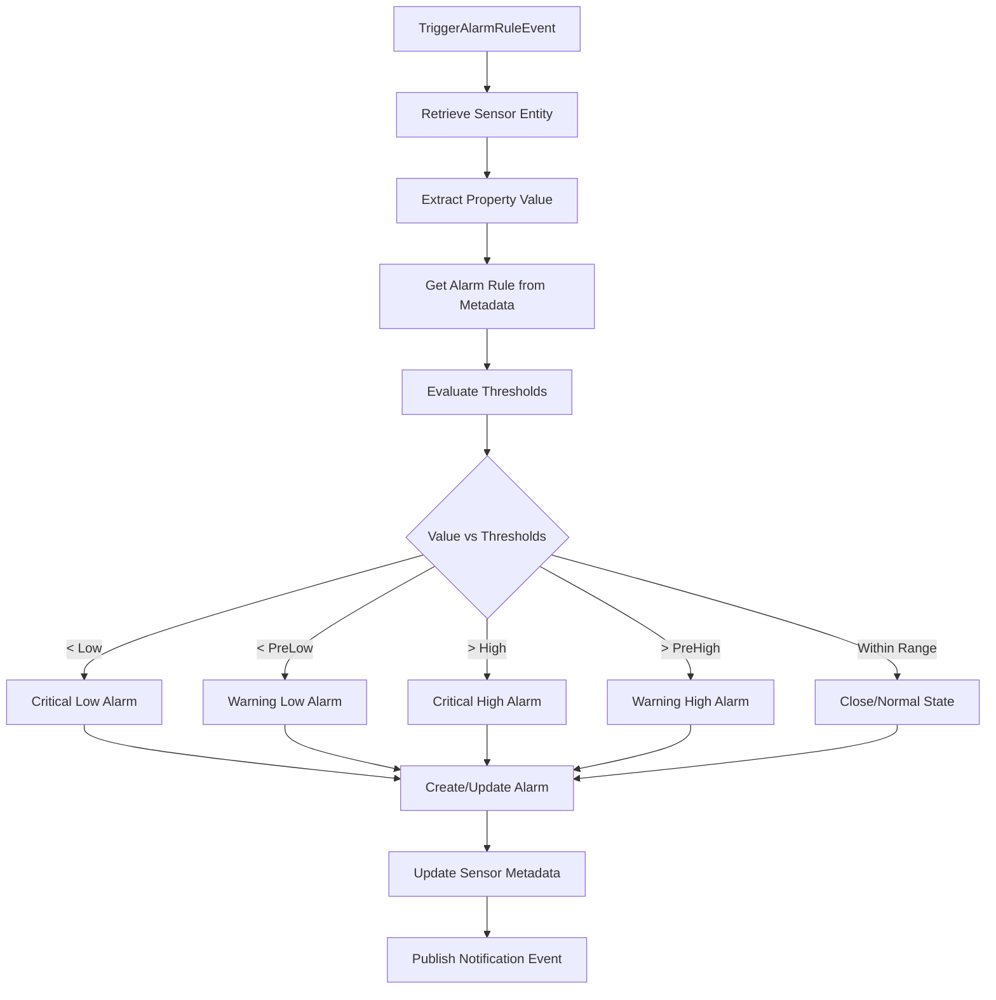
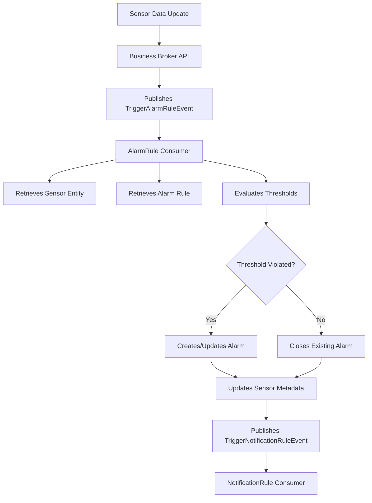

# SensorsReport.AlarmRule.Consumer

[](https://dotnet.microsoft.com/download/dotnet/8.0)
[](https://www.docker.com/)
[](../LICENSE)

## Overview

The SensorsReport.AlarmRule.Consumer is a message queue consumer service that processes alarm rule evaluation events within the SensorsReport IoT platform. This service listens for `TriggerAlarmRuleEvent` messages from RabbitMQ, evaluates sensor data against defined alarm rules, creates or updates alarm entities when thresholds are violated, and triggers notification workflows. It serves as the core alarm processing engine that bridges sensor data monitoring with alarm management.

## Features

### Core Functionality
- **Message Queue Processing**: Consumes TriggerAlarmRuleEvent messages from RabbitMQ via MassTransit
- **Alarm Rule Evaluation**: Evaluates sensor values against configured alarm rule thresholds
- **Alarm Management**: Creates new alarms or updates existing ones based on threshold violations
- **Multi-threshold Support**: Handles high, low, pre-high, and pre-low threshold conditions
- **Status Management**: Manages alarm states (open/close) based on sensor conditions

### Alarm Processing
- **Threshold Evaluation**: Compares sensor values against multiple threshold levels
- **Alarm Creation**: Creates new alarm entities when thresholds are first violated
- **Alarm Updates**: Updates existing alarms with new measurements and status changes
- **Alarm Closure**: Closes alarms when sensor values return to normal ranges
- **Relationship Management**: Links alarms to sensors and maintains monitoring relationships

### Integration Features
- **FIWARE Orion-LD**: Direct integration with context broker for entity management
- **Event Publishing**: Publishes notification events when alarms are triggered
- **Tenant Awareness**: Full multi-tenant support for isolated alarm processing
- **Structured Logging**: Comprehensive logging with NLog integration

## Technology Stack

- **.NET 8.0**: Core framework for high-performance background services
- **MassTransit**: Message queue consumer with RabbitMQ integration
- **FIWARE Orion-LD**: NGSI-LD context broker for entity storage and retrieval
- **NLog**: Structured logging framework
- **Docker**: Containerization for deployment
- **Kubernetes**: Orchestration with Flux GitOps

## Project Structure

```
SensorsReport.AlarmRule.Consumer/
├── Consumers/
│   └── TriggerAlarmRuleConsumer.cs # Message queue consumer for alarm rule events
├── Services/
│   ├── IAlarmRuleProcessor.cs      # Interface for alarm processing (placeholder)
│   └── WebhookDataValidator.cs     # Data validation service (placeholder)
├── Properties/                     # Assembly properties
├── flux/                          # Kubernetes deployment manifests
├── Dockerfile                     # Container build configuration
├── Program.cs                     # Application entry point and DI setup
├── appsettings.json              # Default configuration
├── nlog.config                   # Logging configuration
└── README.md                     # This documentation
```

## Getting Started

### Prerequisites
- .NET 8.0 SDK
- Access to FIWARE Orion-LD Context Broker
- RabbitMQ instance for message queue
- Access to SensorsReport.Api.Core for event bus functionality

### Local Development

#### 1. Clone and Setup
```bash
cd SensorsReport.AlarmRule.Consumer
dotnet restore
```

#### 2. Configure Environment Variables
```bash
# Orion-LD Context Broker Configuration
export ORION_LD_HOST="localhost"
export ORION_LD_PORT="1026"

# Message Queue Configuration (inherited from Api.Core)
export EventBus__Host="localhost"
export EventBus__Username="guest"
export EventBus__Password="guest"

# Application Configuration
export ASPNETCORE_ENVIRONMENT="Development"
export ASPNETCORE_URLS="http://localhost:5000"

# Default tenant (if not provided in events)
export NGSILD_TENANT="default"
```

#### 3. Run the Application
```bash
dotnet run
```

The consumer will start processing alarm rule events from the message queue.

#### 4. Test Message Processing
The consumer automatically processes events published to the queue. You can test by publishing events through the Business Broker API or other services.

### Docker Deployment

#### Build Container
```bash
# From the root SensorsReport directory
docker build -f SensorsReport.AlarmRule.Consumer/Dockerfile -t sensorsreport-alarmrule-consumer:latest .
```

#### Run Container
```bash
docker run -d \
  --name alarmrule-consumer \
  -e ORION_LD_HOST="orion.example.com" \
  -e ORION_LD_PORT="1026" \
  -e EventBus__Host="rabbitmq.example.com" \
  sensorsreport-alarmrule-consumer:latest
```

### Kubernetes Deployment

Deploy using Flux manifests:
```bash
kubectl apply -f flux/
```

## Configuration

### Orion-LD Integration
The service integrates with FIWARE Orion-LD Context Broker for entity management:

```json
{
  "OrionLD": {
    "Host": "localhost",
    "Port": 1026,
    "UseHttps": false,
    "BasePath": "/ngsi-ld/v1"
  }
}
```

### Message Queue Configuration
Uses MassTransit for RabbitMQ integration (inherited from Api.Core):

```json
{
  "EventBus": {
    "Host": "localhost",
    "Username": "guest",
    "Password": "guest",
    "Port": 5672
  }
}
```

### Environment Variables

| Variable | Description | Default |
|----------|-------------|---------|
| `ORION_LD_HOST` | Orion-LD Context Broker host | `localhost` |
| `ORION_LD_PORT` | Orion-LD Context Broker port | `1026` |
| `ORION_LD_USE_HTTPS` | Use HTTPS for Orion-LD connection | `false` |
| `EventBus__Host` | RabbitMQ host for message queue | `localhost` |
| `EventBus__Username` | RabbitMQ username | `guest` |
| `EventBus__Password` | RabbitMQ password | `guest` |
| `NGSILD_TENANT` | Default tenant for operations | `default` |
| `ASPNETCORE_ENVIRONMENT` | Application environment | `Production` |

## Event Processing

### TriggerAlarmRuleEvent Structure
The consumer processes events with the following structure:

```json
{
  "sensorId": "urn:ngsi-ld:Device:sensor-001",
  "propertyKey": "temperature",
  "metadataKey": "temperatureMeta",
  "tenant": {
    "tenant": "manufacturing"
  }
}
```

### Event Properties
- **sensorId**: Unique identifier of the sensor entity
- **propertyKey**: Name of the sensor property to evaluate (e.g., "temperature")
- **metadataKey**: Name of the metadata property containing alarm rule references
- **tenant**: Tenant information for multi-tenant isolation

## Alarm Rule Evaluation

### Threshold Processing Workflow



### Threshold Evaluation Logic

#### 1. Critical Low Threshold
```csharp
if (sensorValue < alarmRule.Low?.Value)
{
    // Create critical low alarm
    alarm.Status = AlarmModel.StatusValues.Open;
    alarm.Description = "Sensor value is below low threshold";
    alarm.Condition = "Low threshold exceeded";
}
```

#### 2. Warning Low Threshold  
```csharp
else if (sensorValue < alarmRule.PreLow?.Value)
{
    // Create warning low alarm
    alarm.Status = AlarmModel.StatusValues.Open;
    alarm.Description = "Sensor value is below pre-low threshold";
    alarm.Condition = "Pre-low threshold exceeded";
}
```

#### 3. Critical High Threshold
```csharp
else if (sensorValue > alarmRule.High?.Value)
{
    // Create critical high alarm
    alarm.Status = AlarmModel.StatusValues.Open;
    alarm.Description = "Sensor value is above high threshold";
    alarm.Condition = "High threshold exceeded";
}
```

#### 4. Warning High Threshold
```csharp
else if (sensorValue > alarmRule.PreHigh?.Value)
{
    // Create warning high alarm
    alarm.Status = AlarmModel.StatusValues.Open;
    alarm.Description = "Sensor value is above pre-high threshold";
    alarm.Condition = "Pre-high threshold exceeded";
}
```

#### 5. Normal Range
```csharp
else
{
    // Close alarm - value within acceptable range
    alarm.Status = AlarmModel.StatusValues.Close;
    alarm.Description = "Sensor value is within defined thresholds";
    alarm.Condition = "Within defined thresholds";
}
```

## Data Models

### Alarm Entity Creation
When thresholds are violated, the consumer creates or updates alarm entities:

```json
{
  "id": "urn:ngsi-ld:Alarm:12345678-1234-1234-1234-123456789012",
  "type": "Alarm",
  "status": {
    "type": "Property",
    "value": "open"
  },
  "severity": {
    "type": "Property",
    "value": "high"
  },
  "description": {
    "type": "Property",
    "value": "Sensor value for probe temperature is above high threshold"
  },
  "condition": {
    "type": "Property",
    "value": "High threshold exceeded"
  },
  "threshold": {
    "type": "Property",
    "value": 80.0
  },
  "monitors": {
    "type": "Relationship",
    "value": [
      {
        "object": ["urn:ngsi-ld:Device:sensor-001"],
        "monitoredAttribute": {
          "type": "Property",
          "value": "temperature"
        }
      }
    ]
  },
  "measuredValue": {
    "type": "Property",
    "value": [
      {
        "value": 85.2,
        "unit": "°C",
        "observedAt": "2024-01-01T12:00:00Z"
      }
    ]
  }
}
```

### Sensor Metadata Updates
The consumer updates sensor metadata to link alarms:

```json
{
  "temperatureMeta": {
    "type": "Property",
    "value": {
      "alarmRule": {
        "type": "Relationship",
        "object": ["urn:ngsi-ld:AlarmRule:temp-rule-001"]
      },
      "alarm": {
        "type": "Relationship",
        "object": ["urn:ngsi-ld:Alarm:12345678-1234-1234-1234-123456789012"]
      }
    }
  }
}
```

## Usage Examples

### Basic Alarm Processing Flow

#### 1. Temperature Monitoring Example
```json
// Input Event
{
  "sensorId": "urn:ngsi-ld:Device:temp-sensor-001",
  "propertyKey": "temperature",
  "metadataKey": "temperatureMeta",
  "tenant": {
    "tenant": "manufacturing"
  }
}

// Sensor Entity (retrieved from Orion-LD)
{
  "id": "urn:ngsi-ld:Device:temp-sensor-001",
  "type": "Device",
  "temperature": {
    "type": "Property",
    "value": 85.2,
    "unit": "°C",
    "observedAt": "2024-01-01T12:00:00Z"
  },
  "temperatureMeta": {
    "type": "Property",
    "value": {
      "alarmRule": {
        "type": "Relationship",
        "object": ["urn:ngsi-ld:AlarmRule:temp-rule-001"]
      }
    }
  }
}

// Alarm Rule (retrieved from Orion-LD)
{
  "id": "urn:ngsi-ld:AlarmRule:temp-rule-001",
  "type": "AlarmRule",
  "high": {
    "type": "Property",
    "value": 80.0
  },
  "preHigh": {
    "type": "Property",
    "value": 75.0
  },
  "low": {
    "type": "Property",
    "value": -10.0
  },
  "preLow": {
    "type": "Property",
    "value": 0.0
  }
}

// Result: High threshold alarm created (85.2 > 80.0)
```

#### 2. Vibration Monitoring Example
```json
// Input Event
{
  "sensorId": "urn:ngsi-ld:Device:vibr-sensor-001",
  "propertyKey": "vibration",
  "metadataKey": "vibrationMeta",
  "tenant": {
    "tenant": "maintenance"
  }
}

// Processing Result: Pre-high warning alarm (16.5 > 15.0 but < 20.0)
```

### Multi-tenant Processing
```bash
# Manufacturing tenant - different thresholds
Event: {"sensorId": "temp-001", "tenant": {"tenant": "manufacturing"}}
Rule: High=80°C, Low=-10°C
Result: Alarm created for manufacturing tenant

# Healthcare tenant - stricter thresholds  
Event: {"sensorId": "temp-001", "tenant": {"tenant": "healthcare"}}
Rule: High=25°C, Low=15°C
Result: Alarm created for healthcare tenant (isolated from manufacturing)
```

## Integration

### Event Flow in SensorsReport Ecosystem



### Related Services Integration
- **Business Broker API**: Publishes TriggerAlarmRuleEvent when sensor data changes
- **AlarmRule API**: Provides alarm rule definitions for threshold evaluation
- **Alarm API**: Target for alarm entity creation and management
- **NotificationRule Consumer**: Receives TriggerNotificationRuleEvent for notification processing
- **Audit API**: Logs alarm processing activities

### Event Publishing
After processing, the consumer publishes notification events:

```csharp
await eventBus.PublishAsync(new TriggerNotificationRuleEvent
{
    PropertyKey = triggerAlarmRuleEvent.PropertyKey,
    SensorId = triggerAlarmRuleEvent.SensorId,
    Tenant = triggerAlarmRuleEvent.Tenant,
    MetadataKey = triggerAlarmRuleEvent.MetadataKey,
    AlarmId = alarm.Id
});
```

## Monitoring and Observability

### Health Checks
The service provides built-in health monitoring:

```bash
# Check service health
curl http://localhost:5000/health

# Response
{
  "status": "Healthy",
  "totalDuration": "00:00:00.001"
}
```

### Logging
- **Framework**: NLog with structured logging
- **Tenant Context**: All logs include tenant information
- **Processing Tracing**: Each event tracked with correlation IDs
- **Error Logging**: Comprehensive error logging with stack traces

### Log Examples
```csharp
// Successful alarm rule processing
logger.LogInformation("Processing TriggerAlarmRuleEvent for sensor {SensorId} with property {PropertyKey}", 
    sensorId, propertyKey);

// Threshold violation detected
logger.LogInformation("Sensor property {PropertyKey} value {Value} is above the high threshold {HighThreshold}",
    propertyKey, sensorValue, highThreshold);

// Alarm created/updated
logger.LogInformation("Updated Entity {EntityId} with new Alarm relationship for property {Property}",
    entityId, propertyKey);
```

### Performance Metrics
Monitor these key metrics:
- **Event Processing Rate**: Events processed per second
- **Success Rate**: Percentage of successfully processed events
- **Processing Time**: Average time to process an event
- **Alarm Creation Rate**: Number of alarms created per period
- **Threshold Violation Frequency**: Rate of threshold violations per sensor

## Error Handling

### Common Error Scenarios

#### Sensor Entity Not Found
```csharp
if (sensor is null)
{
    logger.LogError("Sensor with ID {SensorId} not found", triggerAlarmRuleEvent.SensorId);
    return; // Skip processing this event
}
```

#### Invalid Property Structure
```csharp
if (propertyJson.ValueKind != JsonValueKind.Object)
{
    logger.LogError("Property for sensor {SensorId} with property {PropertyKey} is not an object",
        sensorId, propertyKey);
    return; // Skip processing this event
}
```

#### Missing Alarm Rule
```csharp
if (alarmRule is null)
{
    logger.LogWarning("AlarmRule with ID {AlarmRuleId} not found", alarmRuleId);
    return; // Skip processing this event
}
```

### Retry Logic
- **Message Queue Retry**: MassTransit provides automatic retry for transient failures
- **Orion-LD Retry**: Built-in retry for connection and timeout issues
- **Dead Letter Queue**: Failed messages after max retries are sent to dead letter queue

### Error Recovery
```csharp
try
{
    // Process alarm rule evaluation
    await ProcessAlarmRule(triggerAlarmRuleEvent);
}
catch (EntityNotFoundException ex)
{
    logger.LogWarning("Entity not found: {Message}", ex.Message);
    // Don't retry - entity genuinely missing
}
catch (TimeoutException ex)
{
    logger.LogError("Timeout processing alarm rule: {Message}", ex.Message);
    throw; // Allow MassTransit to retry
}
```

## Performance Considerations

### Throughput Optimization
- **Async Processing**: All operations are asynchronous
- **Connection Pooling**: HTTP client connection pooling for Orion-LD
- **Efficient Queries**: Optimized entity retrieval with minimal data transfer
- **Parallel Processing**: Multiple consumer instances for high throughput

### Resource Management
- **Memory Efficiency**: Minimal object caching to reduce memory footprint
- **Connection Management**: Proper disposal of HTTP connections
- **Scope Management**: Proper service scope management for DI containers

### Scaling Strategies
```yaml
# Kubernetes deployment scaling
apiVersion: apps/v1
kind: Deployment
metadata:
  name: alarmrule-consumer
spec:
  replicas: 3  # Multiple consumer instances
  template:
    spec:
      containers:
      - name: alarmrule-consumer
        resources:
          requests:
            memory: "256Mi"
            cpu: "250m"
          limits:
            memory: "512Mi"
            cpu: "500m"
```

## Security Considerations

### Multi-tenant Security
- **Tenant Isolation**: Strict tenant boundary enforcement in all operations
- **Data Separation**: Complete data isolation between tenants
- **Metadata Access**: Secure access to alarm rule metadata

### Event Security
- **Message Validation**: Comprehensive validation of incoming events
- **Entity Access Control**: Verify access rights to sensor and alarm entities
- **Secure Communication**: TLS for all external communications

### Data Protection
- **Sensitive Data**: Alarm thresholds and sensor values handled securely
- **Audit Trail**: All alarm rule processing logged for compliance
- **Error Sanitization**: Error messages sanitized to prevent information leakage

## Troubleshooting

### Common Issues

#### Consumer Not Processing Messages
```bash
# Check RabbitMQ connection
docker logs alarmrule-consumer | grep "MassTransit"

# Verify message queue configuration
docker logs alarmrule-consumer | grep "EventBus"
```

#### Orion-LD Connection Issues
```bash
# Test Orion-LD connectivity
curl http://orion:1026/version

# Check consumer logs for connection errors
docker logs alarmrule-consumer | grep "OrionLD"
```

#### Missing Entities or Rules
```bash
# Check if sensor exists
curl -H "NGSILD-Tenant: mytenant" \
     http://orion:1026/ngsi-ld/v1/entities/urn:ngsi-ld:Device:sensor-001

# Check if alarm rule exists
curl -H "NGSILD-Tenant: mytenant" \
     http://orion:1026/ngsi-ld/v1/entities/urn:ngsi-ld:AlarmRule:rule-001
```

### Debug Commands
```bash
# Check service health
curl http://localhost:5000/health

# View service logs
kubectl logs -f deployment/alarmrule-consumer

# Monitor message queue
kubectl exec -it rabbitmq-pod -- rabbitmqctl list_queues

# Check event processing
kubectl logs alarmrule-consumer | grep "Processing TriggerAlarmRuleEvent"
```

### Performance Debugging
```bash
# Monitor processing time
kubectl logs alarmrule-consumer | grep "Processing.*completed in"

# Check for errors
kubectl logs alarmrule-consumer | grep "ERROR"

# Monitor resource usage
kubectl top pods alarmrule-consumer
```

## Dependencies

### External Dependencies
- **FIWARE Orion-LD**: NGSI-LD Context Broker for entity management
- **RabbitMQ**: Message queue for event processing
- **MongoDB**: Database backend for Orion-LD (indirect dependency)

### .NET Dependencies
No additional NuGet packages beyond the base .NET 8.0 framework and SensorsReport core libraries.

### Runtime Dependencies
- **.NET 8.0 Runtime**: Core runtime environment
- **SensorsReport.Api.Core**: Shared core functionality and MassTransit integration
- **SensorsReport.OrionLD.Extensions**: Orion-LD integration extensions

## Related Services

- **SensorsReport.Business.Broker.API**: Publishes TriggerAlarmRuleEvent messages
- **SensorsReport.AlarmRule.API**: Provides alarm rule definitions
- **SensorsReport.Alarm.API**: Target for alarm entity creation
- **SensorsReport.NotificationRule.Consumer**: Processes notification events
- **SensorsReport.Email.Consumer**: Sends alarm notification emails
- **SensorsReport.SMS.Consumer**: Sends alarm notification SMS

## Contributing

When contributing to this consumer service:

1. **Follow Event-Driven Patterns**: Maintain compatibility with existing event structures
2. **Add Comprehensive Error Handling**: Handle all failure scenarios gracefully
3. **Include Unit Tests**: Test alarm rule evaluation logic thoroughly
4. **Maintain Tenant Isolation**: Ensure all operations respect tenant boundaries
5. **Performance Testing**: Verify changes don't impact processing throughput
6. **Update Documentation**: Keep event schemas and processing logic documented

### Development Workflow
1. Fork the repository
2. Create a feature branch (`git checkout -b feature/alarm-enhancement`)
3. Make your changes with tests
4. Verify event processing works correctly
5. Test with actual RabbitMQ and Orion-LD instances
6. Update documentation
7. Submit a pull request

## License

This project is part of the SensorsReport system for AerOS. See the root LICENSE file for details.

## Support

For issues with the AlarmRule Consumer:

1. **Check Message Queue Connectivity**: Verify RabbitMQ is accessible and events are being published
2. **Verify Orion-LD Connectivity**: Ensure context broker is accessible and entities exist
3. **Check Event Structure**: Verify TriggerAlarmRuleEvent messages have correct format
4. **Review Logs**: Check service logs for detailed error information
5. **Test Entity Access**: Verify sensor and alarm rule entities exist and are accessible
6. **Monitor Performance**: Check processing rates and resource usage
7. **Contact Support**: Reach out to the SensorsReport development team

## Changelog

### Version 1.0.0
- Initial release with TriggerAlarmRuleEvent processing
- Multi-threshold alarm rule evaluation (high, low, pre-high, pre-low)
- Alarm entity creation and updates
- Sensor metadata relationship management
- Notification event publishing
- Multi-tenant support
- FIWARE Orion-LD integration
- Docker and Kubernetes deployment support
