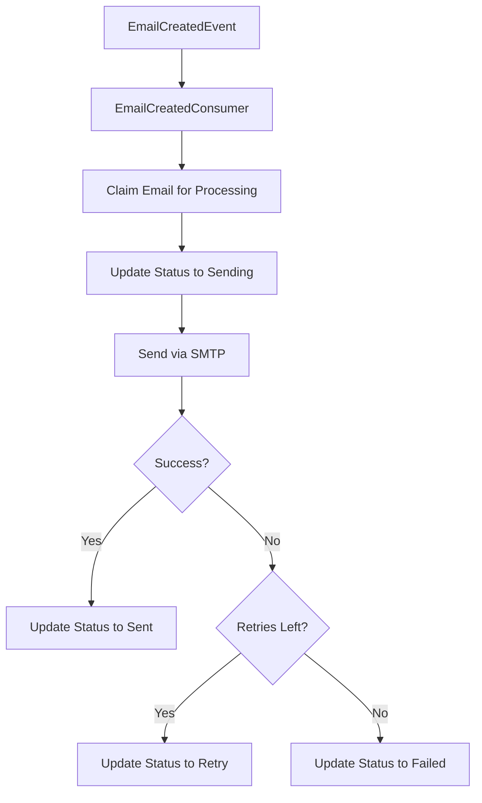

# SensorsReport.Email.Consumer

A message queue consumer service for processing email notifications within the SensorsReport ecosystem. This service listens for email creation events from RabbitMQ, processes email delivery through SMTP providers, and updates email status with retry logic and error handling.

## Overview

SensorsReport.Email.Consumer is a .NET 8.0 background service that serves as the email delivery engine for the SensorsReport microservices architecture. It consumes `EmailCreatedEvent` messages from the message queue, retrieves email details from MongoDB, sends emails via SMTP using MailKit, and updates delivery status with comprehensive error handling and retry mechanisms.

## Features

### Core Functionality
- **Message Queue Processing**: Consumes EmailCreatedEvent messages from RabbitMQ via MassTransit
- **Email Delivery**: Sends emails through SMTP servers using MailKit library
- **Status Management**: Updates email status throughout the delivery lifecycle
- **Retry Logic**: Automatic retry with configurable retry counts and exponential backoff
- **Error Handling**: Comprehensive error handling with detailed logging and status tracking

### Email Processing
- **HTML Email Support**: Full HTML email rendering with MimeKit
- **Multi-Recipient Support**: Support for To, CC, and BCC recipients
- **Email Tracking**: Unique email IDs embedded in headers and reply-to addresses
- **SMTP Authentication**: Secure SMTP connection with username/password authentication
- **SSL/TLS Support**: Encrypted email transmission

### Reliability Features
- **Atomic Processing**: Email claiming mechanism prevents duplicate processing
- **Retry Management**: Failed emails automatically retry within configured limits
- **Dead Letter Handling**: Failed emails after max retries are marked as failed
- **Reconciliation Support**: Integration with reconciliation services for stuck emails
- **Graceful Degradation**: Service continues processing other emails if individual sends fail

### Operations & Monitoring
- **Structured Logging**: Comprehensive logging with NLog integration
- **Performance Metrics**: Processing time and throughput monitoring
- **Health Monitoring**: Service health status and connectivity checks
- **Configuration Management**: Environment-based SMTP and database configuration

## Technology Stack

- **.NET 8.0**: Background service framework
- **MassTransit**: Message queue consumer with RabbitMQ integration
- **MailKit 4.13.0**: SMTP email delivery library
- **MimeKit**: Email message composition and formatting
- **MongoDB 3.4.0**: Email status storage and tracking
- **NLog**: Structured logging and diagnostics
- **Docker**: Containerization for deployment
- **Kubernetes**: Orchestration (via Flux)

## Project Structure

```
SensorsReport.Email.Consumer/
├── Consumers/
│   └── EmailCreatedConsumer.cs  # Message queue consumer
├── Services/
│   ├── IEmailService.cs         # Email service interface
│   └── EmailService.cs          # SMTP email implementation
├── Repositories/
│   ├── IEmailRepository.cs      # Email repository interface
│   └── EmailRepository.cs       # MongoDB email operations
├── Models/
│   ├── EmailModel.cs           # Email data model
│   └── EmailStatusEnum.cs      # Email status enumeration
├── Program.cs                   # Application startup and configuration
├── Dockerfile                   # Container build configuration
├── flux/                        # Kubernetes deployment manifests
├── nlog.config                 # Logging configuration
└── appsettings.json            # Application settings
```

## Getting Started

### Prerequisites
- .NET 8.0 SDK
- MongoDB instance (shared with SensorsReport.Email.API)
- RabbitMQ instance for message queue
- SMTP server credentials (Gmail, SendGrid, Mailgun, etc.)

### Local Development

#### 1. Clone and Setup
```bash
cd SensorsReport.Email.Consumer
dotnet restore
```

#### 2. Configure Environment Variables
```bash
# MongoDB Configuration (shared with Email.API)
export EmailMongoDbConnectionOptions__ConnectionString="mongodb://localhost:27017"
export EmailMongoDbConnectionOptions__DatabaseName="sensorsreport_emails"

# SMTP Configuration
export SmtpOptions__Server="smtp.gmail.com"
export SmtpOptions__Port="587"
export SmtpOptions__Username="your-email@gmail.com"
export SmtpOptions__Password="your-app-password"
export SmtpOptions__UseSSL="true"
export SmtpOptions__FromAddress="noreply@sensorsreport.net"
export SmtpOptions__FromName="SensorsReport System"

# Message Queue Configuration (inherited from Api.Core)
export EventBus__Host="localhost"
export EventBus__Username="guest"
export EventBus__Password="guest"

# Application Configuration
export ASPNETCORE_ENVIRONMENT="Development"
export ASPNETCORE_URLS="http://localhost:5001"
```

#### 3. Run the Application
```bash
dotnet run
```

The consumer will start processing email events from the message queue.

### Docker Deployment

#### Build Container
```bash
# From the root SensorsReport directory
docker build -f SensorsReport.Email.Consumer/Dockerfile -t sensorsreport-email-consumer:latest .
```

#### Run Container
```bash
docker run -d \
  --name email-consumer \
  -e EmailMongoDbConnectionOptions__ConnectionString="mongodb://mongo:27017" \
  -e EmailMongoDbConnectionOptions__DatabaseName="sensorsreport_emails" \
  -e SmtpOptions__Server="smtp.gmail.com" \
  -e SmtpOptions__Username="your-email@gmail.com" \
  -e SmtpOptions__Password="your-app-password" \
  sensorsreport-email-consumer:latest
```

### Kubernetes Deployment

Deploy using Flux manifests:
```bash
kubectl apply -f flux/
```

## Configuration

### SMTP Configuration

```json
{
  "SmtpOptions": {
    "Server": "smtp.gmail.com",
    "Port": 587,
    "Username": "your-email@gmail.com",
    "Password": "your-app-password",
    "UseSSL": true,
    "FromAddress": "noreply@sensorsreport.net",
    "FromName": "SensorsReport System"
  }
}
```

### MongoDB Configuration

```json
{
  "EmailMongoDbConnectionOptions": {
    "ConnectionString": "mongodb://localhost:27017",
    "DatabaseName": "sensorsreport_emails"
  }
}
```

### Environment Variables

| Variable | Description | Default |
|----------|-------------|---------|
| `EmailMongoDbConnectionOptions__ConnectionString` | MongoDB connection string | Required |
| `EmailMongoDbConnectionOptions__DatabaseName` | Database name for email storage | Required |
| `SmtpOptions__Server` | SMTP server hostname | Required |
| `SmtpOptions__Port` | SMTP server port | `587` |
| `SmtpOptions__Username` | SMTP authentication username | Required |
| `SmtpOptions__Password` | SMTP authentication password | Required |
| `SmtpOptions__UseSSL` | Enable SSL/TLS encryption | `true` |
| `SmtpOptions__FromAddress` | Default sender email address | Required |
| `SmtpOptions__FromName` | Default sender display name | Required |

## Email Processing Workflow

### 1. Event Reception


### 2. Email Claiming
The consumer uses an atomic claiming mechanism to prevent duplicate processing:

```csharp
// Atomically claim email for processing
var email = await emailRepository.ClaimForProcessingAsync(emailId);
if (email == null)
{
    // Email already processed or doesn't exist
    return;
}
```

### 3. SMTP Processing
Emails are sent using MailKit with comprehensive error handling:

```csharp
try
{
    using var client = new SmtpClient();
    await client.ConnectAsync(smtpServer, port, useSSL);
    await client.AuthenticateAsync(username, password);
    await client.SendAsync(message);
    await client.DisconnectAsync(true);
}
catch (Exception ex)
{
    // Handle specific SMTP errors
    throw;
}
```

### 4. Status Updates
Email status is updated throughout the process:
- **Queued** → **Sending** → **Sent** (success)
- **Queued** → **Sending** → **Retry** → **Sending** → **Sent/Failed**

## Email Message Format

### Generated Email Structure
```html
From: SensorsReport System <noreply@sensorsreport.net>
To: John Doe <user@example.com>
CC: Manager <manager@example.com> (if specified)
BCC: Audit <audit@example.com> (if specified)
Subject: Temperature Alert [Ref:64f1a2b3c4d5e6f7g8h9i0j1]
Reply-To: SensorsReport System <64f1a2b3c4d5e6f7g8h9i0j1+noreply@sensorsreport.net>
X-Email-Id: 64f1a2b3c4d5e6f7g8h9i0j1

<html>
<body>
<h2>Alert</h2>
<p>Sensor SR-001 temperature is 85°C</p>
<small style="font-size:10px; color:#999;">Ref:<i>64f1a2b3c4d5e6f7g8h9i0j1</i></small>
</body>
</html>
```

### Email Tracking Features
- **Unique Email ID**: Embedded in subject, headers, and reply-to address
- **Reference Tracking**: Email ID appended to message body for support
- **Reply Handling**: Custom reply-to address includes email ID for tracking
- **Header Tracking**: X-Email-Id header for technical tracking

## Event Processing

### EmailCreatedEvent Structure
```json
{
  "Id": "64f1a2b3c4d5e6f7g8h9i0j1"
}
```

### Consumer Implementation
```csharp
public class EmailCreatedConsumer : IConsumer<EmailCreatedEvent>
{
    public async Task Consume(ConsumeContext<EmailCreatedEvent> context)
    {
        var emailId = context.Message.Id;
        
        // Claim email for processing
        var email = await emailRepository.ClaimForProcessingAsync(emailId);
        if (email == null) return;
        
        // Update status to sending
        await emailRepository.UpdateStatusAsync(email.Id, EmailStatusEnum.Sending);
        
        try
        {
            // Send email via SMTP
            await emailService.SendEmailAsync(email);
            await emailRepository.UpdateStatusAsync(email.Id, EmailStatusEnum.Sent);
        }
        catch (Exception ex)
        {
            if (context.GetRetryCount() < email.MaxRetryCount)
            {
                await emailRepository.UpdateStatusAsync(email.Id, EmailStatusEnum.Retry, ex.Message);
                throw; // Trigger MassTransit retry
            }
            else
            {
                await emailRepository.UpdateStatusAsync(email.Id, EmailStatusEnum.Failed, ex.Message);
            }
        }
    }
}
```

## SMTP Provider Configuration

### Gmail Configuration
```bash
export SmtpOptions__Server="smtp.gmail.com"
export SmtpOptions__Port="587"
export SmtpOptions__UseSSL="true"
export SmtpOptions__Username="your-gmail@gmail.com"
export SmtpOptions__Password="your-app-password"  # Use App Password, not regular password
```

### SendGrid Configuration
```bash
export SmtpOptions__Server="smtp.sendgrid.net"
export SmtpOptions__Port="587"
export SmtpOptions__UseSSL="true"
export SmtpOptions__Username="apikey"
export SmtpOptions__Password="your-sendgrid-api-key"
```

### Mailgun Configuration
```bash
export SmtpOptions__Server="smtp.mailgun.org"
export SmtpOptions__Port="587"
export SmtpOptions__UseSSL="true"
export SmtpOptions__Username="postmaster@your-domain.mailgun.org"
export SmtpOptions__Password="your-mailgun-password"
```

### Office 365/Outlook Configuration
```bash
export SmtpOptions__Server="smtp-mail.outlook.com"
export SmtpOptions__Port="587"
export SmtpOptions__UseSSL="true"
export SmtpOptions__Username="your-email@outlook.com"
export SmtpOptions__Password="your-password"
```

## Error Handling and Retry Logic

### Retry Configuration
- **Default Max Retries**: 3 (configurable per email)
- **Retry Strategy**: Exponential backoff via MassTransit
- **Retry Intervals**: 1s, 2s, 4s, 8s (MassTransit default)
- **Dead Letter**: Failed emails after max retries

### Common Error Scenarios

#### Authentication Failures
```
550 5.7.0 Authentication Required
535 5.7.3 Authentication unsuccessful
```
- **Cause**: Invalid SMTP credentials
- **Resolution**: Verify username/password and enable less secure apps if needed

#### Rate Limiting
```
454 4.7.1 Too many login attempts
550 5.4.5 Daily sending quota exceeded
```
- **Cause**: SMTP provider rate limits
- **Resolution**: Implement rate limiting and distribute across multiple providers

#### Invalid Recipients
```
550 5.1.1 User unknown
550 5.7.1 Relay access denied
```
- **Cause**: Invalid email addresses or domain policies
- **Resolution**: Validate email addresses before queuing

#### Network Issues
```
System.Net.Sockets.SocketException: Connection timed out
```
- **Cause**: Network connectivity or DNS issues
- **Resolution**: Check network configuration and DNS resolution

### Error Handling Implementation
```csharp
try
{
    await emailService.SendEmailAsync(email);
    await emailRepository.UpdateStatusAsync(email.Id, EmailStatusEnum.Sent);
}
catch (AuthenticationException ex)
{
    logger.LogError(ex, "SMTP authentication failed for email {EmailId}", email.Id);
    // Don't retry authentication failures
    await emailRepository.UpdateStatusAsync(email.Id, EmailStatusEnum.Failed, ex.Message);
}
catch (SmtpException ex) when (ex.StatusCode == SmtpStatusCode.MailboxBusy)
{
    logger.LogWarning(ex, "SMTP server busy for email {EmailId}, will retry", email.Id);
    throw; // Allow retry
}
catch (Exception ex)
{
    logger.LogError(ex, "Unexpected error sending email {EmailId}", email.Id);
    throw; // Allow retry up to max count
}
```

## Monitoring and Observability

### Logging Examples
```csharp
// Success
logger.LogInformation("Successfully sent email for EmailId: {EmailId}", email.Id);

// Retry
logger.LogWarning("Error sending email for EmailId: {EmailId}. Retrying... Error: {Error}", 
    email.Id, ex.Message);

// Failure
logger.LogError("Error sending email for EmailId: {EmailId}. Failed after {RetryCount} retries. Error: {Error}", 
    email.Id, email.RetryCount, ex.Message);
```

### Performance Metrics
Monitor the following metrics:
- **Processing Rate**: Emails processed per minute
- **Success Rate**: Percentage of successfully sent emails
- **Retry Rate**: Percentage of emails requiring retries
- **Average Processing Time**: Time from event to completion
- **Queue Depth**: Number of pending email events

### Health Checks
```bash
# Check if consumer is processing messages
docker logs email-consumer | grep "Successfully sent email"

# Monitor retry patterns
docker logs email-consumer | grep "Retrying"

# Check for authentication issues
docker logs email-consumer | grep "Authentication"
```

## Performance Considerations

### Throughput Optimization
- **Connection Pooling**: Reuse SMTP connections where possible
- **Async Processing**: All operations are async to avoid blocking
- **Parallel Processing**: Configure multiple consumer instances for high throughput
- **Batch Processing**: Consider batching multiple emails to same domain

### Resource Management
- **Memory Usage**: Email content is not cached to minimize memory footprint
- **Database Connections**: MongoDB connection pooling for efficiency
- **SMTP Connections**: Proper disposal of SMTP clients to prevent resource leaks

### Scaling Strategies
```yaml
# Kubernetes deployment scaling
replicas: 3  # Multiple consumer instances

# Message queue configuration
consumers:
  emailCreated:
    concurrency: 5  # Process 5 emails concurrently per instance
```

## Security Considerations

### SMTP Security
1. **Encrypted Connections**: Always use SSL/TLS for SMTP
2. **Credential Management**: Store SMTP credentials in environment variables or secrets
3. **Authentication**: Use app passwords or API keys instead of account passwords
4. **Access Control**: Restrict SMTP access to authorized services only

### Email Content Security
1. **HTML Sanitization**: Ensure email content is properly sanitized
2. **Attachment Handling**: Current implementation doesn't support attachments
3. **Spam Prevention**: Include proper headers and sender reputation management
4. **Privacy**: Ensure email content complies with privacy regulations

### Configuration Security
```bash
# Use Kubernetes secrets for sensitive data
apiVersion: v1
kind: Secret
metadata:
  name: email-consumer-secrets
type: Opaque
stringData:
  smtp-username: "your-email@gmail.com"
  smtp-password: "your-app-password"
```

## Troubleshooting

### Common Issues

#### Consumer Not Processing Messages
```bash
# Check RabbitMQ connection
docker logs email-consumer | grep "MassTransit"

# Verify message queue configuration
docker logs email-consumer | grep "EventBus"
```

#### SMTP Connection Failures
```bash
# Test SMTP connectivity
telnet smtp.gmail.com 587

# Check SSL/TLS configuration
openssl s_client -connect smtp.gmail.com:587 -starttls smtp
```

#### Database Connection Issues
```bash
# Test MongoDB connectivity
mongo mongodb://localhost:27017/sensorsreport_emails --eval "db.runCommand('ping')"

# Check database permissions
docker logs email-consumer | grep "MongoDB"
```

### Debugging Steps
1. **Check Logs**: Review structured logs for error patterns
2. **Verify Configuration**: Ensure all environment variables are set
3. **Test SMTP**: Verify SMTP credentials and connectivity
4. **Monitor Queue**: Check RabbitMQ for message buildup
5. **Database Health**: Verify MongoDB connectivity and permissions

## Dependencies

This consumer depends on:
- **SensorsReport.Api.Core**: Core shared functionality and MassTransit integration
- **SensorsReport.Email.API**: Source of EmailCreatedEvent messages
- **MongoDB**: Shared email storage with Email.API
- **RabbitMQ**: Message queue for event processing
- **SMTP Provider**: External email delivery service

## Related Services

- **SensorsReport.Email.API**: Creates emails and publishes events
- **SensorsReport.Api.Core**: Core shared functionality
- **SensorsReport.Notification.API**: Coordinates multi-channel notifications
- **Message Queue**: RabbitMQ for event-driven architecture

## Integration with Email.API

### Event Flow
1. **Email.API** receives HTTP request to send email
2. **Email.API** stores email in MongoDB with status "Pending"
3. **Email.API** publishes `EmailCreatedEvent` to RabbitMQ
4. **Email.Consumer** receives event and claims email for processing
5. **Email.Consumer** updates status to "Sending" and sends via SMTP
6. **Email.Consumer** updates final status to "Sent" or "Failed"

### Shared Data Model
Both services share the same email model and status enumeration:
- **EmailModel**: Complete email data structure
- **EmailStatusEnum**: Pending, Queued, Sending, Sent, Failed, Retry
- **MongoDB Collection**: Same collection for status updates

## Contributing

When contributing to this consumer service:
1. Maintain compatibility with Email.API data models
2. Add comprehensive error handling for new SMTP providers
3. Include unit tests for email processing logic
4. Follow established logging patterns for troubleshooting
5. Test with actual SMTP providers in development
6. Document any new configuration options

## License

This project is part of the SensorsReport system for AerOS. See the root LICENSE file for details.

## Support

For issues with the Email Consumer:
1. Check SMTP provider connectivity and credentials
2. Verify MongoDB connectivity and shared collection access
3. Monitor RabbitMQ for message queue issues
4. Review application logs for detailed error information
5. Test email delivery with known good SMTP credentials
6. Check for rate limiting from SMTP providers
7. Contact the SensorsReport development team
