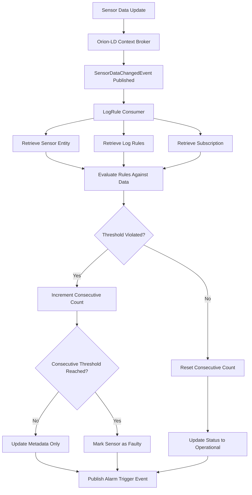

# SensorsReport.LogRule.Consumer

[](https://dotnet.microsoft.com/download/dotnet/8.0)
[](https://www.docker.com/)
[](../LICENSE)

## Overview

The SensorsReport.LogRule.Consumer is a specialized microservice that processes sensor data change events and applies log rules to determine sensor health status. This consumer service monitors real-time sensor data updates and evaluates them against pre-defined log rules to detect consecutive threshold violations, automatically updating sensor status from "operational" to "faulty" when rules are breached. It serves as a critical component in the SensorsReport ecosystem for automated sensor health monitoring and fault detection.

## Features

### Core Functionality
- **Real-time Event Processing**: Consumes sensor data change events using MassTransit messaging
- **Log Rule Evaluation**: Applies pre-configured log rules to incoming sensor data
- **Consecutive Violation Tracking**: Monitors consecutive threshold violations over time
- **Automatic Status Updates**: Updates sensor status based on rule evaluation results
- **Multi-tenant Support**: Full tenant isolation for all operations and data processing

### Rule Processing
- **Threshold Monitoring**: Evaluates sensor values against high/low thresholds
- **Consecutive Hit Counting**: Tracks consecutive violations before marking as faulty
- **Status Management**: Automatically sets sensor status to "operational" or "faulty"
- **Rule Enablement**: Respects enabled/disabled state of log rules
- **Property-specific Rules**: Applies different rules to different sensor properties

### Integration Features
- **Orion-LD Integration**: Retrieves sensors, subscriptions, and log rules from context broker
- **Event Bus Publishing**: Publishes alarm trigger events for downstream processing
- **Subscription-aware**: Processes only watched attributes defined in subscriptions
- **Metadata Management**: Updates sensor metadata with consecutive hit counts and status

## Technology Stack

- **.NET 8.0**: Core framework for high-performance event processing
- **MassTransit**: Message bus for consuming sensor data change events
- **FIWARE Orion-LD**: NGSI-LD context broker for entity storage and retrieval
- **NLog**: Structured logging framework
- **Docker**: Containerization for deployment
- **Kubernetes**: Orchestration with Flux GitOps

## Project Structure

```
SensorsReport.LogRule.Consumer/
├── Consumers/
│   └── SensorDataChangedConsumer.cs   # Main event consumer for sensor data changes
├── Properties/                        # Assembly properties
├── flux/                             # Kubernetes deployment manifests
├── Dockerfile                        # Container build configuration
├── Program.cs                        # Application entry point and service setup
├── appsettings.json                  # Default configuration
├── nlog.config                       # Logging configuration
└── README.md                         # This documentation
```

## Architecture

### Event Flow


### Processing Logic
1. **Event Reception**: Receives SensorDataChangedEvent from message bus
2. **Validation**: Validates event structure and required fields
3. **Entity Retrieval**: Fetches sensor, subscription, and log rule entities
4. **Property Processing**: Processes each sensor property with associated log rules
5. **Threshold Evaluation**: Compares sensor values against rule thresholds
6. **Consecutive Tracking**: Maintains count of consecutive violations
7. **Status Update**: Updates sensor status based on evaluation results
8. **Event Publishing**: Publishes alarm trigger events for downstream processing

## Getting Started

### Prerequisites
- .NET 8.0 SDK
- Access to FIWARE Orion-LD Context Broker
- Message broker (RabbitMQ/Azure Service Bus)
- Docker (for containerized deployment)

### Local Development

#### 1. Clone and Setup
```bash
cd SensorsReport.LogRule.Consumer
dotnet restore
```

#### 2. Configure Environment Variables
```bash
# Orion-LD Context Broker Configuration
export ORION_LD_HOST="localhost"
export ORION_LD_PORT="1026"

# Message Bus Configuration
export MASSTRANSIT_TRANSPORT="RabbitMQ"
export RABBITMQ_HOST="localhost"
export RABBITMQ_PORT="5672"
export RABBITMQ_USERNAME="guest"
export RABBITMQ_PASSWORD="guest"

# Application Configuration
export ASPNETCORE_ENVIRONMENT="Development"
export ASPNETCORE_URLS="http://localhost:5000"
```

#### 3. Run the Application
```bash
dotnet run
```

The consumer will start and begin processing sensor data change events.

#### 4. Verify Operation
```bash
# Check service health
curl http://localhost:5000/health

# Check logs for event processing
docker logs logrule-consumer -f
```

### Docker Deployment

#### Build Container
```bash
# From the root SensorsReport directory
docker build -f SensorsReport.LogRule.Consumer/Dockerfile -t sensorsreport-logrule-consumer:latest .
```

#### Run Container
```bash
docker run -d \
  --name logrule-consumer \
  -e ORION_LD_HOST="orion.example.com" \
  -e ORION_LD_PORT="1026" \
  -e RABBITMQ_HOST="rabbitmq.example.com" \
  sensorsreport-logrule-consumer:latest
```

### Kubernetes Deployment

Deploy using Flux manifests:
```bash
kubectl apply -f flux/
```

## Configuration

### Orion-LD Integration
The service integrates with FIWARE Orion-LD Context Broker for entity operations:

```json
{
  "OrionLD": {
    "Host": "localhost",
    "Port": 1026,
    "UseHttps": false,
    "BasePath": "/ngsi-ld/v1"
  }
}
```

### Message Bus Configuration
Configure MassTransit for event consumption:

```json
{
  "MassTransit": {
    "Transport": "RabbitMQ",
    "RabbitMQ": {
      "Host": "localhost",
      "Port": 5672,
      "Username": "guest",
      "Password": "guest",
      "VirtualHost": "/"
    }
  }
}
```

### Environment Variables

| Variable | Description | Default |
|----------|-------------|---------|
| `ORION_LD_HOST` | Orion-LD Context Broker host | `localhost` |
| `ORION_LD_PORT` | Orion-LD Context Broker port | `1026` |
| `ORION_LD_USE_HTTPS` | Use HTTPS for Orion-LD connection | `false` |
| `MASSTRANSIT_TRANSPORT` | Message transport type | `RabbitMQ` |
| `RABBITMQ_HOST` | RabbitMQ server host | `localhost` |
| `RABBITMQ_PORT` | RabbitMQ server port | `5672` |
| `RABBITMQ_USERNAME` | RabbitMQ username | `guest` |
| `RABBITMQ_PASSWORD` | RabbitMQ password | `guest` |
| `ASPNETCORE_ENVIRONMENT` | Application environment | `Production` |

## Event Processing

### SensorDataChangedEvent Structure
The consumer processes events with the following structure:

```json
{
  "tenant": {
    "tenant": "manufacturing"
  },
  "subscriptionId": "subscription-001",
  "item": {
    "id": "sensor-temperature-001",
    "type": "TemperatureSensor"
  },
  "timestamp": "2024-01-01T10:00:00Z"
}
```

### Processing Steps

#### 1. Event Validation
```csharp
public bool IsValid(SensorDataChangedEvent sensorDataChangedEvent)
{
    // Validates:
    // - Event is not null
    // - Tenant information is present
    // - Subscription ID is provided
    // - Item information is complete
    return validationResult;
}
```

#### 2. Entity Retrieval
- **Sensor Entity**: Retrieved using the sensor ID from the event
- **Subscription Entity**: Retrieved to determine watched attributes
- **Log Rule Entities**: Retrieved for each sensor property with log rule metadata

#### 3. Rule Evaluation
For each sensor property with an associated log rule:
- Check if rule is enabled
- Compare sensor value against high/low thresholds
- Determine if value is within acceptable range
- Track consecutive violations

#### 4. Status Management
- **In Range**: Reset consecutive hit count, set status to "operational"
- **Out of Range**: Increment consecutive hit count
- **Consecutive Threshold Reached**: Set status to "faulty"

### Log Rule Model
Log rules define monitoring parameters:

```json
{
  "id": "temperature-log-rule-001",
  "type": "LogRule",
  "enabled": {
    "type": "Property",
    "value": true
  },
  "high": {
    "type": "Property",
    "value": 80.0
  },
  "low": {
    "type": "Property",
    "value": -10.0
  },
  "consecutiveHit": {
    "type": "Property",
    "value": 3
  }
}
```

### Metadata Updates
The consumer updates sensor metadata with processing results:

```json
{
  "temperatureMetadata": {
    "type": "Property",
    "value": {
      "logRuleConsecutiveHit": {
        "type": "Property",
        "value": 2
      },
      "status": {
        "type": "Property",
        "value": "operational",
        "observedAt": "2024-01-01T10:00:00Z"
      }
    }
  }
}
```

## Integration

### SensorsReport Ecosystem
- **Business Broker API**: Generates sensor data change events
- **LogRule API**: Provides log rule definitions
- **Alarm API**: Receives alarm trigger events for notification processing
- **Audit API**: Logs rule evaluation activities

### Event Publishing
The consumer publishes TriggerAlarmRuleEvent for downstream processing:

```json
{
  "tenant": {
    "tenant": "manufacturing"
  },
  "sensorId": "sensor-temperature-001",
  "propertyKey": "temperature",
  "metadataKey": "temperatureMetadata"
}
```

### Subscription Integration
Processes only attributes specified in Orion-LD subscriptions:
- Retrieves subscription entity by ID
- Filters sensor properties based on watchedAttributes
- Ensures processing aligns with subscription configuration

## Monitoring and Observability

### Health Checks
Built-in health monitoring for service components:

```bash
# Check overall health
curl http://localhost:5000/health

# Check message bus connectivity
curl http://localhost:5000/health/ready
```

### Logging
Comprehensive logging throughout the event processing pipeline:

```csharp
// Processing start
logger.LogInformation("Processing SensorDataChangedEvent for sensor {SensorId} with subscription {SubscriptionId}",
    sensorId, subscriptionId);

// Threshold violations
logger.LogWarning("Sensor property {Property} value {Value} is above the high threshold {HighThreshold}",
    propertyKey, sensorValue, highThreshold);

// Consecutive violations
logger.LogWarning("Sensor property {Property} value {Value} has exceeded the consecutive violations threshold {ConsecutiveHits}",
    propertyKey, sensorValue, consecutiveHit);
```

### Performance Metrics
Monitor these key metrics:
- **Event Processing Rate**: Events processed per second
- **Processing Latency**: Time from event receipt to completion
- **Error Rate**: Percentage of failed event processing
- **Rule Evaluation Time**: Time spent evaluating rules
- **Orion-LD Response Time**: Context broker query performance

## Error Handling

### Validation Errors
Comprehensive validation of incoming events:
- **Null Events**: Logged and skipped
- **Missing Tenant**: Invalid events are rejected
- **Invalid Sensor ID**: Events without valid sensor references are skipped
- **Missing Subscription**: Events must reference valid subscriptions

### Entity Retrieval Errors
Graceful handling of missing entities:
- **Sensor Not Found**: Logged as error, processing skipped
- **Subscription Not Found**: Logged as error, processing skipped
- **Log Rule Not Found**: Logged as warning, alarm event still published

### Processing Errors
Robust error handling during rule evaluation:
- **Invalid Property Data**: Properties with invalid structure are skipped
- **Deserialization Failures**: Logged with property details
- **Orion-LD Update Failures**: Retried with exponential backoff

### Example Error Scenarios
```csharp
// Missing sensor entity
if (sensor is null)
{
    logger.LogError("Sensor with ID {SensorId} not found", sensorId);
    return;
}

// Invalid property structure
if (sensorPropertyJson.ValueKind != JsonValueKind.Object)
{
    logger.LogWarning("Property {Property} is not an object", propertyKey);
    continue;
}

// Missing log rule
if (logRule is null)
{
    logger.LogWarning("LogRule with ID {LogRuleId} not found", logRuleId);
    await eventBus.PublishAsync(updateAlarmEvent);
    continue;
}
```

## Performance Considerations

### Event Processing Optimization
- **Async Operations**: All I/O operations are asynchronous
- **Scoped Services**: Proper service lifetime management
- **Efficient Filtering**: Process only watched attributes
- **Parallel Processing**: Multiple events processed concurrently

### Memory Management
- **Service Scoping**: Proper disposal of scoped services
- **JSON Serialization**: Efficient deserialization with reusable options
- **Entity Caching**: Consider caching frequently accessed entities

### Throughput Optimization
```csharp
// Efficient property filtering
var properties = sensor.Properties.GetProcessableProperties();
if (subscription.WatchedAttributes is not null)
    properties = properties.Where(s => subscription.WatchedAttributes.Contains(s.property));

// Scoped service management
var scope = serviceProvider.CreateScope();
var orionLdService = scope.ServiceProvider.GetRequiredService<IOrionLdService>();
```

## Security Considerations

### Multi-tenant Security
- **Tenant Isolation**: All operations are scoped to event tenant
- **Data Separation**: Complete isolation between tenant data
- **Service Context**: Orion-LD service configured with proper tenant context

### Event Security
- **Event Validation**: Comprehensive validation of all event data
- **Sanitized Logging**: Sensitive data excluded from logs
- **Secure Communications**: Encrypted connections to Orion-LD and message bus

### Processing Security
- **Input Validation**: All sensor data validated before processing
- **Safe Deserialization**: Robust JSON deserialization with error handling
- **Resource Limits**: Memory and processing limits to prevent abuse

## Troubleshooting

### Common Issues

#### Consumer Not Processing Events
```bash
# Check message bus connectivity
kubectl logs -f deployment/logrule-consumer | grep "MassTransit"

# Verify queue configuration
kubectl exec -it logrule-consumer-pod -- curl -u guest:guest http://rabbitmq:15672/api/queues
```

#### Orion-LD Connection Issues
```bash
# Test Orion-LD connectivity
kubectl exec -it logrule-consumer-pod -- curl http://orion:1026/version

# Check entity retrieval
kubectl exec -it logrule-consumer-pod -- curl -H "NGSILD-Tenant: mytenant" \
  http://orion:1026/ngsi-ld/v1/entities/sensor-001
```

#### Rule Processing Failures
```bash
# Check log rule configuration
curl -H "NGSILD-Tenant: mytenant" \
  http://logrule-api:8080/api/logrule/temperature-rule-001

# Verify sensor metadata structure
curl -H "NGSILD-Tenant: mytenant" \
  http://orion:1026/ngsi-ld/v1/entities/sensor-001?options=normalized
```

### Debug Commands
```bash
# View processing logs
kubectl logs -f deployment/logrule-consumer --tail=100

# Check event consumption rate
kubectl exec -it logrule-consumer-pod -- curl http://localhost:5000/metrics

# Monitor rule evaluation
kubectl logs -f deployment/logrule-consumer | grep "consecutive violations"
```

## Dependencies

### External Dependencies
- **FIWARE Orion-LD**: NGSI-LD Context Broker for entity storage
- **Message Broker**: RabbitMQ or Azure Service Bus for event consumption
- **MongoDB**: Database backend for Orion-LD (indirect dependency)

### .NET Dependencies
- **MassTransit**: Message bus integration
- **System.Text.Json**: JSON serialization and deserialization

### Runtime Dependencies
- **.NET 8.0 Runtime**: Core runtime environment
- **SensorsReport.Api.Core**: Shared API infrastructure
- **SensorsReport.OrionLD**: Orion-LD integration services

## Related Services

### Upstream Services
- **SensorsReport.Business.Broker.API**: Publishes sensor data change events
- **SensorsReport.LogRule.API**: Provides log rule definitions
- **Orion-LD Context Broker**: Source of sensor and subscription data

### Downstream Services
- **SensorsReport.Alarm.API**: Processes alarm trigger events
- **SensorsReport.Notification.API**: Handles fault notifications
- **SensorsReport.Audit.API**: Logs rule evaluation activities

### Event Flow
1. **Sensor Data Update**: Sensors report new values to Orion-LD
2. **Business Broker Processing**: Business rules evaluate data changes
3. **Event Publication**: SensorDataChangedEvent published to message bus
4. **LogRule Consumer Processing**: This service processes events and applies rules
5. **Alarm Trigger**: TriggerAlarmRuleEvent published for fault conditions
6. **Notification Processing**: Downstream services handle notifications

## Contributing

### Development Guidelines

1. **Event Processing Best Practices**: Follow async/await patterns
2. **Error Handling**: Implement comprehensive error handling and logging
3. **Testing**: Include unit tests for rule evaluation logic
4. **Documentation**: Update processing logic documentation
5. **Performance**: Consider memory and throughput optimization

### Pull Request Process

1. Fork the repository
2. Create a feature branch (`git checkout -b feature/rule-enhancement`)
3. Implement changes with tests
4. Verify event processing functionality
5. Test with actual message bus and Orion-LD
6. Update documentation
7. Submit pull request with detailed description

### Testing

```bash
# Run unit tests
dotnet test

# Run integration tests with message bus
dotnet test --filter Category=Integration

# Test event processing
dotnet test --filter Category=EventProcessing
```

## License

This project is part of the SensorsReport system for AerOS. See the root LICENSE file for details.

## Support

### Documentation
- Event processing documentation in `/docs` folder
- Message bus configuration guides
- Rule evaluation examples

### Contact
- **Issue Tracking**: GitHub Issues
- **Email Support**: support@sensorsreport.com
- **Documentation**: See project wiki for detailed guides

### Troubleshooting

Common issues and solutions:

1. **Events Not Being Consumed**
   - Verify message bus connectivity
   - Check queue configuration and permissions
   - Validate event routing configuration

2. **Rule Evaluation Failures**
   - Verify log rule definitions exist
   - Check sensor metadata structure
   - Validate property value types

3. **Orion-LD Connection Issues**
   - Test context broker connectivity
   - Verify tenant configuration
   - Check entity access permissions

4. **Performance Issues**
   - Monitor event processing latency
   - Check Orion-LD response times
   - Optimize rule evaluation logic

## Changelog

### Version 1.0.0
- Initial release with sensor data change event processing
- Log rule evaluation and consecutive violation tracking
- Automatic sensor status management
- Multi-tenant support
- Orion-LD integration
- MassTransit message bus integration
- Comprehensive logging and error handling
- Docker and Kubernetes deployment support
