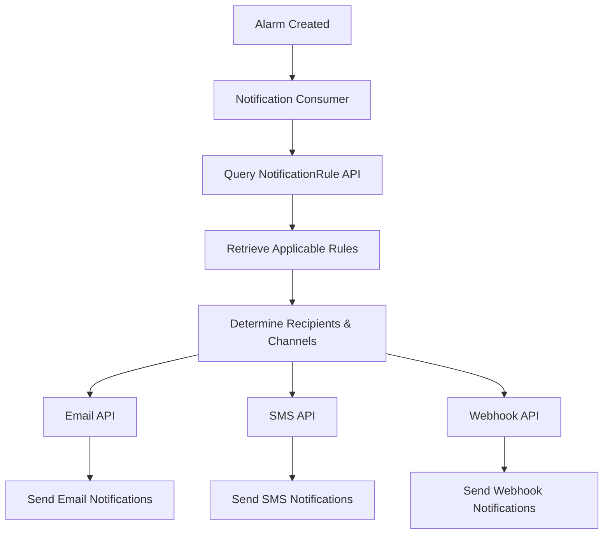

# SensorsReport.NotificationRule.API

[](https://dotnet.microsoft.com/download/dotnet/8.0)
[](https://www.docker.com/)
[](../LICENSE)

## Overview

The SensorsReport.NotificationRule.API is a microservice that provides comprehensive notification rule management functionality for the SensorsReport IoT platform. This API serves as the central hub for creating, managing, and querying notification rule definitions within the FIWARE NGSI-LD ecosystem. It enables administrators to define how, when, and to whom notifications should be sent when specific events or alarm conditions occur, supporting complex notification routing configurations with full multi-tenant isolation.

## Features

### Core Functionality
- **Notification Rule CRUD Operations**: Complete Create, Read, Update, Delete operations for notification rule entities
- **Multi-tenant Support**: Full tenant isolation using NGSILD-Tenant headers
- **FIWARE NGSI-LD Integration**: Native integration with Orion-LD Context Broker
- **RESTful API**: Standard HTTP methods with JSON responses
- **Pagination Support**: Efficient handling of large notification rule datasets

### Rule Management
- **Notification Channels**: Define email, SMS, webhook, and push notification channels
- **Routing Logic**: Configure when and to whom notifications should be sent
- **Priority Handling**: Set notification priorities and escalation rules
- **Template Management**: Support for customizable notification templates
- **Rule Validation**: Input validation for rule consistency and correctness

### Integration Features
- **Orion-LD Native**: Direct integration with FIWARE Orion-LD Context Broker
- **Tenant Awareness**: Automatic tenant context handling for all operations
- **Health Monitoring**: Built-in health checks for service monitoring
- **Structured Logging**: Comprehensive logging with NLog integration

## Technology Stack

- **.NET 8.0**: Core framework for high-performance web APIs
- **ASP.NET Core**: Web framework for RESTful API development
- **FIWARE Orion-LD**: NGSI-LD context broker for entity storage
- **NLog**: Structured logging framework
- **Docker**: Containerization for deployment
- **Kubernetes**: Orchestration with Flux GitOps

## Project Structure

```
SensorsReport.NotificationRule.API/
├── Controllers/
│   └── NotificationRuleController.cs  # Main API controller for notification rule operations
├── Services/
│   └── NotificationRuleService.cs     # Business logic and Orion-LD integration
├── Properties/                        # Assembly properties
├── flux/                             # Kubernetes deployment manifests
├── Dockerfile                        # Container build configuration
├── Program.cs                        # Application entry point and DI setup
├── appsettings.json                  # Default configuration
├── nlog.config                       # Logging configuration
└── README.md                         # This documentation
```

## API Reference

### Base URL
- **Local Development**: `http://localhost:5000/api/notificationrule`
- **Production**: `https://your-domain/api/notificationrule`

### Authentication
All endpoints require tenant identification via the `NGSILD-Tenant` header.

### Endpoints

#### GET /api/notificationrule
Retrieve a list of notification rules for the current tenant.

**Query Parameters:**
- `limit` (int, optional): Maximum number of notification rules to return (default: 100)
- `offset` (int, optional): Number of notification rules to skip for pagination (default: 0)

**Headers:**
- `NGSILD-Tenant: <tenant-id>` (required)

**Response:**
```json
[
  {
    "id": "email-rule-001",
    "type": "NotificationRule",
    "@context": "https://uri.etsi.org/ngsi-ld/v1/ngsi-ld-core-context-v1.6.jsonld"
  }
]
```

**Status Codes:**
- `200 OK`: Notification rules retrieved successfully
- `404 Not Found`: No notification rules found for the tenant
- `400 Bad Request`: Invalid query parameters
- `500 Internal Server Error`: Server error

#### GET /api/notificationrule/{notificationRuleId}
Retrieve a specific notification rule by ID.

**Path Parameters:**
- `notificationRuleId` (string, required): Unique identifier of the notification rule

**Headers:**
- `NGSILD-Tenant: <tenant-id>` (required)

**Response:**
```json
{
  "id": "email-rule-001",
  "type": "NotificationRule",
  "name": {
    "type": "Property",
    "value": "Critical Alert Email Notification"
  },
  "description": {
    "type": "Property",
    "value": "Sends email notifications for critical sensor alarms"
  },
  "channels": {
    "type": "Property",
    "value": ["email", "sms"]
  },
  "recipients": {
    "type": "Property",
    "value": ["admin@company.com", "+1234567890"]
  },
  "priority": {
    "type": "Property",
    "value": "high"
  },
  "enabled": {
    "type": "Property",
    "value": true
  },
  "template": {
    "type": "Property",
    "value": "critical-alert-template"
  },
  "@context": "https://uri.etsi.org/ngsi-ld/v1/ngsi-ld-core-context-v1.6.jsonld"
}
```

**Status Codes:**
- `200 OK`: Notification rule retrieved successfully
- `404 Not Found`: Notification rule not found
- `400 Bad Request`: Invalid notification rule ID
- `500 Internal Server Error`: Server error

#### POST /api/notificationrule
Create a new notification rule entity.

**Headers:**
- `Content-Type: application/json`
- `NGSILD-Tenant: <tenant-id>` (required)

**Request Body:**
```json
{
  "id": "webhook-rule-001",
  "type": "NotificationRule",
  "name": {
    "type": "Property",
    "value": "Webhook Integration Rule"
  },
  "description": {
    "type": "Property",
    "value": "Sends webhook notifications to external systems"
  },
  "channels": {
    "type": "Property",
    "value": ["webhook"]
  },
  "webhookUrl": {
    "type": "Property",
    "value": "https://external-system.com/webhook"
  },
  "priority": {
    "type": "Property",
    "value": "medium"
  },
  "enabled": {
    "type": "Property",
    "value": true
  },
  "retryPolicy": {
    "type": "Property",
    "value": {
      "maxRetries": 3,
      "retryInterval": "PT5M"
    }
  }
}
```

**Response:**
```json
{
  "id": "webhook-rule-001",
  "type": "NotificationRule",
  "name": {
    "type": "Property",
    "value": "Webhook Integration Rule"
  }
}
```

**Status Codes:**
- `201 Created`: Notification rule created successfully
- `400 Bad Request`: Invalid notification rule data
- `500 Internal Server Error`: Creation failed

#### PUT /api/notificationrule/{notificationRuleId}
Update an existing notification rule entity (full replacement).

**Path Parameters:**
- `notificationRuleId` (string, required): Unique identifier of the notification rule

**Headers:**
- `Content-Type: application/json`
- `NGSILD-Tenant: <tenant-id>` (required)

**Request Body:**
```json
{
  "id": "email-rule-001",
  "type": "NotificationRule",
  "priority": {
    "type": "Property",
    "value": "critical"
  },
  "enabled": {
    "type": "Property",
    "value": false
  }
}
```

**Response:**
```json
{
  "id": "email-rule-001",
  "type": "NotificationRule",
  "priority": {
    "type": "Property",
    "value": "critical"
  },
  "enabled": {
    "type": "Property",
    "value": false
  }
}
```

**Status Codes:**
- `200 OK`: Notification rule updated successfully
- `404 Not Found`: Notification rule not found
- `400 Bad Request`: Invalid notification rule data
- `500 Internal Server Error`: Update failed

#### PATCH /api/notificationrule/{notificationRuleId}
Partially update an existing notification rule entity.

**Path Parameters:**
- `notificationRuleId` (string, required): Unique identifier of the notification rule

**Headers:**
- `Content-Type: application/json`
- `NGSILD-Tenant: <tenant-id>` (required)

**Request Body:**
```json
{
  "enabled": {
    "type": "Property",
    "value": true
  },
  "recipients": {
    "type": "Property",
    "value": ["newadmin@company.com", "+9876543210"]
  }
}
```

**Response:**
```json
{
  "id": "email-rule-001",
  "type": "NotificationRule",
  "enabled": {
    "type": "Property",
    "value": true
  },
  "recipients": {
    "type": "Property",
    "value": ["newadmin@company.com", "+9876543210"]
  }
}
```

**Status Codes:**
- `200 OK`: Notification rule updated successfully
- `404 Not Found`: Notification rule not found
- `400 Bad Request`: Invalid patch data
- `500 Internal Server Error`: Update failed

#### DELETE /api/notificationrule/{notificationRuleId}
Delete a notification rule entity.

**Path Parameters:**
- `notificationRuleId` (string, required): Unique identifier of the notification rule

**Headers:**
- `NGSILD-Tenant: <tenant-id>` (required)

**Response:**
No content

**Status Codes:**
- `204 No Content`: Notification rule deleted successfully
- `404 Not Found`: Notification rule not found
- `400 Bad Request`: Invalid notification rule ID
- `500 Internal Server Error`: Deletion failed

## Data Models

### NotificationRule Entity (NGSI-LD)
Notification rules are NGSI-LD entities that extend the base EntityModel and define how notifications should be delivered:

```json
{
  "id": "urn:ngsi-ld:NotificationRule:email-rule-001",
  "type": "NotificationRule",
  "name": {
    "type": "Property",
    "value": "Manufacturing Alert Notifications"
  },
  "description": {
    "type": "Property",
    "value": "Comprehensive notification rule for manufacturing facility alerts"
  },
  "channels": {
    "type": "Property",
    "value": ["email", "sms", "webhook"]
  },
  "recipients": {
    "type": "Property",
    "value": [
      "supervisor@manufacturing.com",
      "operations@manufacturing.com",
      "+1234567890"
    ]
  },
  "priority": {
    "type": "Property",
    "value": "high"
  },
  "enabled": {
    "type": "Property",
    "value": true
  },
  "template": {
    "type": "Property",
    "value": "manufacturing-alert-template"
  },
  "conditions": {
    "type": "Property",
    "value": {
      "severity": ["high", "critical"],
      "deviceTypes": ["TemperatureSensor", "VibrationSensor"],
      "timeWindows": ["business-hours", "after-hours"]
    }
  },
  "retryPolicy": {
    "type": "Property",
    "value": {
      "maxRetries": 3,
      "retryInterval": "PT5M",
      "backoffMultiplier": 2
    }
  },
  "escalation": {
    "type": "Property",
    "value": {
      "enabled": true,
      "delayMinutes": 15,
      "escalationRecipients": ["manager@manufacturing.com"]
    }
  },
  "webhookConfig": {
    "type": "Property",
    "value": {
      "url": "https://external-system.com/webhook",
      "method": "POST",
      "headers": {
        "Authorization": "Bearer token123",
        "Content-Type": "application/json"
      }
    }
  },
  "createdAt": {
    "type": "Property",
    "value": "2024-01-01T10:00:00Z"
  },
  "updatedAt": {
    "type": "Property",
    "value": "2024-01-01T10:00:00Z"
  },
  "@context": "https://uri.etsi.org/ngsi-ld/v1/ngsi-ld-core-context-v1.6.jsonld"
}
```

### Common Properties
- **id**: Unique identifier (URN format recommended)
- **type**: Entity type (always "NotificationRule")
- **name**: Human-readable rule name
- **description**: Detailed rule description
- **channels**: Array of notification channels (email, sms, webhook, push)
- **recipients**: List of notification recipients (emails, phone numbers, URLs)
- **priority**: Notification priority level
- **enabled**: Whether the rule is active
- **template**: Template identifier for message formatting

### Notification Channels
- **email**: Email notifications via SMTP
- **sms**: SMS notifications via SMS gateway
- **webhook**: HTTP webhook notifications
- **push**: Push notifications for mobile apps
- **slack**: Slack channel notifications
- **teams**: Microsoft Teams notifications

### Priority Levels
- **low**: Informational notifications, non-urgent
- **medium**: Standard notifications requiring attention
- **high**: Important notifications requiring prompt action
- **critical**: Urgent notifications requiring immediate response

### Advanced Features
- **Conditions**: Define when rules should trigger based on alarm properties
- **Retry Policy**: Configure retry behavior for failed notifications
- **Escalation**: Automatic escalation to additional recipients
- **Time Windows**: Specify when notifications should be sent
- **Rate Limiting**: Prevent notification flooding

## Getting Started

### Prerequisites
- .NET 8.0 SDK
- Access to FIWARE Orion-LD Context Broker
- Docker (for containerized deployment)

### Local Development

#### 1. Clone and Setup
```bash
cd SensorsReport.NotificationRule.API
dotnet restore
```

#### 2. Configure Environment Variables
```bash
# Orion-LD Context Broker Configuration
export ORION_LD_HOST="localhost"
export ORION_LD_PORT="1026"

# Application Configuration
export ASPNETCORE_ENVIRONMENT="Development"
export ASPNETCORE_URLS="http://localhost:5000"

# Default tenant (if header not provided)
export NGSILD_TENANT="default"
```

#### 3. Run the Application
```bash
dotnet run
```

The API will be available at `http://localhost:5000`.

#### 4. Test Basic Functionality
```bash
# Health check
curl http://localhost:5000/health

# Get notification rules (requires tenant header)
curl -H "NGSILD-Tenant: mytenant" http://localhost:5000/api/notificationrule

# Create a notification rule
curl -X POST http://localhost:5000/api/notificationrule \
  -H "Content-Type: application/json" \
  -H "NGSILD-Tenant: mytenant" \
  -d '{
    "id": "test-rule-001",
    "type": "NotificationRule",
    "name": {"type": "Property", "value": "Test Notification Rule"},
    "channels": {"type": "Property", "value": ["email"]},
    "recipients": {"type": "Property", "value": ["test@example.com"]},
    "enabled": {"type": "Property", "value": true}
  }'
```

### Docker Deployment

#### Build Container
```bash
# From the root SensorsReport directory
docker build -f SensorsReport.NotificationRule.API/Dockerfile -t sensorsreport-notificationrule-api:latest .
```

#### Run Container
```bash
docker run -d \
  --name notificationrule-api \
  -p 80:80 \
  -e ORION_LD_HOST="orion.example.com" \
  -e ORION_LD_PORT="1026" \
  sensorsreport-notificationrule-api:latest
```

### Kubernetes Deployment

Deploy using Flux manifests:
```bash
kubectl apply -f flux/
```

## Configuration

### Orion-LD Integration
The service integrates with FIWARE Orion-LD Context Broker for entity storage:

```json
{
  "OrionLD": {
    "Host": "localhost",
    "Port": 1026,
    "UseHttps": false,
    "BasePath": "/ngsi-ld/v1"
  }
}
```

### Environment Variables

| Variable | Description | Default |
|----------|-------------|---------|
| `ORION_LD_HOST` | Orion-LD Context Broker host | `localhost` |
| `ORION_LD_PORT` | Orion-LD Context Broker port | `1026` |
| `ORION_LD_USE_HTTPS` | Use HTTPS for Orion-LD connection | `false` |
| `NGSILD_TENANT` | Default tenant for operations | `default` |
| `ASPNETCORE_ENVIRONMENT` | Application environment | `Production` |
| `ASPNETCORE_URLS` | Application URLs | `http://*:80` |

## Usage Examples

### Basic Notification Rule Operations

#### Creating Email Notification Rules
```bash
curl -X POST http://localhost:5000/api/notificationrule \
  -H "Content-Type: application/json" \
  -H "NGSILD-Tenant: manufacturing" \
  -d '{
    "id": "email-alerts-production",
    "type": "NotificationRule",
    "name": {
      "type": "Property",
      "value": "Production Line Email Alerts"
    },
    "description": {
      "type": "Property",
      "value": "Email notifications for production line issues"
    },
    "channels": {
      "type": "Property",
      "value": ["email"]
    },
    "recipients": {
      "type": "Property",
      "value": [
        "supervisor@manufacturing.com",
        "operations@manufacturing.com"
      ]
    },
    "priority": {
      "type": "Property",
      "value": "high"
    },
    "enabled": {
      "type": "Property",
      "value": true
    },
    "template": {
      "type": "Property",
      "value": "production-alert-email"
    },
    "conditions": {
      "type": "Property",
      "value": {
        "severity": ["high", "critical"],
        "deviceTypes": ["TemperatureSensor", "PressureSensor"]
      }
    }
  }'
```

#### Creating Multi-channel Notification Rules
```bash
curl -X POST http://localhost:5000/api/notificationrule \
  -H "Content-Type: application/json" \
  -H "NGSILD-Tenant: healthcare" \
  -d '{
    "id": "critical-patient-alerts",
    "type": "NotificationRule",
    "name": {
      "type": "Property",
      "value": "Critical Patient Monitoring Alerts"
    },
    "description": {
      "type": "Property",
      "value": "Multi-channel notifications for critical patient events"
    },
    "channels": {
      "type": "Property",
      "value": ["email", "sms", "push"]
    },
    "recipients": {
      "type": "Property",
      "value": [
        "doctor@hospital.com",
        "nurse@hospital.com",
        "+1234567890",
        "+0987654321"
      ]
    },
    "priority": {
      "type": "Property",
      "value": "critical"
    },
    "enabled": {
      "type": "Property",
      "value": true
    },
    "escalation": {
      "type": "Property",
      "value": {
        "enabled": true,
        "delayMinutes": 5,
        "escalationRecipients": ["chief@hospital.com"]
      }
    }
  }'
```

#### Creating Webhook Integration Rules
```bash
curl -X POST http://localhost:5000/api/notificationrule \
  -H "Content-Type: application/json" \
  -H "NGSILD-Tenant: logistics" \
  -d '{
    "id": "warehouse-webhook-integration",
    "type": "NotificationRule",
    "name": {
      "type": "Property",
      "value": "Warehouse Management Integration"
    },
    "description": {
      "type": "Property",
      "value": "Webhook notifications to warehouse management system"
    },
    "channels": {
      "type": "Property",
      "value": ["webhook"]
    },
    "priority": {
      "type": "Property",
      "value": "medium"
    },
    "enabled": {
      "type": "Property",
      "value": true
    },
    "webhookConfig": {
      "type": "Property",
      "value": {
        "url": "https://wms.logistics.com/api/alerts",
        "method": "POST",
        "headers": {
          "Authorization": "Bearer wms-token-123",
          "Content-Type": "application/json"
        }
      }
    },
    "retryPolicy": {
      "type": "Property",
      "value": {
        "maxRetries": 5,
        "retryInterval": "PT2M",
        "backoffMultiplier": 1.5
      }
    }
  }'
```

#### Retrieving and Filtering Rules
```bash
# Get all notification rules for a tenant
curl -H "NGSILD-Tenant: manufacturing" \
     http://localhost:5000/api/notificationrule

# Get rules with pagination
curl -H "NGSILD-Tenant: manufacturing" \
     "http://localhost:5000/api/notificationrule?limit=10&offset=0"

# Get specific notification rule
curl -H "NGSILD-Tenant: manufacturing" \
     http://localhost:5000/api/notificationrule/email-alerts-production
```

#### Updating Rules
```bash
# Disable a rule temporarily
curl -X PATCH http://localhost:5000/api/notificationrule/email-alerts-production \
  -H "Content-Type: application/json" \
  -H "NGSILD-Tenant: manufacturing" \
  -d '{
    "enabled": {
      "type": "Property",
      "value": false
    }
  }'

# Update recipients
curl -X PATCH http://localhost:5000/api/notificationrule/email-alerts-production \
  -H "Content-Type: application/json" \
  -H "NGSILD-Tenant: manufacturing" \
  -d '{
    "recipients": {
      "type": "Property",
      "value": [
        "newsupervisor@manufacturing.com",
        "operations@manufacturing.com",
        "maintenance@manufacturing.com"
      ]
    }
  }'
```

### Multi-tenant Rule Management

#### Tenant-specific Rules
```bash
# Manufacturing tenant rules
curl -X POST http://localhost:5000/api/notificationrule \
  -H "NGSILD-Tenant: manufacturing" \
  -d '{"id": "mfg-alerts", "type": "NotificationRule", "channels": {"type": "Property", "value": ["email"]}}'

# Healthcare tenant rules (different recipients and priorities)
curl -X POST http://localhost:5000/api/notificationrule \
  -H "NGSILD-Tenant: healthcare" \
  -d '{"id": "health-alerts", "type": "NotificationRule", "channels": {"type": "Property", "value": ["sms", "email"]}}'

# Each tenant sees only their own rules
curl -H "NGSILD-Tenant: manufacturing" http://localhost:5000/api/notificationrule
curl -H "NGSILD-Tenant: healthcare" http://localhost:5000/api/notificationrule
```

### Advanced Rule Configurations

#### Time-based Notification Rules
```bash
curl -X POST http://localhost:5000/api/notificationrule \
  -H "Content-Type: application/json" \
  -H "NGSILD-Tenant: energy" \
  -d '{
    "id": "energy-monitoring-schedule",
    "type": "NotificationRule",
    "name": {
      "type": "Property",
      "value": "Energy Monitoring Scheduled Alerts"
    },
    "description": {
      "type": "Property",
      "value": "Different notification rules for business and after hours"
    },
    "channels": {
      "type": "Property",
      "value": ["email", "sms"]
    },
    "timeWindows": {
      "type": "Property",
      "value": {
        "businessHours": {
          "recipients": ["operations@energy.com"],
          "channels": ["email"]
        },
        "afterHours": {
          "recipients": ["oncall@energy.com", "+1234567890"],
          "channels": ["email", "sms"]
        }
      }
    },
    "priority": {
      "type": "Property",
      "value": "high"
    },
    "enabled": {
      "type": "Property",
      "value": true
    }
  }'
```

## Multi-tenancy

The API provides complete tenant isolation through:

### Tenant Identification
- **Header-based**: Uses `NGSILD-Tenant` header for tenant identification
- **Automatic Isolation**: All operations are automatically scoped to the tenant
- **Orion-LD Integration**: Tenant context is passed to Orion-LD for data isolation

### Data Isolation
```bash
# Tenant A operations
curl -H "NGSILD-Tenant: tenant-a" http://localhost:5000/api/notificationrule

# Tenant B operations
curl -H "NGSILD-Tenant: tenant-b" http://localhost:5000/api/notificationrule

# Results are completely isolated between tenants
```

### Rule Inheritance and Templates
- **Tenant-specific Rules**: Each tenant can define custom notification rules
- **Rule Templates**: Common notification patterns can be adapted per tenant
- **Independent Recipients**: Same notification types can have different recipients per tenant

## Integration

### FIWARE Orion-LD Context Broker
The service integrates seamlessly with Orion-LD:

- **Entity Storage**: All notification rules are stored as NGSI-LD entities
- **Query Capabilities**: Leverages Orion-LD's powerful query capabilities
- **Rule Retrieval**: Notification engines can query rules for message routing
- **Dynamic Updates**: Rules can be updated in real-time

### SensorsReport Ecosystem Integration


### Event Flow Example
1. **Rule Creation**: Administrator creates notification routing rule
2. **Rule Storage**: Rule stored in Orion-LD via NotificationRule API
3. **Alarm Trigger**: Alarm condition occurs and alarm is created
4. **Rule Retrieval**: Notification engine queries applicable notification rules
5. **Recipient Determination**: Rules define who should be notified and how
6. **Notification Delivery**: Appropriate notification services are invoked

### SensorsReport Services Integration
- **NotificationRule Consumer**: Processes notification rule events
- **Email API**: Sends email notifications based on rules
- **SMS API**: Sends SMS notifications based on rules
- **Webhook API**: Sends webhook notifications based on rules
- **Audit API**: Logs all notification rule management activities

## Monitoring and Observability

### Health Checks
The API provides built-in health monitoring:

```bash
# Check service health
curl http://localhost:5000/health

# Response
{
  "status": "Healthy",
  "totalDuration": "00:00:00.001"
}
```

### Logging
- **Framework**: NLog with structured logging
- **Tenant Context**: All logs include tenant information
- **Request Tracing**: Each request tracked with correlation IDs
- **Error Logging**: Comprehensive error logging with stack traces

### Log Examples
```csharp
// Successful rule creation
logger.LogInformation("Notification rule created successfully for tenant {TenantId}: {RuleId}", 
    tenantId, ruleId);

// Rule recipient validation
logger.LogWarning("Invalid recipient configuration for rule {RuleId}: {Recipients}", 
    ruleId, recipients);
```

### Performance Metrics
Monitor these key metrics:
- **Request Rate**: API requests per second
- **Response Time**: Average response latency
- **Success Rate**: Percentage of successful operations
- **Rule Complexity**: Number of active rules per tenant
- **Orion-LD Performance**: Context broker response times

## Error Handling

### Standard Error Responses
All errors follow a consistent format:

```json
{
  "error": {
    "type": "ValidationError",
    "title": "Invalid Notification Rule Data",
    "detail": "Recipients list cannot be empty when channels are specified",
    "status": 400,
    "instance": "/api/notificationrule"
  }
}
```

### Common Error Scenarios

#### Invalid Channel Configuration
```bash
# Request with invalid channels
curl -X POST http://localhost:5000/api/notificationrule \
  -H "NGSILD-Tenant: mytenant" \
  -d '{"channels": ["invalid-channel"], "recipients": []}'

# Response: 400 Bad Request
{
  "error": {
    "type": "ValidationError",
    "title": "Invalid Channel Configuration",
    "detail": "Unsupported notification channel: invalid-channel"
  }
}
```

#### Missing Recipients
```bash
# Request without recipients
curl -X POST http://localhost:5000/api/notificationrule \
  -H "NGSILD-Tenant: mytenant" \
  -d '{"channels": ["email"], "recipients": []}'

# Response: 400 Bad Request
{
  "error": {
    "type": "ValidationError",
    "title": "Missing Recipients",
    "detail": "At least one recipient must be specified for the selected channels"
  }
}
```

### Rule Validation
The service validates notification rules for:
- **Channel Support**: Valid notification channels
- **Recipient Format**: Valid email addresses, phone numbers, URLs
- **Priority Values**: Valid priority levels
- **Template References**: Valid template identifiers
- **Webhook Configuration**: Valid webhook URLs and headers

## Performance Considerations

### Throughput Optimization
- **Async Operations**: All Orion-LD calls are asynchronous
- **Connection Pooling**: HTTP client connection pooling
- **Efficient Queries**: Optimized NGSI-LD queries with proper pagination
- **Rule Caching**: Consider implementing caching for frequently accessed rules

### Resource Management
- **Memory Efficiency**: Streaming responses for large rule sets
- **Connection Management**: Proper disposal of HTTP connections
- **Timeout Configuration**: Appropriate timeouts for Orion-LD calls

### Scaling Strategies
```yaml
# Kubernetes deployment scaling
apiVersion: apps/v1
kind: Deployment
metadata:
  name: notificationrule-api
spec:
  replicas: 2  # Multiple instances for high availability
  template:
    spec:
      containers:
      - name: notificationrule-api
        resources:
          requests:
            memory: "128Mi"
            cpu: "100m"
          limits:
            memory: "256Mi"
            cpu: "200m"
```

## Security Considerations

### Multi-tenant Security
- **Tenant Isolation**: Strict tenant boundary enforcement
- **Data Separation**: Complete data isolation between tenants
- **Access Control**: Tenant-scoped access to all operations

### API Security
- **Input Validation**: Comprehensive validation of all inputs
- **Rule Validation**: Notification channel and recipient validation
- **Rate Limiting**: Protection against abuse (typically handled at gateway level)
- **Error Information**: Sanitized error messages without sensitive data

### Notification Security
- **Recipient Validation**: Verify recipient addresses and permissions
- **Template Security**: Prevent template injection attacks
- **Webhook Security**: Validate webhook URLs and implement authentication
- **Audit Trail**: All rule changes are logged for compliance

## Troubleshooting

### Common Issues

#### Service Won't Start
```bash
# Check logs for startup errors
docker logs notificationrule-api

# Common causes:
# - Missing environment variables
# - Orion-LD not accessible
# - Port conflicts
```

#### Rule Creation Failures
```bash
# Verify rule data is valid
curl -v -X POST http://localhost:5000/api/notificationrule \
  -H "NGSILD-Tenant: mytenant" \
  -d '{"id": "test", "type": "NotificationRule"}'

# Check Orion-LD directly
curl -H "NGSILD-Tenant: mytenant" \
     http://orion:1026/ngsi-ld/v1/entities?type=NotificationRule
```

#### Recipient Validation Issues
```bash
# Test recipient configuration
curl -X POST http://localhost:5000/api/notificationrule \
  -H "NGSILD-Tenant: mytenant" \
  -d '{
    "id": "test-rule",
    "type": "NotificationRule",
    "channels": ["email", "sms"],
    "recipients": ["admin@example.com", "+1234567890"]
  }'
```

### Debug Commands
```bash
# Check service health
curl http://localhost:5000/health

# View service logs
kubectl logs -f deployment/notificationrule-api

# Test Orion-LD integration
kubectl exec -it notificationrule-api-pod -- curl http://orion:1026/version

# Check environment variables
kubectl exec -it notificationrule-api-pod -- env | grep ORION
```

## Dependencies

### External Dependencies
- **FIWARE Orion-LD**: NGSI-LD Context Broker for entity storage
- **MongoDB**: Database backend for Orion-LD (indirect dependency)

### .NET Dependencies
No additional NuGet packages beyond the base .NET 8.0 framework.

### Runtime Dependencies
- **.NET 8.0 Runtime**: Core runtime environment
- **SensorsReport.Api.Core**: Shared core functionality
- **SensorsReport.OrionLD.Extensions**: Orion-LD integration extensions

## Related Services

- **SensorsReport.NotificationRule.Consumer**: Processes notification rule events
- **SensorsReport.Email.API**: Sends email notifications based on rules
- **SensorsReport.SMS.API**: Sends SMS notifications based on rules
- **SensorsReport.Webhook.API**: Sends webhook notifications based on rules
- **SensorsReport.Alarm.API**: Triggers notifications when alarms are created
- **SensorsReport.Audit.API**: Logs notification rule management activities

## Contributing

When contributing to this service:

1. **Follow .NET Best Practices**: Use established coding standards
2. **Maintain NGSI-LD Compliance**: Ensure all entities follow NGSI-LD format
3. **Add Comprehensive Tests**: Include unit and integration tests
4. **Update Documentation**: Keep API documentation current
5. **Test Multi-tenancy**: Verify tenant isolation works correctly
6. **Validate Rule Logic**: Ensure notification routing logic is sound and secure

### Development Workflow
1. Fork the repository
2. Create a feature branch (`git checkout -b feature/notification-enhancement`)
3. Make your changes with tests
4. Verify multi-tenant functionality
5. Test with actual Orion-LD instance
6. Update documentation
7. Submit a pull request

## License

This project is part of the SensorsReport system for AerOS. See the root LICENSE file for details.

## Support

For issues with the NotificationRule API:

1. **Check Orion-LD Connectivity**: Verify context broker is accessible
2. **Verify Tenant Headers**: Ensure NGSILD-Tenant header is included
3. **Validate Rule Data**: Check channel and recipient configurations
4. **Review Logs**: Check service logs for detailed error information
5. **Test with Health Endpoint**: Verify service is running correctly
6. **Contact Support**: Reach out to the SensorsReport development team

## Changelog

### Version 1.0.0
- Initial release with basic CRUD operations for notification rules
- FIWARE NGSI-LD integration
- Multi-tenant support
- Orion-LD Context Broker integration
- Comprehensive notification channel validation
- Health monitoring endpoints
- Docker and Kubernetes deployment support
- Support for email, SMS, webhook, and push notification channels
- Advanced rule configuration with conditions and escalation
