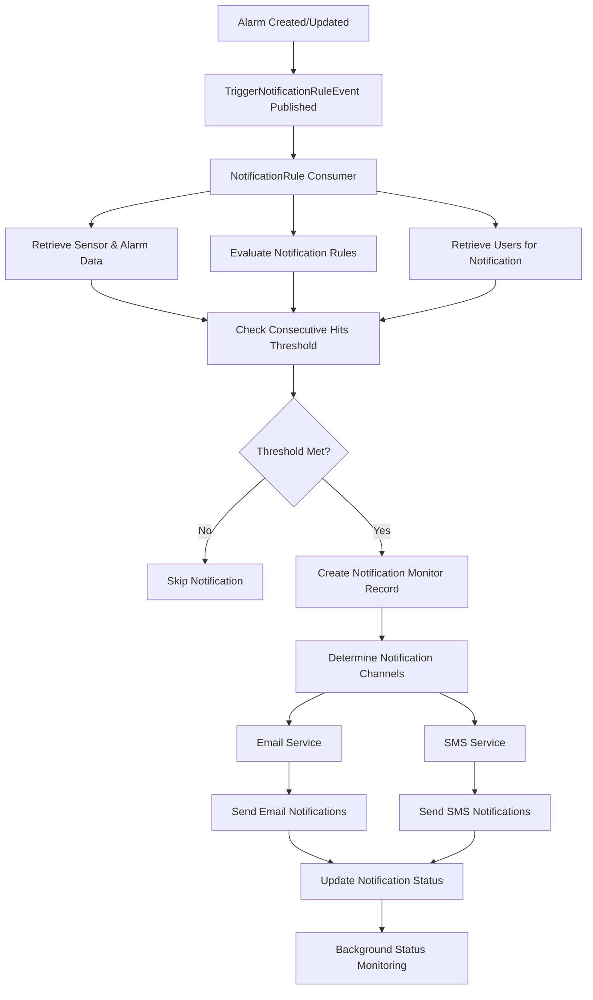

# SensorsReport.NotificationRule.Consumer

[](https://dotnet.microsoft.com/download/dotnet/8.0)
[](https://www.docker.com/)
[](../LICENSE)

## Overview

The SensorsReport.NotificationRule.Consumer is a specialized microservice that processes notification trigger events and orchestrates the delivery of notifications through various channels (email, SMS, webhooks) based on predefined notification rules. This consumer service monitors alarm events, evaluates notification rules, manages notification workflows, and tracks notification delivery status. It serves as the central orchestrator for all notification activities within the SensorsReport ecosystem, ensuring that the right people are notified through the right channels when critical events occur.

## Features

### Core Functionality
- **Event-driven Notification Processing**: Consumes TriggerNotificationRuleEvent messages via MassTransit
- **Multi-channel Notification Delivery**: Supports email, SMS, and webhook notifications
- **Notification Rule Evaluation**: Applies complex notification rules based on alarm conditions
- **Workflow Management**: Tracks notification states through complete lifecycle
- **Multi-tenant Support**: Full tenant isolation for all notification operations

### Notification Management
- **Consecutive Hit Tracking**: Ensures alarms meet threshold requirements before triggering notifications
- **Status-based Notifications**: Different notifications for new, acknowledged, and closed alarms
- **Template-based Messaging**: Uses configurable templates for different notification types
- **User Management Integration**: Retrieves appropriate users for notification delivery
- **Delivery Tracking**: Monitors notification delivery status and handles failures

### Advanced Features
- **Background Processing**: Continuously monitors and updates notification statuses
- **Timeout Management**: Handles notification timeouts and escalation scenarios
- **Error Handling**: Comprehensive error tracking and retry mechanisms
- **MongoDB Integration**: Persistent storage for notification monitoring and audit trails
- **Channel Management**: Independent control of email and SMS channels

## Technology Stack

- **.NET 8.0**: Core framework for high-performance event processing
- **MassTransit**: Message bus for consuming notification trigger events
- **MongoDB**: Database for notification monitoring and persistence
- **FIWARE Orion-LD**: NGSI-LD context broker for entity retrieval
- **NLog**: Structured logging framework
- **Docker**: Containerization for deployment
- **Kubernetes**: Orchestration with Flux GitOps

## Project Structure

```
SensorsReport.NotificationRule.Consumer/
├── Consumers/
│   └── TriggerNotificationRuleEvent.cs    # Main event consumer for notification triggers
├── Repositories/
│   ├── INotificationRepository.cs         # Repository interface for MongoDB operations
│   └── NotificationRepository.cs          # MongoDB repository implementation
├── Services/
│   ├── IMessageService.cs                 # Interface for message delivery services
│   ├── MessageService.cs                  # Email and SMS delivery service
│   ├── IUsersService.cs                   # Interface for user management
│   └── UsersService.cs                    # User retrieval and management service
├── Tasks/
│   └── CheckNotificationsBackgroundService.cs # Background service for notification monitoring
├── Properties/                            # Assembly properties
├── flux/                                  # Kubernetes deployment manifests
├── Dockerfile                             # Container build configuration
├── Program.cs                             # Application entry point and service setup
├── appsettings.json                       # Default configuration
├── nlog.config                            # Logging configuration
└── README.md                              # This documentation
```

## Architecture

### Event Flow


### Processing Logic
1. **Event Reception**: Receives TriggerNotificationRuleEvent from message bus
2. **Entity Retrieval**: Fetches sensor, alarm, notification, and notification rule entities
3. **Threshold Validation**: Verifies consecutive hits threshold is met
4. **User Resolution**: Retrieves users eligible for notification
5. **Channel Determination**: Identifies active notification channels (email/SMS)
6. **Template Selection**: Chooses appropriate templates based on alarm status
7. **Notification Delivery**: Sends notifications through configured channels
8. **Status Tracking**: Creates and maintains notification monitoring records
9. **Background Monitoring**: Continuously tracks notification lifecycle

## Getting Started

### Prerequisites
- .NET 8.0 SDK
- Access to FIWARE Orion-LD Context Broker
- MongoDB database for notification tracking
- Message broker (RabbitMQ/Azure Service Bus)
- Email/SMS service configurations
- Docker (for containerized deployment)

### Local Development

#### 1. Clone and Setup
```bash
cd SensorsReport.NotificationRule.Consumer
dotnet restore
```

#### 2. Configure Environment Variables
```bash
# Orion-LD Context Broker Configuration
export ORION_LD_HOST="localhost"
export ORION_LD_PORT="1026"

# MongoDB Configuration
export NOTIFICATION_MONGODB_CONNECTION_STRING="mongodb://localhost:27017"
export NOTIFICATION_MONGODB_DATABASE_NAME="notifications"

# Message Bus Configuration
export MASSTRANSIT_TRANSPORT="RabbitMQ"
export RABBITMQ_HOST="localhost"
export RABBITMQ_PORT="5672"
export RABBITMQ_USERNAME="guest"
export RABBITMQ_PASSWORD="guest"

# Email Service Configuration
export EMAIL_API_BASE_URL="http://email-api:8080"

# SMS Service Configuration
export SMS_API_BASE_URL="http://sms-api:8080"

# Application Configuration
export ASPNETCORE_ENVIRONMENT="Development"
export ASPNETCORE_URLS="http://localhost:5000"
```

#### 3. Run the Application
```bash
dotnet run
```

The consumer will start processing notification events and running background monitoring tasks.

#### 4. Verify Operation
```bash
# Check service health
curl http://localhost:5000/health

# Check logs for event processing
docker logs notificationrule-consumer -f

# Monitor MongoDB for notification records
mongosh --eval "db.notificationMonitors.find().pretty()"
```

### Docker Deployment

#### Build Container
```bash
# From the root SensorsReport directory
docker build -f SensorsReport.NotificationRule.Consumer/Dockerfile -t sensorsreport-notificationrule-consumer:latest .
```

#### Run Container
```bash
docker run -d \
  --name notificationrule-consumer \
  -e ORION_LD_HOST="orion.example.com" \
  -e ORION_LD_PORT="1026" \
  -e NOTIFICATION_MONGODB_CONNECTION_STRING="mongodb://mongo:27017" \
  -e RABBITMQ_HOST="rabbitmq.example.com" \
  sensorsreport-notificationrule-consumer:latest
```

### Kubernetes Deployment

Deploy using Flux manifests:
```bash
kubectl apply -f flux/
```

## Configuration

### MongoDB Integration
The service uses MongoDB for persistent notification monitoring:

```json
{
  "NotificationMongoDbConnectionOptions": {
    "ConnectionString": "mongodb://localhost:27017",
    "DatabaseName": "notifications",
    "CollectionName": "notificationMonitors"
  }
}
```

### Message Bus Configuration
Configure MassTransit for event consumption:

```json
{
  "MassTransit": {
    "Transport": "RabbitMQ",
    "RabbitMQ": {
      "Host": "localhost",
      "Port": 5672,
      "Username": "guest",
      "Password": "guest",
      "VirtualHost": "/"
    }
  }
}
```

### Environment Variables

| Variable | Description | Default |
|----------|-------------|---------|
| `ORION_LD_HOST` | Orion-LD Context Broker host | `localhost` |
| `ORION_LD_PORT` | Orion-LD Context Broker port | `1026` |
| `NOTIFICATION_MONGODB_CONNECTION_STRING` | MongoDB connection string | - |
| `NOTIFICATION_MONGODB_DATABASE_NAME` | MongoDB database name | `notifications` |
| `MASSTRANSIT_TRANSPORT` | Message transport type | `RabbitMQ` |
| `RABBITMQ_HOST` | RabbitMQ server host | `localhost` |
| `EMAIL_API_BASE_URL` | Email service API URL | - |
| `SMS_API_BASE_URL` | SMS service API URL | - |
| `ASPNETCORE_ENVIRONMENT` | Application environment | `Production` |

## Event Processing

### TriggerNotificationRuleEvent Structure
The consumer processes events with the following structure:

```json
{
  "tenant": {
    "tenant": "manufacturing"
  },
  "sensorId": "sensor-temperature-001",
  "propertyKey": "temperature",
  "metadataKey": "temperatureMetadata",
  "alarmId": "alarm-001",
  "timestamp": "2024-01-01T10:00:00Z"
}
```

### Processing Steps

#### 1. Event Validation and Entity Retrieval
```csharp
// Retrieve related entities
var sensor = await orionLdService.GetEntityByIdAsync<EntityModel>(event.SensorId);
var alarm = await orionLdService.GetEntityByIdAsync<AlarmModel>(event.AlarmId);
var notification = await orionLdService.GetEntityByIdAsync<NotificationModel>(notificationId);
var notificationRule = await orionLdService.GetEntityByIdAsync<NotificationRuleModel>(notificationRuleId);
```

#### 2. Threshold Validation
- Check if alarm meets consecutive hits threshold
- Verify notification rule is enabled
- Validate notification channels are configured

#### 3. User Resolution
- Retrieve users eligible for notification based on tenant and notification ID
- Apply role-based filtering for notification recipients

#### 4. Notification Delivery
Different notification types based on alarm status:
- **New Alarm**: First time alarm is triggered
- **Acknowledged**: Alarm has been acknowledged by operator
- **Closed**: Alarm condition has been resolved

#### 5. Status Tracking
```csharp
var notificationMonitor = new NotificationMonitorModel
{
    AlarmId = event.AlarmId,
    RuleId = notificationRule.Id,
    NotificationId = notificationId,
    SensorId = event.SensorId,
    Status = NotificationMonitorStatusEnum.Processing,
    EmailChannelActive = isEmailActive,
    SmsChannelActive = isSmsActive
};
```

### Notification Templates
The service uses predefined templates for different scenarios:
- **SensorFirstAlarm**: Initial alarm notification
- **FirstAcknowledgeAlarm**: Alarm acknowledgment notification
- **ReturnToNormal**: Alarm resolution notification

### MongoDB Data Models

#### NotificationMonitorModel
```json
{
  "_id": "ObjectId",
  "alarmId": "alarm-001",
  "ruleId": "notification-rule-001",
  "notificationId": "notification-001",
  "sensorId": "sensor-temperature-001",
  "sensorName": "temperature",
  "status": "Watching",
  "tenant": {
    "tenant": "manufacturing"
  },
  "createdAt": "2024-01-01T10:00:00Z",
  "lastUpdatedAt": "2024-01-01T10:00:00Z",
  "emailChannelActive": true,
  "smsChannelActive": true,
  "lastNotificationSentAt": "2024-01-01T10:05:00Z"
}
```

#### Notification Status Enum
- **Watching**: Monitoring alarm for changes
- **Processing**: Currently processing notification
- **Acknowledged**: Alarm has been acknowledged
- **TimedOut**: Notification has timed out
- **Completed**: Notification process completed
- **Error**: Error occurred during processing

## Integration

### SensorsReport Ecosystem
- **Business Broker API**: Publishes TriggerNotificationRuleEvent when alarms are created
- **NotificationRule API**: Provides notification rule definitions
- **Email API**: Delivers email notifications
- **SMS API**: Delivers SMS notifications
- **User Management**: Retrieves notification recipients
- **Audit API**: Logs notification activities

### Message Templates
Integrates with template services for consistent messaging:

```csharp
// Email templates
public static class EmailTemplateKeys
{
    public const string SensorFirstAlarm = "sensor-first-alarm";
    public const string FirstAcknowledgeAlarm = "alarm-acknowledged";
    public const string ReturnToNormal = "alarm-resolved";
}

// SMS templates
public static class SmsTemplateKeys
{
    public const string SmsSensorFirstAlarm = "sms-sensor-alarm";
    public const string SmsFirstAcknowledgeAlarm = "sms-alarm-ack";
    public const string SmsReturnToNormal = "sms-alarm-resolved";
}
```

### Background Processing
The CheckNotificationsBackgroundService continuously monitors notification status:
- Tracks notification timeouts
- Updates notification states
- Handles escalation scenarios
- Maintains audit trails

## Monitoring and Observability

### Health Checks
Built-in health monitoring for service components:

```bash
# Check overall health
curl http://localhost:5000/health

# Check MongoDB connectivity
curl http://localhost:5000/health/ready
```

### Logging
Comprehensive logging throughout the notification processing pipeline:

```csharp
// Processing start
logger.LogInformation("Processing TriggerNotificationRuleEvent for sensor {SensorId} with alarm {AlarmId}",
    sensorId, alarmId);

// Threshold validation
logger.LogInformation("Alarm with ID {AlarmId} has not reached the required consecutive hits for notification",
    alarmId);

// Notification delivery
logger.LogInformation("Sending notification for alarm with ID {AlarmId}", alarmId);
```

### Performance Metrics
Monitor these key metrics:
- **Event Processing Rate**: Notification events processed per second
- **Notification Delivery Time**: Time from trigger to delivery
- **Success Rate**: Percentage of successful notifications
- **Channel Performance**: Email vs SMS delivery rates
- **Background Task Performance**: Status monitoring efficiency

### MongoDB Monitoring
Track notification data:
```bash
# Count notifications by status
db.notificationMonitors.aggregate([
  { $group: { _id: "$status", count: { $sum: 1 } } }
])

# Recent notifications
db.notificationMonitors.find().sort({ createdAt: -1 }).limit(10)

# Failed notifications
db.notificationMonitors.find({ status: "Error" })
```

## Error Handling

### Validation Errors
Comprehensive validation of incoming events and entities:
- **Null Events**: Logged and skipped
- **Missing Entities**: Sensor, alarm, notification, or rule not found
- **Invalid Configuration**: Missing notification channels or users
- **Threshold Not Met**: Consecutive hits requirement not satisfied

### Delivery Errors
Robust error handling during notification delivery:
- **Service Unavailable**: Email/SMS services not accessible
- **Template Errors**: Missing or invalid notification templates
- **User Resolution Failures**: Unable to retrieve notification recipients
- **Channel Failures**: Specific email or SMS delivery issues

### Background Service Errors
Comprehensive error handling in status monitoring:
- **Database Connection Issues**: MongoDB connectivity problems
- **Entity Retrieval Failures**: Unable to fetch updated alarm status
- **Timeout Processing**: Handling notification timeout scenarios

### Example Error Scenarios
```csharp
// Missing sensor entity
if (sensor is null)
{
    logger.LogError("Sensor with ID {SensorId} not found", sensorId);
    return;
}

// Threshold not met
if (alarm.MeasuredValue?.Value?.Count < notificationRule.ConsecutiveHits?.Value)
{
    logger.LogInformation("Alarm with ID {AlarmId} has not reached the required consecutive hits for notification", alarmId);
    return;
}

// No users found
if (users.Count == 0)
{
    logger.LogWarning("No users found for Notification with ID {NotificationId}", notificationId);
    return;
}
```

## Performance Considerations

### Event Processing Optimization
- **Async Operations**: All I/O operations are asynchronous
- **Scoped Services**: Proper service lifetime management
- **Efficient Entity Retrieval**: Batch operations where possible
- **Parallel Channel Processing**: Email and SMS sent concurrently

### MongoDB Optimization
- **Indexed Queries**: Proper indexing on frequently queried fields
- **Connection Pooling**: Efficient database connection management
- **Batch Operations**: Bulk updates for status changes
- **Document Structure**: Optimized for query patterns

### Memory Management
```csharp
// Efficient service scoping
using var scope = serviceProvider.CreateScope();
var usersService = scope.ServiceProvider.GetRequiredService<IUsersService>();

// Proper resource disposal
// MongoDB connections auto-managed by driver
// HTTP clients managed by DI container
```

## Security Considerations

### Multi-tenant Security
- **Tenant Isolation**: All operations are scoped to event tenant
- **Data Separation**: Complete isolation between tenant notifications
- **Service Context**: Orion-LD and MongoDB operations properly tenant-scoped

### Notification Security
- **User Validation**: Verify users are authorized for notification
- **Template Security**: Prevent template injection attacks
- **Channel Security**: Secure communication with email/SMS services
- **Audit Trail**: Complete logging of all notification activities

### Data Protection
- **Sensitive Information**: Careful handling of user contact information
- **Encryption**: Secure storage of notification templates and user data
- **Access Control**: Role-based access to notification configuration

## Troubleshooting

### Common Issues

#### Consumer Not Processing Events
```bash
# Check message bus connectivity
kubectl logs -f deployment/notificationrule-consumer | grep "MassTransit"

# Verify queue configuration
kubectl exec -it notificationrule-consumer-pod -- curl -u guest:guest http://rabbitmq:15672/api/queues
```

#### MongoDB Connection Issues
```bash
# Test MongoDB connectivity
kubectl exec -it notificationrule-consumer-pod -- mongosh "mongodb://mongo:27017" --eval "db.adminCommand('ping')"

# Check notification records
kubectl exec -it notificationrule-consumer-pod -- mongosh "mongodb://mongo:27017/notifications" \
  --eval "db.notificationMonitors.find().limit(5).pretty()"
```

#### Notification Delivery Failures
```bash
# Check email service connectivity
kubectl exec -it notificationrule-consumer-pod -- curl http://email-api:8080/health

# Check SMS service connectivity
kubectl exec -it notificationrule-consumer-pod -- curl http://sms-api:8080/health

# View notification status
kubectl logs -f deployment/notificationrule-consumer | grep "notification"
```

### Debug Commands
```bash
# View processing logs
kubectl logs -f deployment/notificationrule-consumer --tail=100

# Check background service status
kubectl logs -f deployment/notificationrule-consumer | grep "CheckNotifications"

# Monitor notification events
kubectl logs -f deployment/notificationrule-consumer | grep "TriggerNotificationRuleEvent"
```

## Dependencies

### External Dependencies
- **FIWARE Orion-LD**: NGSI-LD Context Broker for entity storage
- **MongoDB**: Database for notification monitoring and persistence
- **Message Broker**: RabbitMQ or Azure Service Bus for event consumption
- **Email Service**: SensorsReport.Email.API for email delivery
- **SMS Service**: SensorsReport.SMS.API for SMS delivery

### .NET Dependencies
- **MassTransit**: Message bus integration
- **MongoDB.Driver**: MongoDB database operations
- **System.Text.Json**: JSON serialization and deserialization

### Runtime Dependencies
- **.NET 8.0 Runtime**: Core runtime environment
- **SensorsReport.Api.Core**: Shared API infrastructure
- **SensorsReport.OrionLD**: Orion-LD integration services

## Related Services

### Upstream Services
- **SensorsReport.Business.Broker.API**: Publishes TriggerNotificationRuleEvent
- **SensorsReport.NotificationRule.API**: Provides notification rule definitions
- **SensorsReport.Alarm.API**: Source of alarm data

### Downstream Services
- **SensorsReport.Email.API**: Processes email notification requests
- **SensorsReport.SMS.API**: Processes SMS notification requests
- **SensorsReport.Audit.API**: Logs notification activities
- **User Management Service**: Provides user information for notifications

### Event Flow
1. **Alarm Creation**: Alarm is created or updated in the system
2. **Event Publication**: TriggerNotificationRuleEvent published to message bus
3. **Notification Processing**: This service processes events and orchestrates delivery
4. **Channel Delivery**: Email/SMS services handle actual delivery
5. **Status Monitoring**: Background service monitors notification lifecycle
6. **Audit Logging**: Activities logged for compliance and monitoring

## Contributing

### Development Guidelines

1. **Event Processing Best Practices**: Follow async/await patterns
2. **Error Handling**: Implement comprehensive error handling and logging
3. **Testing**: Include unit tests for notification logic
4. **Documentation**: Update processing logic documentation
5. **Performance**: Consider memory and throughput optimization

### Pull Request Process

1. Fork the repository
2. Create a feature branch (`git checkout -b feature/notification-enhancement`)
3. Implement changes with tests
4. Verify event processing functionality
5. Test with actual message bus and MongoDB
6. Update documentation
7. Submit pull request with detailed description

### Testing

```bash
# Run unit tests
dotnet test

# Run integration tests with MongoDB
dotnet test --filter Category=Integration

# Test event processing
dotnet test --filter Category=EventProcessing
```

## License

This project is part of the SensorsReport system for AerOS. See the root LICENSE file for details.

## Support

### Documentation
- Notification processing documentation in `/docs` folder
- Message bus configuration guides
- MongoDB setup and optimization guides

### Contact
- **Issue Tracking**: GitHub Issues
- **Email Support**: support@sensorsreport.com
- **Documentation**: See project wiki for detailed guides

### Troubleshooting

Common issues and solutions:

1. **Events Not Being Consumed**
   - Verify message bus connectivity
   - Check queue configuration and permissions
   - Validate event routing configuration

2. **Notification Delivery Failures**
   - Verify email/SMS service availability
   - Check user configuration and permissions
   - Validate notification templates

3. **MongoDB Connection Issues**
   - Test database connectivity
   - Verify connection string configuration
   - Check database permissions

4. **Background Service Issues**
   - Monitor background service logs
   - Check notification status updates
   - Verify timeout processing logic

## Changelog

### Version 1.0.0
- Initial release with TriggerNotificationRuleEvent processing
- Multi-channel notification delivery (email, SMS)
- MongoDB-based notification monitoring
- Background service for status management
- Template-based messaging system
- Multi-tenant support
- Comprehensive error handling and logging
- Docker and Kubernetes deployment support
- Integration with SensorsReport ecosystem services
